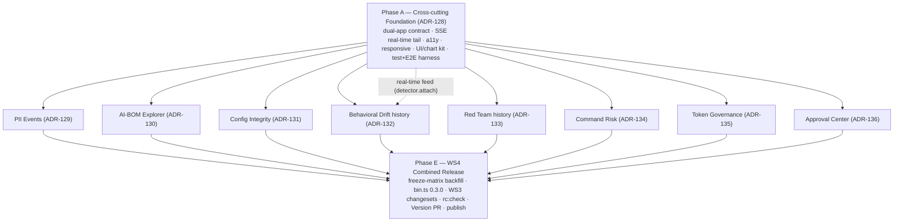

# Adjudicate Roadmap — WS3 (Web Parity) + WS4 (Combined Release)

> **Status:** Phase-0/1 complete (discovery + design). Pending **design approval** before implementation.
> **Scope:** Phase-3 "web application parity" across **both** apps + a single combined post-v1 release wave.

This directory is the planning home for the two active workstreams. It backfills the
program's mandatory **Phase-0** (`discovery-report.md`) and **Phase-1** (`design/*.md`)
artifacts, all grounded in a read-only architectural survey of the repo.

## Locked decisions

| Decision | Choice |
|---|---|
| **WS3 target apps** | **Both** — `apps/console` = full operator tool; `apps/web` = read-only, public, aggregates-only transparency dashboards |
| **Sequencing** | **Parity first, ship together** — build WS3's new backend surfaces now; their changesets/ADRs/freeze-matrix rows join the 15 staged changesets in **one** combined post-v1 **MINOR** wave (no major) |
| **Experimental packs** | `pack-incident-response` + `pack-access-governance` **go stable** at `0.2.0` (the `-experimental` tag drop is intended) |

## Document map

| Doc | What it covers |
|---|---|
| [`discovery-report.md`](discovery-report.md) | Phase-0 survey: 26 packages / 2 apps, layering, trust direction, all 14 roadmap features → ADRs, data-readiness tiers |
| [`design/_cross-cutting-platform.md`](design/_cross-cutting-platform.md) | Dual-app contract, real-time tail (SSE + AuditEventBus), a11y, responsive, UI/chart primitives, test/E2E harness — **the foundation everything depends on** |
| [`design/pii-events.md`](design/pii-events.md) | PII Events (Tier A) |
| [`design/ai-bom-explorer.md`](design/ai-bom-explorer.md) | AI-BOM Explorer (Tier A) |
| [`design/configuration-integrity.md`](design/configuration-integrity.md) | Configuration Integrity — seals + violations + kill-switch timeline (Tier A→B) |
| [`design/behavioral-drift.md`](design/behavioral-drift.md) | Behavioral Drift + timeline (Tier B) |
| [`design/red-team-results.md`](design/red-team-results.md) | Red Team Results + trend (Tier B) |
| [`design/command-risk.md`](design/command-risk.md) | Command Risk — net-new aggregation (Tier C) |
| [`design/token-governance.md`](design/token-governance.md) | Token Governance — store + tenant model (Tier C) |
| [`design/approval-center.md`](design/approval-center.md) | Approval Center — real engine wiring (Tier C, security-critical) |
| [`release-plan.md`](release-plan.md) | WS4 combined release plan + ordered checklist |

## Data-readiness tiers (drives sequencing)

| Surface | Tier | Data today | Net-new backend needed |
|---|---|---|---|
| PII Events | **A** | `governance.piiClassificationStats` fully wired | thin `governance.piiEvents` event-drill seam |
| AI-BOM Explorer | **A** | `pack.aiBom` carries all fields; UI is a summary card | `pack.aiBomList` / `aiBomById` (multi-pack) |
| Configuration Integrity | **A→B** | seals + `emergency.history` real; `analyzeKillSwitchTimeline` exists but unexposed | `governance.killSwitchTimeline` + multi-pack `configSealStatusAll` |
| Behavioral Drift | **B** | single startup snapshot, **no time-series** | `createDriftHistory` ring-buffer + `governance.driftHistory` |
| Red Team Results | **B** | single startup run, **no history** | run-history store + `governance.redTeamHistory` + CI wiring |
| Command Risk | **C** | **no data API at all** | `createCommandRiskStatsHandler` + `governance.commandRisk` |
| Token Governance | **C** | port-only (demo literal); **no store, no tenant model** | `TokenUsageStore` (adapter-core) + tenant schema + `tokenBudgetByTenant` |
| Approval Center | **C** | `resolve()` is **display-only** (no real auth) | real engine wiring + `approval.history`/`approval.chain` + strict resume |

## Sequenced implementation roadmap

- **Phase A — Foundation (lands first; blocks all surfaces).** Mostly app-only + devDeps + CI. One ADR (ADR-128). The SSE tail also supplies Drift's live feed.
- **Phase B — Tier A surfaces (fast parity wins).** Thin additive SDK seams + console sections + sanitized web views.
- **Phase C — Tier B surfaces.** Deterministic time-series persistence (bounded, harness-supplied timestamps).
- **Phase D — Tier C surfaces.** Heavy backend; Approval Center is the security-critical one (single-use tokens, strict replay-safe resume).
- **Phase E — WS4 release.** Aggregates every prior phase's changeset + the 15 already staged into one MINOR wave.

Within each phase, surfaces are independent and parallelizable.

## ADR allocation (collisions resolved)

Latest existing ADR is **ADR-127**. Assigning a clean contiguous block (several agents independently
proposed "ADR-128"; resolved here). Each WS3 surface ADR cross-references the original feature ADR it extends.

| ADR | Title | Extends |
|---|---|---|
| **ADR-128** | Cross-cutting web-parity platform (dual-app contract, SSE tail, a11y/responsive/charts, harness) | ADR-114 |
| **ADR-129** | PII Events read seam | ADR-117 |
| **ADR-130** | AI-BOM Explorer (multi-pack list/detail + public transparency) | ADR-127 |
| **ADR-131** | Configuration Integrity aggregation (kill-switch timeline + multi-pack seal) | ADR-114, ADR-121 |
| **ADR-132** | Behavioral Drift snapshot history | ADR-119 |
| **ADR-133** | Red Team run-history + multi-pack aggregation | ADR-118 |
| **ADR-134** | Command Risk aggregation surface | ADR-123 |
| **ADR-135** | Token-usage telemetry store + tenant budgets + minimal tenant model | ADR-120 |
| **ADR-136** | Approval Center real-engine wiring + history/chain + strict resume | ADR-122 |

## New published surfaces (need changesets) vs app-only

> Apps (`apps/console`, `apps/web`) are **unpublished reference UI → no changesets**. Only package changes below need them.

| New changeset | Packages / bump | Surface |
|---|---|---|
| `pii-events.md` | `admin-sdk` minor | `governance.piiEvents` + schemas + handler |
| `ai-bom-explorer.md` | `admin-sdk` minor | `pack.aiBomList` / `pack.aiBomById` + list/summary schemas |
| `configuration-integrity.md` | `admin-sdk` minor | `governance.killSwitchTimeline` + `configSealStatusAll` + schemas |
| `behavioral-drift.md` | `drift` minor + `admin-sdk` minor | `createDriftHistory` + `governance.driftHistory` |
| `red-team-history.md` | `red-team` minor + `admin-sdk` minor | run-history store + `governance.redTeamHistory` |
| `command-risk.md` | `admin-sdk` minor | `createCommandRiskStatsHandler` + `governance.commandRisk` |
| `token-governance.md` | `adapter-core` minor + `admin-sdk` minor | `TokenUsageStore` + tenant schema + `tokenBudgetByTenant` |
| `approval-center.md` | `approval-engine` minor + `admin-sdk` minor (+ `runtime` minor, evidence-gated) | Redis registry + `approval.history`/`approval.chain` + strict `verifyParkedHash` |

All additive → **MINOR**, no closed-enum widening, no wire-format/hash-recipe change → the v1 freeze holds.

## WS4 release — corrected facts

- The 15 staged changesets net to **16 minor + 1 patch** (only `audit-postgres` → `2.0.1`). _(Earlier "14 minor + 3 patch" was a miscount.)_
- Resulting versions: `core` 1.2.0→1.3.0 · `admin-sdk` 2.0.0→2.1.0 · `conformance`/`observability` 1.0.0→1.1.0 · `primitives`/`cli`/`analyze`/`anthropic`/`openai`/`adapter-core`/`pack-deployments-approval` 0.2.0→0.3.0 · **new** `approval-engine`/`drift`/`red-team` 0.1.0→0.2.0 · `pack-incident-response`/`pack-access-governance` 0.1.0-experimental→0.2.0 stable.
- **🔴 HARD blocker:** `packages/cli/src/bin.ts` literal `.version("0.2.0")` ≠ cli 0.3.0 → `check-versions.ts` fails. **Fix = bump the literal to `0.3.0`** in the Version PR (a dynamic `package.json` read would make the regex check go *advisory* and silently stop validating — confirmed at `scripts/check-versions.ts:103,114`).
- **🟡 Governance-mandatory (CI-soft today):** `V1_FREEZE_MATRIX.md` is missing rows for the 5 new packages + all new exported symbols (existing wave **and** WS3). The freeze-matrix check is advisory/`continue-on-error` everywhere, so it won't mechanically block — but skipping it violates SEMVER_GOVERNANCE §5/§9 + EXTENSION_POLICY §2.2/§2.3.
- **🔵 Info:** the two adopter-evidence items (kill-switch v2 latency, AuditEventBus fan-out) gate the *formal v1.0-line alignment*, **not** this additive wave.

## Open questions for approval

Consolidated from the per-feature docs — these don't block starting Phase A, but resolve before the surfaces that touch them:

1. **Public web data path** — serve sanitized aggregates via app-local allowlisted Next routes (recommended) vs a public `transparency.*` tRPC subset? (cross-cutting)
2. **Web component testing** — keep `apps/web` on node-only vitest + server-side redaction snapshot tests (recommended), or add jsdom/RTL to web? (affects every web view)
3. **Small-cohort privacy floor** — should public views clamp low counts (e.g. show `<5`) to prevent de-anonymization? (PII, Command Risk, Token)
4. **Drift/Red-Team time-series store** — in-memory ring (reference default) vs a durable Postgres table reusing `DATABASE_URL`?
5. **`verifyParkedHash` warn→strict flip** — evidence-gated; ship the Approval schemas/procedures now and defer the default flip, or flip this wave if an adopter confirms no legacy parked blobs?
6. **Operator identity / RBAC** — actor still comes from forgeable `x-adjudicate-actor-*` headers; treat Approval `resolvedBy` as a *claim* this wave (recommended) and defer real OIDC/Clerk auth?
7. **Shared `@adjudicate/ui` package** — extract UI/chart primitives as a published package (new surface) vs keep app-local (recommended)?

## Verification cadence (per program EXECUTION RULES, run after each phase)

`pnpm build` · `pnpm test` · `pnpm rc:check` · replay verification · `adjudicate red-team` · update docs · update web app · commit.
