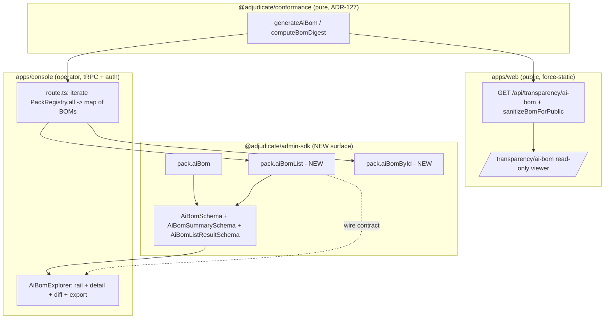

# AI-BOM Explorer — Design

> Status: Draft (Phase-1 design, pending approval) · Roadmap: WS3 Web Parity · Target apps: console + web

## Problem

Regulators (EU AI Act Art. 11 technical documentation; NIST AI RMF MAP/MEASURE) and supply-chain security want a machine-readable manifest of the AI components in a Pack deployment: model, declared prompt templates, tools, retrieval sources, guardrail taxonomy, conformance status, fingerprint. ADR-127 shipped the *producer* (`generateAiBom`/`computeBomDigest` in `@adjudicate/conformance`) and a thin *consumer*: `pack.aiBom` in `@adjudicate/admin-sdk` feeding a single SUMMARY CARD (`apps/console/.../AiBomPanel.tsx`).

The gap vs the roadmap requirement is twofold:

1. **The console panel is a summary, not an explorer.** It renders pack@version, model, conformance, health, a 16-char fingerprint slice, and frameworks — and nothing else. The richest, most regulator-relevant fields the BOM already carries — `promptHashes[]`, `tools[]`, `rag[]` (vector stores), `intents[]`, `signals[]`, `basisCodes[]`, `guardrails[]`, full `fingerprint`/`bomDigest`, `signature` — are computed and shipped over the wire but never surfaced. It is also single-pack: `pack.aiBom` returns the BOM for exactly one Pack (the route handler computes it once at startup for `deploymentsApprovalPack`; see "Existing Architecture"). There is no version browser and no cross-pack browser even though the console registers five Packs.

2. **`apps/web` has no BOM surface at all** — only a 100%-mock `ConsolePreview` card. The AI-BOM is the *one* governance artifact that is non-sensitive by design (it is a manifest of hashes and component references, never contents), which makes it the ideal candidate for a public, read-only compliance/transparency view. Today there is nothing.

This design builds a real **Explorer** on the console (multi-pack, fully expandable, exportable, version-diffable) and a sanitized **public BOM viewer** on the web (compliance/transparency for shipped reference Packs).

## Existing Architecture

What is real today (all grounded in repo):

**Producer — `@adjudicate/conformance/src/ai-bom.ts` (ADR-127).** Pure, no clock/RNG/I/O.
- `generateAiBom(inputs: GenerateAiBomInputs): AiBom` — composes `computePackFingerprint` + `runConformance` + `scorePackHealth` + manifest + author-declared model/prompt/tool/RAG metadata.
- `computeBomDigest(bomCore): string` — sha256 over `canonicalJson(core)` where `core = Omit<AiBom, "bomDigest" | "generatedAt" | "signature">`. So `bomDigest` is invariant to `generatedAt`/`signature` and to input array order (comparators are total-order; equal keys return 0).
- Exported types: `AiBom`, `AiBomVersion` (`"1.0"`), `AiBomFramework` (`"eu-ai-act" | "nist-ai-rmf"`), `AiBomModelRef`, `AiBomPromptHash {id, sha256}`, `AiBomToolRef {name, description?, version?, schemaDigest?}`, `AiBomRagRef {name, kind?, version?, embeddingModel?}`, `AiBomGuardrail {basisCode, category}`, `GenerateAiBomInputs`.

**Data layer — `@adjudicate/admin-sdk`.**
- `AiBomSchema` / `AiBomParsed` (`packages/admin-sdk/src/schemas/ai-bom.ts`): a Zod mirror of `AiBom`. NOTE the wire schema is **slightly looser** than the producer type — `tools` and `rag` are `z.array(z.record(z.string(), z.unknown()))` (the producer ships `AiBomToolRef`/`AiBomRagRef` shapes, but the schema doesn't pin their fields). `promptHashes`, `guardrails`, `conformance`, `healthScore`, `signature` are pinned.
- `pack.aiBom` procedure (`packages/admin-sdk/src/trpc/index.ts`, `packRouter`): `.output(AiBomSchema).query(...)`. Reads `ctx.aiBom` (single optional `AiBomParsed`); throws `PRECONDITION_FAILED` when absent. **This is single-pack.** There is no list procedure and no version dimension.

**Adopter wiring — `apps/console/.../api/admin/trpc/[trpc]/route.ts`.** At module init it computes ONE BOM via `generateAiBom({ pack: <fields of deploymentsApprovalPack>, manifest, conformance: runConformance(deploymentsApprovalPack), health: scorePackHealth(...), generatedAt: "2026-06-06T00:00:00.000Z" })` and threads it as `ctx.aiBom`. `generatedAt` is a hard-coded literal (no clock). `promptHashes`/`tools`/`rag`/`model` are NOT supplied, so the BOM ships `promptHashes: []`, `rag: []`, `tools = intents.map(name => ({name}))` (the default), and no `model`.

**Console UI — `apps/console/src/components/governance/AiBomPanel.tsx` (+ `useAiBom.ts` hook + `AiBomPanel.test.tsx`).** Summary card: pack@version, model, conformance (passed + counts), health (tier + score), `fingerprint.slice(0,16)`, frameworks, and a "Download JSON" button that blobs the single BOM. `useAiBom` = `useQuery(["pack","aiBom"], () => trpc.pack.aiBom.query(), { retry: false })`. Mounted on `apps/console/src/app/governance/page.tsx`.

**CLI.** `adjudicate pack bom <path>` (`packages/cli/src/commands/pack-bom.ts`) loads a pack, runs conformance+health, prints the BOM JSON, exits 1 on conformance failure. Uses `now()` for `generatedAt` (clock injected/defaulted).

**Web — `apps/web`.** No BOM surface. The only governance-flavored public reads are `force-static`, `runtime = "nodejs"` route handlers that import packs directly and emit JSON at build time (e.g. `apps/web/src/app/api/playground/policy/route.ts` calls `describePolicyBundle(pack.policy)` over PIX/KYC/Deployments — no auth, no tRPC, no user input). This is the precedent the public BOM viewer follows. `apps/web` has `@tanstack/react-query` (unused provider in `providers.tsx`), no charting lib, no auth/tenant model.

Registry: `apps/console/src/lib/packs/registry.ts` exposes `PackRegistry.all()` (five adapters: pix, kyc, deployments, incident, access) and `PackRegistry.match(intentKind)`. This is the multi-pack source the Explorer iterates.

## Proposed Architecture

Three layers change; the kernel does NOT.

1. **`@adjudicate/admin-sdk` — NEW published surface (additive, MINOR):**
   - `AiBomSummarySchema` — a small projection (packId, packVersion, healthTier, conformance.passed, bomDigest, generatedAt, frameworks) for cheap list rendering.
   - `AiBomListResultSchema` — `{ packs: AiBomSummary[] }` (or richer; see API Design).
   - `pack.aiBomList` procedure — returns every wired Pack's BOM (full or summary). Feature-detected via `PRECONDITION_FAILED`, mirroring `pack.aiBom`.
   - `pack.aiBomById` procedure (input `{ packId, packVersion? }`) — returns the full `AiBom` for one Pack (optionally a specific version), so the Explorer can lazy-load detail without shipping all full BOMs in the list call.
   - Tighten `AiBomSchema.tools`/`AiBomSchema.rag` to pinned object schemas (`AiBomToolRefSchema`, `AiBomRagRefSchema`) so the wire contract matches the producer — done as an **additive narrowing within the existing `1.0` `bomVersion`** (the producer already only ever emits these fields; this is a documentation/validation tightening, not a wire change). Treated as MINOR; flagged in the freeze matrix.

2. **`apps/console` — Explorer UI (app-only, no new published surface):**
   - `AiBomExplorer` (replaces the panel's role on a dedicated route `/governance/ai-bom`; the summary `AiBomPanel` can stay as a compact card link). Multi-pack left rail (from `pack.aiBomList`), detail pane with expandable sections, JSON export per-pack and combined, version diff when ≥2 versions exist for a pack.
   - The adopter route handler changes from computing ONE BOM to computing a **map of BOMs** by iterating `PackRegistry.all()` (same pure `generateAiBom` per pack, same hard-coded `generatedAt`), wiring `ctx.aiBomList`/`ctx.aiBomById`.

3. **`apps/web` — public read-only viewer (app-only):**
   - A `force-static`, Node-runtime route handler `GET /api/transparency/ai-bom` that imports the shipped reference Packs and emits their **sanitized** BOMs at build time (same pattern as `/api/playground/policy`). It does NOT call the admin tRPC router and carries no auth — it never needs one because the payload is non-sensitive by construction (see Security Analysis) and is additionally passed through a `sanitizeBomForPublic()` allowlist projection.
   - A `/transparency/ai-bom` page rendering a read-only viewer fed by that static JSON.



## API Design

All new procedures live on the existing `packRouter` in `@adjudicate/admin-sdk/trpc`, consistent with `pack.aiBom`. Naming follows the established `<namespace>.<verb/noun>` pattern (`audit.query`, `approval.list`, `pack.aiBom`).

```ts
// packages/admin-sdk/src/schemas/ai-bom.ts  (additions)

// Pinned element schemas — tighten the existing permissive z.record arrays.
export const AiBomToolRefSchema = z.object({
  name: z.string(),
  description: z.string().optional(),
  version: z.string().optional(),
  schemaDigest: z.string().optional(),
});
export const AiBomRagRefSchema = z.object({
  name: z.string(),
  kind: z.string().optional(),
  version: z.string().optional(),
  embeddingModel: z.string().optional(),
});
// AiBomSchema.tools/rag re-typed to z.array(AiBomToolRefSchema)/z.array(AiBomRagRefSchema).

// Cheap list projection (no promptHashes/tools/rag — keeps the list call small).
export const AiBomSummarySchema = z.object({
  packId: z.string(),
  packVersion: z.string(),
  bomVersion: z.string(),
  healthTier: z.string(),
  healthScore: z.object({ score: z.number(), maxScore: z.number() }),
  conformance: z.object({ passed: z.boolean(), passedCount: z.number(), total: z.number() }),
  fingerprint: z.string(),
  bomDigest: z.string(),
  frameworks: z.array(z.string()),
  generatedAt: z.string(),
  signed: z.boolean(),            // derived: signature !== undefined (never leak the value here)
});
export type AiBomSummaryParsed = z.infer<typeof AiBomSummarySchema>;

export const AiBomListResultSchema = z.object({
  packs: z.array(AiBomSummarySchema),
});
export type AiBomListResultParsed = z.infer<typeof AiBomListResultSchema>;

export const AiBomByIdQuerySchema = z.object({
  packId: z.string(),
  packVersion: z.string().optional(),   // omit => latest/only version wired
});
```

```ts
// packages/admin-sdk/src/trpc/index.ts  (packRouter additions)

// AdminContext additions (optional, feature-detected — same posture as ctx.aiBom):
interface AdminContextAdditions {
  /** All wired Packs' BOMs, keyed for aiBomById lookup. Adopter computes via
   *  generateAiBom per PackRegistry.all() entry. pack.aiBomList PRECONDITION_FAILED when absent. */
  readonly aiBoms?: ReadonlyArray<AiBomParsed>;
}

pack: t.router({
  aiBom: /* unchanged: single BOM, kept for back-compat */,

  aiBomList: t.procedure
    .output(AiBomListResultSchema)
    .query(({ ctx }) => {
      const all = ctx.aiBoms ?? (ctx.aiBom ? [ctx.aiBom] : undefined);
      if (!all) throw new TRPCError({ code: "PRECONDITION_FAILED",
        message: "AI-BOM list not configured. Compute generateAiBom(...) per PackRegistry.all() and wire ctx.aiBoms." });
      return { packs: all.map(toSummary) };   // toSummary maps AiBom -> AiBomSummary, signed: !!bom.signature
    }),

  aiBomById: t.procedure
    .input(AiBomByIdQuerySchema)
    .output(AiBomSchema)
    .query(({ input, ctx }) => {
      const all = ctx.aiBoms ?? (ctx.aiBom ? [ctx.aiBom] : []);
      const matches = all.filter((b) => b.packId === input.packId
        && (input.packVersion === undefined || b.packVersion === input.packVersion));
      if (matches.length === 0) throw new TRPCError({ code: "NOT_FOUND",
        message: `No AI-BOM for ${input.packId}${input.packVersion ? "@" + input.packVersion : ""}` });
      // Deterministic pick when version omitted: highest packVersion by semver, ties by bomDigest.
      return pickLatest(matches);
    }),
}),
```

**Auth posture.** `pack.aiBom` today has NO `ctx.actor` guard — the BOM is non-sensitive. `aiBomList`/`aiBomById` follow that same posture (no actor required) to stay consistent and to keep the surface usable behind the console's bearer gate without per-procedure RBAC. The public web viewer never touches this router at all (it reads the static JSON).

**Console hooks (app-only):** `useAiBomList()` → `trpc.pack.aiBomList.query()`, `useAiBomById(packId, version?)` → `trpc.pack.aiBomById.query({...})`. Both `retry: false`, `PRECONDITION_FAILED`/`NOT_FOUND` → empty state.

## Data Model

No new kernel types and **no closed-enum widening**. The closed taxonomies the BOM references are unchanged: `AiBomFramework` (2 members), `AiBomVersion` (`"1.0"`), `AiBomGuardrail.category` (derived from `basisCode.split(".")[0]` — a `BasisCategory`-shaped string, bounded by the Pack's `basisCodes`).

**Bounded cardinality.** `pack.aiBomList` returns one summary per wired Pack — bounded by `PackRegistry.all().length` (5 today). `aiBoms[]` per pack is bounded by the number of versions the adopter wires (1 today; the schema supports N for the diff feature). Arrays inside a BOM (`intents`, `signals`, `basisCodes`, `tools`, `rag`, `promptHashes`, `guardrails`) are Pack-bounded and already total-order-sorted by the producer.

**Events.** This feature introduces **no kernel events and no event-bus taxonomy.** BOM generation is a pure read-model projection, outside the determinism boundary (see below). Observability is via Prometheus metrics + access logs only (see Observability Design). Optionally, an **operator audit log entry** when an operator exports a combined BOM bundle from the console — but that is an app-level access log, NOT a kernel `GovernanceEvent`, and carries no closed taxonomy of its own.

**Sanitization model (web).** `sanitizeBomForPublic(bom: AiBom): PublicAiBom` is an **allowlist projection** (app-only type in `apps/web`):
- Keeps: `bomVersion`, `packId`, `packVersion`, `contract`, `kernelMinVersion`, `fingerprint`, `model`, `intents`, `signals`, `basisCodes`, `tools` (name/description/version/schemaDigest — all already hashes/identifiers), `rag` (name/kind/version/embeddingModel — store *references*, not contents), `promptHashes` (id + sha256 — hashes, never templates), `guardrails`, `conformance` (counts + reportDigest), `healthTier`, `healthScore`, `frameworks`, `bomDigest`, `generatedAt`, and `signature` **as `signed: boolean` only** (drop algorithm/keyId/value).
- The projection is an allowlist (not a denylist) so a future additive BOM field is *excluded by default* until someone consciously adds it to the public projection. This is the load-bearing safety property of the web surface.

## Determinism Analysis

The BOM lives **entirely outside the kernel determinism boundary** and this design preserves that.

- **Pure producer.** `generateAiBom`/`computeBomDigest` are pure: no clock, no RNG, no I/O. `generatedAt` and `signature` are caller-supplied and are the *only* non-deterministic inputs; both are EXCLUDED from `bomDigest`, so the digest is reproducible. The Explorer does not change the producer.
- **No clock/RNG in new code paths.** The console route handler already supplies a hard-coded `generatedAt: "2026-06-06T00:00:00.000Z"`. When it switches to iterating `PackRegistry.all()`, every BOM must use a **single, harness-supplied timestamp** (one literal, or one captured-at-startup value), NOT per-pack `new Date()` calls — otherwise BOMs would differ run-to-run on `generatedAt` only (digests stay stable, but snapshot tests would flap). `aiBomById`'s "pick latest" is deterministic: semver-max, ties broken by `bomDigest` string order (no wall-clock tiebreak). The web `force-static` route emits at build time; its `generatedAt` is build-time but is again excluded from `bomDigest`, so the *digest* CI gate is stable across builds.
- **Never a kernel input.** Nothing here feeds `adjudicate()`, `intentHash`, the Decision-6 outcomes, the Taint lattice, or replay. The BOM is a downstream read-model over already-frozen primitives (fingerprint, conformance report). It cannot perturb a decision. Replay safety is unaffected: replay re-adjudicates `AuditRecord`s; the BOM is not part of that path.
- **Wire/canonical-hash recipe untouched.** `computeBomDigest` uses the existing `canonicalJson`; no append to the canonical-hash recipe. Tightening `tools`/`rag` Zod element schemas is a validation change on the read side, not a wire-format change — the bytes the producer emits are unchanged.
- **Ordering.** List/diff ordering is derived deterministically (declaration order from `PackRegistry.all()` for the list; semver for version pick; the producer's total-order sorts inside each BOM). No reliance on object key insertion order beyond `canonicalJson`'s canonicalization.

## Security Analysis

**Threat model.** Two distinct surfaces with different exposure: the console (authenticated, operator-only, behind `ADMIN_API_TOKEN` bearer in prod) and the web viewer (fully public, build-time static).

- **Data-leak via the public web view (primary risk).** The BOM is non-sensitive *by design* — it is hashes and component *references*, never contents: `promptHashes` are sha256 of declared prompt *templates* (ADR-127 explicitly frames these as "declared prompt templates," not rendered prompts — rendered prompts need runtime state and are never in the Pack); `rag` entries are vector-store *names/kinds/embedding-model ids*, not retrieved documents; `tools` are names/schema digests, not invocations; `conformance.reportDigest` is a hash. There are **no raw commands, no envelope contents, no tokens, no PII, no privileged actions** anywhere in a BOM. Defense-in-depth: `sanitizeBomForPublic()` is an **allowlist** projection (future fields excluded by default), it drops the signature value (keeps `signed: boolean`), and the route is `force-static` (no per-request input → no injection vector, no SSRF, no IDOR — there is no `packId` parameter to enumerate beyond the shipped reference set). A reviewer checklist item: any new BOM field must be consciously added to the allowlist with a "is this safe to publish?" sign-off.
- **Prompt-injection paths.** The Explorer renders strings that ultimately originate from Pack authors (`tools[].description`, `rag[].name`, prompt `id`s, `basisCodes`). These are author-controlled, not attacker-controlled at runtime, but the renderer MUST treat them as untrusted text: no `dangerouslySetInnerHTML`, render hashes/ids in `<code>` with monospace, and the JSON export is `JSON.stringify` (no template interpolation). A malicious/compromised Pack author cannot inject script into the console/web via a BOM field if these are plain-text rendered. The taint model is not involved (BOM fields never become kernel inputs), so there is no taint-lattice path to corrupt.
- **Taint implications.** None. The BOM is outside the determinism/taint boundary; it does not read or write `Taint`, and it cannot launder an `UNTRUSTED`→`TRUSTED` transition. Confirm: nothing in the new procedures touches envelopes, decisions, or the taint lattice.
- **Abuse cases.**
  - *Enumeration/scraping of the public BOMs* — acceptable; the content is published transparency data. The static route caps exposure to the shipped reference Packs.
  - *Console DoS via `aiBomList`* — bounded: BOMs are pre-computed at startup and held in memory; the procedure is an in-memory map+project, O(packs). No per-request `generateAiBom`. Rate-limit at the existing bearer gate if needed.
  - *Stale/forged digest* — `bomDigest` is recomputable by anyone from the published core; a downstream verifier can detect tampering. Signing (`signature`) is an ADR-127 follow-up; until then the public view advertises `signed: false` honestly rather than implying provenance it lacks.
  - *Confused-deputy via `aiBomById` packVersion* — input is a string filter over an in-memory set; `NOT_FOUND` on miss, no filesystem/network reach, no path traversal.
- **Auth/consistency.** Console procedures sit behind the same fail-closed bearer gate as the rest of the admin router (`requireConsoleAdminAuth`); they intentionally do not add per-procedure actor checks because the data is non-sensitive (consistent with the existing `pack.aiBom`). The web route has no auth and needs none.

## UI Design

### Console (full operator Explorer) — `/governance/ai-bom`

Layout: two-pane. **Left rail** = pack list (from `pack.aiBomList`): each row shows packId@version, health-tier chip, conformance pass/fail dot, `signed`/`unsigned` badge, truncated `bomDigest`. **Right detail pane** (from `pack.aiBomById` on select): header (pack@version, full fingerprint + copy button, full bomDigest + copy, frameworks, generatedAt, signed badge) and collapsible sections:
- **Model** — provider/model/modelVersion, or "not declared".
- **Prompts** — table of `promptHashes` (id, sha256 with copy); empty-state "No declared prompt templates."
- **Tools** — table of `tools` (name, description, version, schemaDigest).
- **Vector stores (RAG)** — table of `rag` (name, kind, version, embeddingModel).
- **Guardrails** — `guardrails` grouped by `category`, each listing `basisCode`s.
- **Intents / Signals / Basis codes** — three chip lists.
- **Conformance** — passed/total/passedCount/failedCount + reportDigest.
- **Versions & diff** — when `aiBomList` reports ≥2 versions for the selected packId, a version picker + a **diff view** (added/removed/changed across two BOMs' field sets; digest delta highlighted).
- **Export** — "Download JSON" (this pack's full BOM) and "Download all (.json)" (combined bundle of all wired BOMs).

States (every screen):
- **Loading** — rail: 5 skeleton rows; detail: skeleton header + collapsed section placeholders. `aria-busy="true"` on the region.
- **Empty** — `PRECONDITION_FAILED` (no BOMs wired) → centered "AI-BOM not configured" with a link to the wiring docs (mirrors today's panel copy). A pack with empty `promptHashes`/`rag`/`tools` → per-section "None declared" rows, not a blank table.
- **Error** — `NOT_FOUND` on a stale selection → toast + auto-reselect first rail item; transport error → inline "Couldn't load AI-BOM" with a Retry button (re-runs the query).
- **a11y** — rail is a `role="listbox"` with `aria-selected`; sections are `<button aria-expanded>` disclosure widgets controlling `<region>`s; hashes/digests in `<code>`, each with an accessible "Copy" button (`aria-label="Copy fingerprint"`); diff uses text markers (`+`/`-`/`~`) plus color (not color-alone); focus moves to the detail pane heading on rail selection.
- **responsive** — ≥1024px two-pane; <1024px the rail collapses to a top `<select>`/sheet and the detail pane goes full-width; tables become stacked key/value cards on narrow widths; copy buttons remain hit-target ≥44px.

The compact `AiBomPanel` summary card stays on `/governance` as an at-a-glance widget with a "Open Explorer →" link, so the existing panel + its test are not orphaned.

### Web (public, read-only, sanitized subset) — `/transparency/ai-bom`

Purpose: EU AI Act / NIST AI RMF transparency for the *shipped reference Packs* only. Fed by the static `GET /api/transparency/ai-bom` (sanitized via `sanitizeBomForPublic`). **No operator actions, no live console data, no tenant/customer Packs.**

Surface = a read-only subset of the console detail pane:
- Header: packId@version, contract, kernelMinVersion, framework badges, `bomDigest`, `signed: yes/no`.
- Sections rendered read-only: Model, Tools, Vector stores (names/kinds only), Guardrail taxonomy, Intents/Signals/Basis codes, Prompt-hash count + the hashes (hashes are publishable), Conformance summary.
- "Download manifest (JSON)" of the *sanitized* BOM. A short explainer: "This is a Bill-of-Materials — a manifest of components and hashes, not contents."
- **Explicitly NOT exposed on web:** the version-diff workflow, the combined multi-pack export of non-reference Packs, the signature value, any live/operator data. (Multi-pack browsing of the *shipped reference set* IS exposed; per-tenant/customer BOMs are operator-only.)

States:
- **Loading** — static JSON is inlined at build; effectively no client fetch. If hydrated progressively, show a one-line skeleton; otherwise content is SSG-present.
- **Empty** — if the reference set ships zero BOMs (shouldn't happen), render "No published manifests yet."
- **Error** — build-time route failure fails the build (caught in CI), not at runtime; the page therefore has no runtime error path beyond a generic 404 if the route is removed.
- **a11y** — same disclosure-widget + `<code>` + color-plus-marker rules as console; high-contrast on the marketing canvas; semantic headings per pack.
- **responsive** — single-column card list on mobile; two-up grid on desktop; tables → stacked cards on narrow widths.

## Observability Design

- **Metrics (Prometheus-compatible), console side:**
  - `adjudicate_aibom_list_requests_total{result="ok|precondition_failed"}`
  - `adjudicate_aibom_byid_requests_total{result="ok|not_found"}`
  - `adjudicate_aibom_export_total{scope="single|bundle"}` (operator export action)
  - `adjudicate_aibom_packs_wired` (gauge: `ctx.aiBoms.length`) — surfaces "is the Explorer actually populated".
  These hang off the existing admin-router instrumentation seam (same place other `pack.*`/`governance.*` procedures are counted); no new metric *taxonomy*, just new label values.
- **Web side:** standard static-asset/CDN request logs for `/api/transparency/ai-bom` and `/transparency/ai-bom`; a build-time log line `aibom-transparency: published N manifests` so a missing publish is visible in CI.
- **Logs / audit records:** an operator **combined-export** action emits an app-level access-log entry `{actor, action: "aibom.export.bundle", packCount, at}`. This is NOT a kernel `GovernanceEvent` and adds no closed taxonomy. Per-BOM reads are not individually audited (non-sensitive).
- **Dashboards / alerts / SLO:**
  - Dashboard panel: `aibom_packs_wired` vs `PackRegistry.all().length` — alert if they diverge (a Pack stopped emitting a BOM).
  - Alert: sustained `precondition_failed` rate on `aiBomList` > 0 in prod (means BOMs aren't wired — a deploy regression).
  - SLO: `aiBomList` p99 latency < 50ms (in-memory map+project; should be trivially met) — a regression flags an accidental per-request `generateAiBom`.
  - CI gate (not runtime): assert published `bomDigest`s are stable across builds (digest excludes `generatedAt`), catching accidental nondeterminism.

## Testing Strategy

- **Unit (admin-sdk):** `toSummary` maps `AiBom`→`AiBomSummary` and sets `signed` from `signature` presence (never leaks value); `pickLatest` is deterministic (semver-max, `bomDigest` tiebreak, no clock); `AiBomToolRefSchema`/`AiBomRagRefSchema` accept producer output and reject extra/missing-required shapes; `AiBomListResultSchema` round-trips. Sanitizer unit (web): `sanitizeBomForPublic` is an allowlist — an injected unknown field is dropped; `signature` value is stripped to `signed`.
- **Integration (tRPC via `createAdminCaller`):** `pack.aiBomList` returns one summary per wired BOM; `PRECONDITION_FAILED` when neither `ctx.aiBoms` nor `ctx.aiBom` set; `aiBomList` falls back to `[ctx.aiBom]` when only the legacy single BOM is wired (back-compat). `pack.aiBomById` returns the full BOM, `NOT_FOUND` on unknown id, deterministic pick on version-omitted with multiple versions.
- **Conformance:** reuse `packages/conformance/tests/ai-bom.test.ts` invariants (digest excludes `generatedAt`/`signature`; array-order-insensitive; tampered prompt-hash flips digest). Add: iterating `PackRegistry.all()` with one shared `generatedAt` yields BOMs whose digests are stable across two generations.
- **Replay:** assertion-style test that nothing in the new procedures touches `adjudicate()`/`intentHash`/decisions — a guard test that the admin context BOM fields are never read by the replay path (i.e. `replay.run` output is invariant to `ctx.aiBoms`).
- **Security / adversarial:** sanitizer drops a planted secret-looking field; a Pack with a `tools[].description` containing `<script>` renders as inert text (no HTML execution) — assert escaped output; `aiBomById` with a path-traversal-shaped `packId` returns `NOT_FOUND`, no throw/leak; public route exposes no `signature.value`.
- **UI component (RTL, console — has jsdom/RTL, 16 tests):** `AiBomExplorer` loading skeletons; empty state on `PRECONDITION_FAILED`; rail selection loads detail and moves focus; expandable sections toggle `aria-expanded`; "Download JSON"/"Download all" build the right blob filenames; version-diff renders +/-/~ markers; per-section "None declared" when arrays empty. Keep the existing `AiBomPanel.test.tsx` green (summary card unchanged).
- **E2E (Playwright):** **console** — auth, navigate to `/governance/ai-bom`, expand all sections for a pack, switch packs, export. **web** — open `/transparency/ai-bom`, assert no operator controls present, assert no `signature.value` in the DOM or downloaded JSON, download the sanitized manifest. (Note: `apps/web` is node-only vitest with no jsdom/RTL today — its component coverage is via Playwright, not RTL, unless RTL is added; design assumes Playwright for web component behavior.)

## Rollout & Release Impact

**New published surface — `@adjudicate/admin-sdk` (MINOR bump; currently `2.0.0`).**
- New Zod schemas: `AiBomSummarySchema`/`AiBomSummaryParsed`, `AiBomListResultSchema`/`AiBomListResultParsed`, `AiBomByIdQuerySchema`, `AiBomToolRefSchema`, `AiBomRagRefSchema`.
- New tRPC procedures: `pack.aiBomList`, `pack.aiBomById`.
- New `AdminContext` field: `aiBoms?`.
- Tightening `AiBomSchema.tools`/`rag` to pinned element schemas — additive validation within `bomVersion "1.0"`; not a wire-format change (producer already emits these shapes). Flag in the ADR's lifecycle note.
- All additive, no major, no closed-enum widening, no kernel/wire/canonical-hash change.

**`@adjudicate/conformance`:** NO change required — the producer already emits every field the Explorer needs. (If the freeze-matrix tightening review decides to pin `tools`/`rag` at the *producer* level too, that would be a separate conformance MINOR, but it is not needed for this feature.)

**Apps (`apps/console`, `apps/web`):** app-only changes (Explorer UI + route-handler wiring of multiple BOMs + the static transparency route + page). No published surface from the apps.

**Governance artifacts required IN THE SAME PR** (EXTENSION_POLICY §2.2/§2.3; SEMVER_GOVERNANCE §5/§9):
- **ADR** — extend/supersede ADR-127, or add a follow-up ADR (e.g. **ADR-130 — AI-BOM Explorer (multi-pack list/detail + public transparency view)**) covering: `pack.aiBomList`/`pack.aiBomById`, the list/summary schemas, the `aiBoms` context field, the `tools`/`rag` schema tightening, and the `sanitizeBomForPublic` allowlist contract for the public web view. Recommend a NEW ADR-130 referencing ADR-127, since this adds public surface and a new public-data-handling decision.
- **V1_FREEZE_MATRIX rows** — under §8 `@adjudicate/admin-sdk`:
  - `pack.aiBomList` / `pack.aiBomById` procedures — Tier `F` (or `E` if we want a stabilization window), Owner `admin-sdk`, Replay impact `none`, Migration `additive`, Semver `additive`, Extension `additive`, Tol. `scheduled`, rationale: "Additive `pack.*` read procedures; per-procedure surface tracked alongside changesets (consistent with `trpc` router row)."
  - `AiBomSummarySchema` / `AiBomListResultSchema` / `AiBomByIdQuerySchema` / `AiBomToolRefSchema` / `AiBomRagRefSchema` — append to the §8 Zod-schemas row's symbol list, Tier `F`, additive.
  - `AdminContext.aiBoms?` — note alongside the existing `aiBom?` context field documentation.
- **Changeset** — a new `.changeset/ai-bom-explorer.md` marking `@adjudicate/admin-sdk: minor` (and joining the existing 15 staged changesets in the single combined post-v1 MINOR release wave; PARITY FIRST, ship together). The two new Packs (incident/access) still go stable at 0.2.0 in that same wave; this feature does not touch them.

**Migration notes:** Back-compatible. `pack.aiBom` is unchanged. Adopters that only wire `ctx.aiBom` (single BOM) still get a working `aiBomList` (it falls back to `[ctx.aiBom]`). To light up multi-pack, the adopter iterates `PackRegistry.all()` and wires `ctx.aiBoms`. No data migration, no wire-format change.

**Effort: M.** SDK additions are small and pattern-matched to existing `pack.*` procedures; the bulk is console Explorer UI (rail/detail/diff/export + states + RTL) and the web static route + read-only viewer + sanitizer. No kernel work, no determinism risk.
