# Approval Center — Design

> Status: Draft (Phase-1 design, pending approval) · Roadmap: WS3 Web Parity · Target apps: console + web

## Problem

The roadmap's Approval Center asks for four capabilities: **human review** (have),
a **resume workflow** (unmet), **decision history** (transient only), and an
**audit chain** linking the request to its resolution and resumed decision (unmet).

The console surface looks complete but is a **security theatre** today. The
reference `approvalPort.resolve()` (apps/console/src/app/api/admin/trpc/[trpc]/route.ts:295-308)
calls `approvalRegistry.markResolved(...)` and **nothing else** — it flips a
projection's status from `pending` to `approved`/`declined`. It runs **none** of
the real authorization the design depends on:

- no single-use `ConfirmationStore.take()` (token never redeemed),
- no timing-safe `sha256Canonical` hash verification of the parked envelope blob,
- no kernel re-adjudication via `agent.confirm()`,
- no resume of the parked deferred intent,
- no audit-chain linkage (`Supersession`), no persistence.

The console even renders a visible amber banner saying so
(apps/console/src/components/approvals/ApprovalsPanel.tsx:33-40, commit 55c2494).
This makes the surface **readiness tier C — security-critical**: an operator could
believe a destructive action ("Confirm rollback of production…", the seeded
`DEMO_APPROVAL`) was authorized when in fact the kernel never re-adjudicated it.

This doc specifies wiring the **real** engine end-to-end so a console "Approve"
click performs the actual cryptographic + kernel authorization, persisting the
projection (in-memory + Redis), and exposing a **decision-history** view and an
**audit-chain** panel that follow the existing `Supersession` lineage
(`confirmation_resolved`, `defer_resumed`). No kernel changes: the engine reuses
adapter-core's `confirm()` crypto, which already exists and is already strict.
apps/web exposes **no privileged action** — at most a synthetic, read-only
decision-history demo.

## Existing Architecture

Real today (verified by reading the cited files):

| Concern | Where | Status |
|---|---|---|
| Engine | `createApprovalEngine` / `ApprovalEngine` / `ApprovalEngineOptions` (packages/approval-engine/src/engine.ts) — `request/resolve/list/get` | **Real**, and `resolve()` already calls `agent.confirm()` (engine.ts:108-147) |
| Registry | `createInMemoryApprovalRegistry` / `ApprovalRegistry` / `ApprovalRequest` / `ApprovalStatus` (packages/approval-engine/src/registry.ts) | Real, **in-memory only**, TTL + maxEntries, injectable clocks |
| Channels | `ApprovalChannel` / `createWebhookChannel` / `createConsoleLogChannel` (packages/approval-engine/src/channel.ts) | Real, pure I/O |
| Errors | `ApprovalError` / `ApprovalErrorCode` = `UNKNOWN_TOKEN \| ALREADY_RESOLVED \| CHANNEL_FAILED \| CONFIRM_REJECTED` (errors.ts) | Real, **closed enum** |
| Confirm crypto | adapter-core `agent.confirm()` (packages/adapter-core/src/loop.ts:566-668): single-use `confirmationStore.take()`, `timingSafeHexEqual(sha256Canonical(...), pending.envelope.intentHash)`, then `adjudicateAndAudit(..., confirmationReceipt:{ intentHash, at, token })` | **Real**, default `verifyParkedHash:"strict"` (loop.ts:580) |
| ConfirmationStore | `ConfirmationStore<H>` (`put`/single-use `take`); `createInMemoryConfirmationStore` (persistence.ts:185-236); `createRedisConfirmationStore` (persistence-redis.ts:101) — GET+DEL single-use take, restart-durable | Real |
| Park / resume | `parkDeferredIntent` (adapter-core/src/decisions.ts:163 → `@adjudicate/runtime`), `resumeDeferredIntent`; `verifyParkedHash` default **`"warn"`** on the *runtime resume* path (freeze §26, V1_CERTIFICATION_REPORT §6.3) | Real, default needs the **`"warn"`→`"strict"`** flip |
| Supersession lineage | core `Supersession { predecessorIntentHash, predecessorAt, reason, token? }`; `SupersessionReason` = `confirmation_resolved \| defer_resumed \| rewrite_executed \| replay \| lgpd_scrub` (packages/core/src/audit.ts:53-70). `confirm()` writes `Supersession.token` = the single-use confirmation token | **Real, frozen** — this *is* the audit chain |
| Wire schema | `ApprovalRequestSchema` / `ApprovalStatusSchema` / `ApprovalListQuerySchema` / `ApprovalResolveInputSchema` (admin-sdk/src/schemas/approval.ts) — structural mirror, **no dep on approval-engine** | Real, **published** |
| tRPC | `approval.list` (query) / `approval.resolve` (mutation), actor-gated, `PRECONDITION_FAILED` when `approvalPort` unwired (admin-sdk/src/trpc/index.ts:524-558) | Real |
| Console wiring | `approvalPort` is **display-only**: `resolve()` = `markResolved` only; **no** `createApprovalEngine`, **no** `confirm()`, **no** ConfirmationStore (route.ts:272-308). Seeded with one `DEMO_APPROVAL` | Real but **fake authorization** |
| Console UI | `/approvals` page + `ApprovalsPanel.tsx` (`useApprovals`/`useResolveApproval`, 2s `refetchInterval`, amber display-only banner) | Real, has component test |
| ADR | ADR-122 (`@adjudicate/approval-engine`); `approval-engine` is **not yet in V1_FREEZE_MATRIX** (newer than its HEAD) | Real |

apps/web today: **no governance dashboards** (only a 100%-mock `ConsolePreview.tsx`).
No auth/tenant model, node-only vitest (no jsdom/RTL), unused React Query
provider, no charting lib. The approval surface is greenfield there.

Key gaps: (1) the console substitutes `markResolved` for the real engine; (2) the
registry is RAM-only (no Redis, no Postgres, history dies on cold start); (3) there
is no view of the **resumed decision** or the `Supersession` audit chain; (4) the
*runtime resume* path still defaults `verifyParkedHash:"warn"`.

## Proposed Architecture

Five additive pieces. **No kernel changes** — all crypto already exists in
`agent.confirm()`; we stop bypassing it.

1. **Wire the real engine in the console (app-only).** Replace the display-only
   `approvalPort` with one backed by `createApprovalEngine({ agent, registry,
   channels, resolveStateContext })`. The console builds a small reference
   `AdjudicatedAgent` over the installed `deploymentsApprovalPack` with a
   `ConfirmationStore` (in-memory by default, `createRedisConfirmationStore` when
   `REDIS_URL` is set) and a `deferStore`/`rk` namespacer so the DEFER park/resume
   primitive is live. `resolveStateContext(sessionId)` fetches synthetic state
   **fresh** at resolve time (never stored, never in `intentHash`). `resolve()`
   then runs the real path: `confirmationStore.take()` → timing-safe hash verify →
   `adjudicateAndAudit` (writes the `confirmation_resolved` `Supersession`) →
   resume the parked deferred intent. The amber banner is **removed** once the
   real path is live (kept behind a `display-only` mode flag for demos).

2. **Persisted `ApprovalRegistry` (admin-sdk, new adopter port + ref impl).** Add
   `createRedisApprovalRegistry` mirroring `createRedisConfirmationStore`'s key
   schema, plus the existing `createInMemoryApprovalRegistry`. The projection is a
   **lossy view** (it never holds the authoritative envelope blob — that stays in
   the single-use `ConfirmationStore`). The registry only persists *display* fields
   already in `ApprovalRequest` (no prompt-secret expansion).

3. **Decision-history read surface (admin-sdk, new tRPC).** `approval.history` —
   a query that joins the resolved `ApprovalRequest` projections to the audit
   ledger by `intentHash`. For each resolved request it returns the **resumed
   decision's** `AuditRecord` (found via `store.getByIntentHash` + the
   `Supersession.predecessorIntentHash` back-link, `reason:"confirmation_resolved"`).
   This is what turns "transient" history into a durable, ledger-backed view.

4. **Audit-chain read surface (admin-sdk, new tRPC).** `approval.chain` — given a
   `token`/`intentHash`, walk the `Supersession` lineage and return the ordered
   chain: **request → resolution → resumed decision → audit record**. Reuses the
   existing core `Supersession` (`confirmation_resolved` for the confirm step,
   `defer_resumed` for the park-resume step) — no new lineage taxonomy.

5. **`verifyParkedHash` default flip (runtime, evidence-gated MINOR).** Flip the
   *runtime resume* default `"warn"`→`"strict"` (V1_FREEZE_MATRIX §26/§5,
   V1_CERTIFICATION_REPORT §6.3) so a resumed parked intent fails closed on a
   tampered blob, matching `confirm()` which is already strict. Ships as MINOR with
   a migration note (adopters with v0.5-era legacy blobs flip after a clean
   rolling deploy).

```mermaid
flowchart TD
  subgraph kernel["@adjudicate/core + adapter-core (PURE, unchanged)"]
    CONF["agent.confirm(token)"] -->|single-use| TAKE["confirmationStore.take()"]
    TAKE --> HV["timingSafeHexEqual(sha256Canonical(envelope), intentHash)"]
    HV --> RE["adjudicateAndAudit + confirmationReceipt"]
    RE --> SUP["AuditRecord.supersedes{reason:confirmation_resolved, token}"]
    RE --> RESUME["resumeDeferredIntent (verifyParkedHash:strict)"]
  end
  subgraph engine["@adjudicate/approval-engine"]
    REQ["request()"] --> REG[("ApprovalRegistry<br/>in-memory + redis")]
    RES["resolve()"] --> CONF
    RES --> MR["markResolved (projection)"]
  end
  subgraph sdk["@adjudicate/admin-sdk"]
    MR --> L["approval.list / resolve<br/>(existing)"]
    SUP --> HIST["approval.history (NEW)<br/>join projection↔ledger by intentHash"]
    SUP --> CHAIN["approval.chain (NEW)<br/>walk Supersession lineage"]
  end
  subgraph console["apps/console (operator, FULL)"]
    OP["Operator: Approve/Decline"] --> RES
    HIST --> PANEL["ApprovalsPanel + HistoryView + ChainView"]
    CHAIN --> PANEL
  end
  subgraph web["apps/web (PUBLIC, read-only)"]
    SYN["synthetic decision-history fixture"] -. build-time .-> DEMO["read-only history demo<br/>NO live resolve, NO PII"]
  end
```



## API Design

### `@adjudicate/approval-engine` (additive — Redis registry)

Mirrors `createRedisConfirmationStore` (persistence-redis.ts). Same `ApprovalRegistry`
interface (registry.ts:26-40), new backing:

```ts
export interface CreateRedisApprovalRegistryOptions {
  readonly redis: { set(k: string, v: string, exSeconds: number): Promise<void>;
                    get(k: string): Promise<string | null>;
                    del(k: string): Promise<number>;
                    /** SCAN-backed list of projection keys — bounded by prefix. */
                    keys?(pattern: string): Promise<readonly string[]>; };
  readonly keyPrefix?: string;       // default "adjudicate:approval"
  readonly nowMs?: () => number;
  readonly nowIso?: () => string;
}
/** Redis-backed display projection. NEVER stores the authoritative envelope blob. */
export function createRedisApprovalRegistry(
  opts: CreateRedisApprovalRegistryOptions,
): ApprovalRegistry;
```

`createApprovalEngine` / `ApprovalEngine` / `request/resolve/list/get` are
**unchanged** — the real authorization already lives there (engine.ts:108-147).
The console change is *wiring*, not API.

### `@adjudicate/admin-sdk` — tRPC (new, additive)

Extends the existing `approval.*` namespace (trpc/index.ts:524-558), reusing the
actor-gate + `PRECONDITION_FAILED`-when-unwired pattern. Both new procedures are
**queries** (passive reads; we do not want them auto-mutating).

```ts
approval.history: query
  .input(ApprovalHistoryQuerySchema)   // { status?, sessionId?, limit?, includeResumedDecision? }
  .output(ApprovalHistoryResultSchema) // { entries: ApprovalHistoryEntry[] }

approval.chain: query
  .input(ApprovalChainQuerySchema)     // { token?: string; intentHash?: IntentHash }  (one required)
  .output(ApprovalChainResultSchema)   // { steps: ApprovalChainStep[] }
```

The handlers join the `approvalPort` projection list to the **existing**
`AuditStore` (`ctx.store.getByIntentHash`, used by `audit.byHash` /
`replay.run`). The audit chain is reconstructed from the frozen core
`AuditRecord.supersedes` link — no new audit shape. Both require an actor
(consistent with `approval.list`/`audit.query`).

```ts
// AdminContext — extend the existing optional approvalPort (trpc/index.ts:177-180):
readonly approvalPort?: {
  list(filter: { status?: string; sessionId?: string; limit?: number }):
    Promise<ReadonlyArray<ApprovalRequestParsed>>;
  resolve(input: ApprovalResolveInput, by: { id: string; displayName?: string }):
    Promise<ApprovalRequestParsed>;
  // NEW (optional → history/chain PRECONDITION_FAILED when absent, like driftDetector):
  history?(input: ApprovalHistoryQuery): Promise<ApprovalHistoryResult>;
  chain?(input: ApprovalChainQuery): Promise<ApprovalChainResult>;
};
```

The history/chain handlers live in admin-sdk and read `ctx.store` directly; the
adopter only supplies the projection `list`. (Alternatively the adopter implements
`history`/`chain` for richer joins — both shapes are valid, history-as-handler is
the reference.)

## Data Model

```ts
// admin-sdk/src/schemas/approval.ts  (extend the existing file)

// existing, unchanged, reused:
// ApprovalStatusSchema = z.enum(["pending","approved","declined","expired"])  ← CLOSED
// ApprovalRequestSchema, ApprovalListQuerySchema, ApprovalResolveInputSchema

export const ApprovalHistoryQuerySchema = z.object({
  status: ApprovalStatusSchema.optional(),            // reuse closed enum — never widen
  sessionId: z.string().optional(),
  limit: z.number().int().min(1).max(500).default(100),
  includeResumedDecision: z.boolean().default(true),
});

export const ApprovalHistoryEntrySchema = z.object({
  request: ApprovalRequestSchema,                     // the resolved projection
  // The resumed decision's ledger row, joined by intentHash (null if not yet
  // written / not found). DecisionSchema + AuditRecordSchema are already published.
  resumedDecision: AuditRecordSchema.nullable(),
  // Provenance: did the resolution actually run the kernel? (false for legacy
  // display-only rows — lets the UI flag "not authorized" honestly.)
  authorized: z.boolean(),
});
export const ApprovalHistoryResultSchema = z.object({
  entries: z.array(ApprovalHistoryEntrySchema),
});

export const ApprovalChainQuerySchema = z.object({
  token: z.string().optional(),
  intentHash: IntentHashSchema.optional(),
}).refine((v) => v.token !== undefined || v.intentHash !== undefined,
  { message: "token or intentHash required" });

// One step in request → resolution → resumed decision → audit record.
export const ApprovalChainStepKindSchema = z.enum([
  "request", "resolution", "resumed_decision", "audit_record",
]);                                                   // NEW closed enum, bounded cardinality (4)
export const ApprovalChainStepSchema = z.object({
  kind: ApprovalChainStepKindSchema,
  at: z.string(),                                     // ISO; sourced from projection/ledger, not wall-clock
  intentHash: z.string().optional(),
  // SupersessionReasonSchema is the core-frozen enum; reused, never widened.
  supersedesReason: SupersessionReasonSchema.optional(),
  // Confirmation/resume token presence ONLY — never the token value.
  tokenPresent: z.boolean(),
  status: ApprovalStatusSchema.optional(),
  actor: z.object({ id: z.string(), displayName: z.string().optional() }).optional(),
});
export const ApprovalChainResultSchema = z.object({
  steps: z.array(ApprovalChainStepSchema),            // chronological asc, ≤ small bound
});

export type ApprovalHistoryResultParsed = z.infer<typeof ApprovalHistoryResultSchema>;
export type ApprovalChainResultParsed = z.infer<typeof ApprovalChainResultSchema>;
```

```ts
// apps/web public DTO (NOT published; app-local) — synthetic, sanitized
interface PublicApprovalHistoryRow {
  intentKind: string;          // e.g. "deployment.rollback.execute" — kind only
  decision: "approved" | "declined" | "expired";   // NO "pending" (no live queue)
  resolvedAt: string;          // coarse ISO
  // NO token, NO intentHash, NO prompt, NO sessionId, NO actor identity, NO chain.
}
```

**Closed taxonomies / bounded cardinality.** `ApprovalStatusSchema` (4) and
`SupersessionReasonSchema` (5) are **reused as-is, never widened** — widening
either is a MAJOR (freeze §1.1, ADR-104). The new `ApprovalChainStepKindSchema`
is a fixed 4-value enum; the chain length is bounded (a confirmation produces at
most request→resolution→resumed_decision→audit_record). **Kernel events:** none
new. Resolving emits the **existing** `AuditRecord` with a `confirmation_resolved`
`Supersession` (already written by `confirm()`); the projection mutation is plain
governance telemetry, not a kernel `GovernanceEvent`. The single-use token take is
an existing security event in adapter-core, surfaced via `ApprovalError`.

## Determinism Analysis

- **The kernel re-adjudication is pure — and that is the whole point.** Today's
  display-only `resolve()` is *non-deterministic theatre*: it flips a status with
  no reproducible decision. The real path runs `adjudicateAndAudit(envelope,
  state, policy, …)` over `(envelope, policy, state)` — the same pure function the
  send/replay paths use. The decision is reproducible from the audit row.
- **State fetched FRESH at resolve time, never in `intentHash`.** The engine's
  `resolveStateContext(sessionId)` (engine.ts:115) is called at resolve time and
  the result is **never stored** in the projection. Because the out-of-band
  approval fires hours later, re-adjudication runs against *current* state — and
  because state never enters `intentHash` (which hashes only `version, kind,
  payload, nonce, actor, taint` — freeze §1.2 `sha256Canonical`), the hash is
  stable across the pause. The resume verifies `sha256Canonical(parked envelope)
  === stored intentHash` byte-for-byte (loop.ts:582-594).
- **No wall-clock / RNG in the deterministic path.** The confirmation token is
  generated **at park time** by the adapter's injectable `generateToken`
  (decisions.ts:116), not at resolve. The registry/engine accept injectable
  `now()` / `nowMs` / `nowIso` (registry.ts:48-55, engine.ts:20,45) so tests are
  clock-deterministic. The `confirmationReceipt.at` and `AuditRecord.at` are
  harness/adopter timestamps, consistent with the kernel contract (no `Date.now()`
  reaches a decision).
- **Telemetry stays outside the boundary.** The projection registry, the
  decision-history join, and the chain walk are all **reads/telemetry** — they
  never feed back into a kernel input. The history view *reads* `AuditRecord`s;
  it cannot perturb any decision.
- **Replay safety reused, not re-implemented.** Approve → `agent.confirm(accepted:true)`
  → existing single-use take + hash verify + re-adjudicate (ADR-122 "Invariants
  preserved"). Double-resolve is idempotent (`ALREADY_RESOLVED`; the second
  `confirm` never runs — engine.ts:111-113). A tampered/expired token surfaces
  `CONFIRM_REJECTED` and marks the projection `expired`, **never** `approved`
  (engine.ts:124-129).
- **Taint preserved across the pause.** `taint` is part of the hashed envelope
  fields, so a tampered taint level fails the resume hash verify. The parked
  blob (`parkDeferredIntent`) carries `taint` + `actorPrincipal` explicitly
  (decisions.ts:172-175) and the resume re-derives + asserts the hash. The
  `verifyParkedHash:"strict"` flip (piece 5) closes the legacy-blob gap so a
  resumed DEFER cannot skip taint verification.

## Security Analysis

**Threat model.** This is the kernel's most security-critical operator surface: a
human "Approve" must equal a real, single-use, replay-safe, taint-preserving,
non-escalating kernel authorization. The asset under protection is the
**integrity of the confirm→resume gate** and the **confidentiality** of tokens,
prompts, commands, and operator identity.

- **Token replay (PRIMARY).** Today the console never redeems the token, so the
  same `demo-approval-token` could be "approved" infinitely. The fix makes the
  token **single-use**: `confirmationStore.take()` is get-and-delete
  (persistence.ts:181-185, persistence-redis.ts:24-25), so a second resolve finds
  `pending === null` and throws `CONFIRMATION_TOKEN_INVALID` → `CONFIRM_REJECTED`.
  The engine's own `ALREADY_RESOLVED` guard is a second layer.
- **Approval forgery / blob tampering.** An attacker who edits the parked envelope
  (e.g. swaps `deployment.rollback.execute` payload, or downgrades `taint` to
  `TRUSTED`) is caught by `timingSafeHexEqual(sha256Canonical(envelope),
  pending.envelope.intentHash)` (loop.ts:582-594) → `confirmation_blob_tampered`
  refusal. **Timing-safe** compare (`timingSafeHexEqual`, not `!==`) prevents
  leaking how many leading hex chars of a forged hash matched (P3-CRYPTO-TIMINGSAFE).
- **TOCTOU between approve and resume.** The window between "operator clicked
  approve" and "kernel re-adjudicated" is closed because *both* happen inside one
  `agent.confirm()` call after a single atomic-ish take. Caveat to document:
  Redis `GET`+`DEL` is **not atomic** (persistence-redis.ts:24-25) — two concurrent
  takes can race; the engine's `ALREADY_RESOLVED` projection check narrows but does
  not eliminate this. **Recommendation:** use a Lua `GETDEL` (or `EVAL`) for the
  Redis confirmation take to make the redemption atomic; track as an ADR-122
  follow-up note.
- **Operator-identity spoofing (RBAC gap — flag loudly).** The actor is read from
  **forgeable** `x-adjudicate-actor-*` headers via `extractActor` (route.ts:344;
  the gate comment at route.ts:75-77 already calls these "forgeable"). The bearer
  `ADMIN_API_TOKEN` authenticates *the console*, not *the operator* — anyone with
  the shared token can set any `displayName`/`id`. So `resolvedBy` and the chain's
  `actor` are **attestations, not proofs**. **Recommendation:** wire real
  per-operator identity (`withClerkAuth`/`withOidcAuth`, freeze §8 lists the auth
  surface as `experimental`) before the chain's `actor` field is treated as
  evidentiary; until then label it "claimed actor" in the UI.
- **Privilege escalation.** None possible via this path: `resolve()` cannot widen
  the decision — it only re-runs the same pure policy over current state. There is
  no metadata bag or confidence override (ADR-104). A declined confirmation runs
  no handler (loop.ts:615-628).
- **Prompt-injection paths.** The `prompt` field is operator-facing display text
  authored by the policy (`decision.prompt`), not LLM free-text fed back into a
  decision. Resolving does **not** execute any prompt; the kernel re-adjudicates
  the *envelope*, not the prompt string. The console must render `prompt` /
  `intentKind` as **text** (existing ApprovalsPanel pattern), never as markup, to
  avoid stored-XSS via a malicious payload-derived prompt.
- **Data-leak via the public web view.** The full chain carries tokens (presence
  only — never values in the schema), `intentHash`, `prompt` (may embed the raw
  destructive command — "rollback of production to a1b2c3d4"), `sessionId`, and
  actor identity. **None may reach apps/web.** apps/web shows only a **synthetic**
  `PublicApprovalHistoryRow` (intentKind + decision + coarse `resolvedAt`); it has
  **no live resolve action, no token, no prompt, no intentHash, no real chain**.
  Enforcement is structural: apps/web never imports `approvalPort` and has no
  bearer token, so it cannot reach `approval.*`. A schema test asserts the public
  DTO has no `token`/`prompt`/`intentHash`/`sessionId`/`actor` keys.
- **Auth / unbounded growth.** `approval.history`/`approval.chain` sit behind the
  same fail-closed `requireConsoleAdminAuth` bearer gate (route.ts:79-96; prod
  with no `ADMIN_API_TOKEN` → 503) and require an actor. The Redis registry TTLs
  match the ConfirmationStore (24h default); `limit` is schema-capped (≤500) and
  the chain is length-bounded.

## UI Design

### Console (full operator surface)

**Screen A — `ApprovalsPanel` (rewired), pending queue + REAL resolve.** Keep
the existing list + Approve/Decline buttons + 2s `refetchInterval`. Changes: (1)
**remove the amber display-only banner** once the real engine is wired (gate it on
a `displayOnly` mode flag so demo deployments can keep it); (2) on resolve, show a
**result toast** reflecting the kernel outcome — `approved` (re-adjudicated to
EXECUTE), `declined`, or **`CONFIRM_REJECTED`** (token replay / tampered blob /
expired) with the `ApprovalError.code`; (3) surface `taint` and `channel` per row;
(4) a confirm-dialog before resolving a destructive `intentKind`.

- *Loading:* keep "Loading approvals…" text (existing).
- *Empty:* "No approval requests." (existing).
- *Error:* `PRECONDITION_FAILED` → "Approval engine not configured." (existing);
  `UNAUTHORIZED` → "Sign in to review approvals."; resolve failure → inline error
  with the `ApprovalError.code` ("Token already redeemed / tampered — not
  authorized"). `retry:false` on the mutation.
- *a11y:* buttons have explicit `aria-label` ("Approve {intentKind}"); status by
  **text label + color**, never color alone (extend `STATUS_STYLE`); destructive
  confirm dialog is focus-trapped; `data-testid="approvals-panel"` retained.
- *Responsive:* row actions wrap below the prompt < 480px; prompt truncates with a
  "show more" affordance.

**Screen B — `ApprovalHistoryView` (new), durable decision history.** Table of
resolved requests from `approval.history`: `intentKind`, `status`, `resolvedAt`,
**claimed actor**, and an `authorized` badge ("Kernel re-adjudicated" vs
"Display-only — NOT authorized" for legacy rows). Each row expands to the
**resumed decision** (`resumedDecision.decision.kind` + basis codes from the
joined `AuditRecord`).

- *Loading:* 3 skeleton rows.
- *Empty:* "No resolved approvals yet — history populates after the first
  resolve." (Distinguish from `PRECONDITION_FAILED` "not configured".)
- *Error:* inline; `retry:false`.
- *a11y:* `<table>` with `<th scope="col">`; the `authorized` badge has text not
  color only; intentHash in `<code>` with copy affordance.
- *Responsive:* horizontal scroll with sticky first column < 600px.

**Screen C — `ApprovalChainView` (new), audit-chain lineage.** Given a row, render
the ordered steps from `approval.chain`: **request → resolution → resumed_decision
→ audit_record**, each showing `kind`, `at`, `status`/`supersedesReason`, a
`tokenPresent` lock icon (presence only), and a deep link to the audit record
(reuses the audit explorer's `byHash` view). A small vertical timeline.

- *Loading:* muted timeline placeholder.
- *Empty:* "No chain — this request was never resolved through the kernel."
- *Error:* inline; if the audit row is missing, render the chain up to the last
  known step and flag the gap ("audit record not found for {intentHash}").
- *a11y:* timeline is an ordered list (`<ol>`); each step labeled; the lock icon
  has `aria-label="confirmation token present"` (never the value).
- *Responsive:* timeline collapses to stacked cards on narrow.

### apps/web (public, read-only — OPERATOR-ONLY feature, narrow demo only)

Approve/decline, the live queue, tokens, prompts, intent hashes, the audit chain,
and per-operator identity are **operator-only — not exposed on web**. Resolving is
a privileged action and must never be reachable without the bearer gate + a real
operator session.

The single web-eligible artifact is a **read-only, synthetic decision-history
demo** ("How human approval works") on the existing playground/architecture page:
a static table of `PublicApprovalHistoryRow` fixtures (intentKind + decision +
coarse `resolvedAt`) illustrating the confirm→resume narrative, backed by a
build-time fixture — **no live data, no `approval.*` call, no real tokens/prompts**.

- *Loading:* none (static fixture) — or skeleton if hydrated client-side.
- *Empty:* hide the demo block; never fabricate "100% approved".
- *Error:* n/a (static); if hydrated and fetch fails, hide rather than fall back to
  optimistic content.
- *a11y:* table with `<th scope="col">`; decision conveyed by text not color only.
- *Responsive:* 1-col mobile, table ≥ md; `tabular-nums` for timestamps.

apps/web currently has **no jsdom/RTL** (node-only vitest) — this demo is covered
by a node-only render/serialization test asserting it never emits a token,
prompt, intentHash, sessionId, or actor identity.

## Observability Design

- **Metrics (Prometheus-compatible, emitted by the adopter, not the kernel):**
  `adjudicate_approval_requests_total{channel,intentKind}`,
  `adjudicate_approval_resolved_total{status}` (status ∈ approved/declined/expired),
  `adjudicate_approval_confirm_rejected_total{reason}` (reason ∈
  token_replay/blob_tampered/expired — **alert if > 0**, a tamper/replay signal),
  `adjudicate_approval_pending` (gauge; watch vs queue-age SLO),
  `adjudicate_approval_resolve_latency_seconds` (histogram; click → resumed
  decision).
- **Logs:** on resolve, structured `{ token: "<present>", intentHash, intentKind,
  status, by:{id}, authorized, channel }` — **never log the token value, never the
  prompt at info level** (prompts may carry raw commands; reserve for debug,
  operator-only). On `confirm` rejection, log the `AdapterErrorCode` + reason
  (`confirmation_blob_tampered`) at **warn** (already done — loop.ts:595-603).
- **Audit records:** the resolve path writes the **existing** `AuditRecord` with a
  `confirmation_resolved` `Supersession` (token = the redeemed confirmation token)
  via `confirmationReceipt` (loop.ts:643-652). That *is* the durable audit trail;
  `approval.chain` reads it. No new kernel audit shape.
- **Event-bus events:** none new on the kernel bus (telemetry boundary). The
  registry mutation is governance telemetry; the single-use take + hash-verify
  failures surface as `ApprovalError`.
- **Dashboards / SLO suggestions:** "Approval funnel" (requested → pending →
  resolved → resumed-decision-written) with drop-off. **SLO:**
  `confirm_rejected{reason=blob_tampered}` == 0 (a tamper is a hard incident);
  `confirm_rejected{reason=token_replay}` == 0 (replay attempt). Alert: page on any
  `blob_tampered`; warn on rising `expired` (operators not acting in time). Track
  pending queue age (alert if a destructive `intentKind` sits pending > N minutes).

## Testing Strategy

- **Unit (approval-engine):** `createRedisApprovalRegistry` — `put/get/list/markResolved`,
  TTL, prefix-scoped `keys`, never persists the envelope blob; injectable clocks.
  (Existing `registry.test.ts` covers in-memory.)
- **Unit / Integration (engine):** extend `engine.test.ts` — approve calls
  `confirm` with **fresh** state; the single-use take fires; `markResolved`
  reflects the kernel outcome; resume of the parked deferred intent runs.
- **Integration (tRPC):** `createAdminCaller` with a real engine-backed
  `approvalPort` → `approval.resolve` runs the kernel (not `markResolved`);
  `approval.history` joins the resolved projection to the seeded `AuditStore` by
  `intentHash` and returns the resumed decision; `approval.chain` returns
  request→resolution→resumed_decision→audit_record; both throw `PRECONDITION_FAILED`
  when `history`/`chain` unwired and `UNAUTHORIZED` with no actor.
- **Conformance:** the deployments-approval Pack's `REQUEST_CONFIRMATION` →
  approve → resumed decision is an EXECUTE with a `confirmation_resolved`
  `Supersession`; declined → no handler, status `declined`.
- **Replay:** re-adjudicate the resumed decision's `AuditRecord` via `replay.run`
  and assert `IDENTICAL` (the resume decision is reproducible). Assert the parked
  blob's re-derived `sha256Canonical` equals the stored `intentHash`.
- **Security / adversarial:** (1) **token replay** — second `resolve(token)`
  throws `CONFIRM_REJECTED` (`pending === null`); (2) **blob tamper** — mutate the
  parked envelope payload/taint → `confirmation_blob_tampered` refusal, projection
  marked `expired` not `approved`; (3) **timing-safe** — `timingSafeHexEqual`
  returns false on a near-miss hash without an early-exit timing signature;
  (4) **TOCTOU** — concurrent resolves: exactly one wins, the other gets
  `ALREADY_RESOLVED`/`CONFIRM_REJECTED` (and a test asserting the Redis race is
  closed once `GETDEL` lands); (5) **public DTO leak** — apps/web fixture has no
  token/prompt/intentHash/sessionId/actor; (6) **verifyParkedHash strict** — a
  legacy blob without verification fields fails closed under the new default.
- **UI component (RTL, console):** `ApprovalsPanel` renders pending + resolves
  (existing test extended for the result toast + removed banner gating);
  `ApprovalHistoryView` empty/loading/error + `authorized` badge text;
  `ApprovalChainView` renders the 4-step lineage with token-presence lock (never
  the value). (apps/web has **no jsdom/RTL** — the demo is a node-only
  render/serialization test + Playwright.)
- **E2E (Playwright):** console — operator approves a pending request, sees the
  resumed-decision row in history and the audit chain; a second approve attempt
  shows "already resolved / token redeemed". web — public visitor sees the
  synthetic history demo and **no** token/prompt/intentHash appears in the DOM.

## Rollout & Release Impact

**New published surface (additive MINOR, no major — joins the combined post-v1
minor wave with the existing 15 staged changesets; both new packs go stable at
0.2.0):**

- **`@adjudicate/approval-engine` → minor (0.2.0):** add `createRedisApprovalRegistry`
  + `CreateRedisApprovalRegistryOptions`. (`createApprovalEngine` and the in-memory
  registry are unchanged — no API change to the real authorization path.)
- **`@adjudicate/admin-sdk` → minor:** add `approval.history` + `approval.chain`
  procedures; `ApprovalHistoryQuerySchema` / `ApprovalHistoryEntrySchema` /
  `ApprovalHistoryResultSchema` / `ApprovalChainQuerySchema` /
  `ApprovalChainStepKindSchema` / `ApprovalChainStepSchema` / `ApprovalChainResultSchema`;
  optional `AdminContext.approvalPort.history`/`.chain`.
- **`@adjudicate/runtime` → minor (evidence-gated):** flip `verifyParkedHash`
  default `"warn"`→`"strict"` (freeze §26/§5, V1_CERTIFICATION_REPORT §6.3/§6.5)
  with a migration note. **Gated** on at least one adopter confirming no legacy
  v0.5-era blobs (per V0.7-AUDIT-REPORT); ship behind the changeset that is already
  prepared. If evidence is not yet in hand, ship the schemas/procedures now and
  defer the default flip to the next MINOR — call this out for the release manager.
- **Changeset:** extend the existing `.changeset/approval-engine.md` (already
  declares `approval-engine: minor` + `admin-sdk: minor`) to enumerate the new
  symbols, and add a `runtime: minor` entry (or a sibling changeset) for the
  default flip. Per **EXTENSION_POLICY §2.2/§2.3** and **SEMVER_GOVERNANCE §5/§9**,
  every NEW public symbol above needs a **V1_FREEZE_MATRIX.md** row **and** an ADR
  **in the same PR**.
- **ADR to create:** **ADR-122 follow-up** ("Approval Center: real-engine console
  wiring + decision-history/audit-chain read surfaces + Redis registry") —
  documents (a) the console moving off display-only `markResolved` onto
  `createApprovalEngine.resolve()`; (b) the history/chain join contract over the
  frozen `AuditRecord.supersedes` lineage (no new lineage taxonomy); (c) the Redis
  registry key schema (projection-only, never the envelope blob); (d) the
  recommended atomic `GETDEL` for the Redis confirmation take (TOCTOU); (e) the
  RBAC gap (forgeable `x-adjudicate-actor-*`) and the per-operator-identity
  recommendation; (f) the `verifyParkedHash` strict flip; (g) the apps/web
  synthetic-only redaction rule.
- **V1_FREEZE_MATRIX rows to add:** a **new § for `@adjudicate/approval-engine`**
  (the package is not yet in the matrix) listing `createApprovalEngine` /
  `ApprovalEngine` / `ApprovalEngineOptions` / `createInMemoryApprovalRegistry` /
  `createRedisApprovalRegistry` / `ApprovalRegistry` / `ApprovalRequest` /
  `ApprovalStatus` / `ApprovalChannel` / `createWebhookChannel` /
  `createConsoleLogChannel` / `ApprovalError` / `ApprovalErrorCode`; and under §8
  `@adjudicate/admin-sdk`, the new approval schemas + the two new procedures (note
  in the trpc-router row). Tier `F` (frozen-additive), `closed` extension for the
  status/chain-kind enums. Update the §26 `verifyParkedHash` row from `G` /
  "warn (unchanged)" to reflect the strict flip if it ships in this wave. Add
  approval-engine to the §24 version table (0.1.0 → 0.2.0 stable).
- **apps/console / apps/web changes are app-only** (no published surface): console
  wires `createApprovalEngine` + a reference `AdjudicatedAgent` + ConfirmationStore
  (Redis when `REDIS_URL`) + `resolveStateContext`, removes the display-only
  shim/banner, and adds the History/Chain views; web adds the node-only synthetic
  history demo.
- **Migration notes:** schemas/procedures are purely additive (`approval.list`/
  `resolve` unchanged; `history`/`chain` feature-detected via `PRECONDITION_FAILED`).
  The **one behavior change** is the console resolve becoming real authorization —
  document that legacy display-only rows are flagged `authorized:false` so history
  is honest. The `verifyParkedHash` flip is the only contract-touching change and
  is migration-noted + evidence-gated.

**Effort: M.** The real authorization path already exists in `agent.confirm()`
(zero kernel work); the lift is console *wiring* (reference agent + ConfirmationStore
+ resolveStateContext), one Redis registry impl, two read-only SDK procedures over
the existing AuditStore + frozen `Supersession`, three console views, and a small
synthetic web demo. Governance paperwork (ADR follow-up + freeze rows + changeset)
plus the security review of the resolve path are the long poles; the
`verifyParkedHash` flip is one line gated on adopter evidence.
