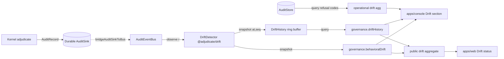

# Behavioral Drift — Design

> Status: Draft (Phase-1 design, pending approval) · Roadmap: WS3 Web Parity · Target apps: console + web

## Problem

Operators need a single, trustworthy answer to "is the agent's decision behaviour shifting?" Today the answer is split across two unreconciled panels and frozen in time:

- **`apps/console/src/components/governance/BehavioralDriftPanel.tsx`** — *statistical* drift. Renders the `governance.behavioralDrift` snapshot from `@adjudicate/drift` (per-dimension TVD + alert counts, ADR-119). Has a component test.
- **`apps/console/src/components/dashboard/DriftPanel.tsx`** — *operational* drift. Counts six integrity-violation refusal codes (`basis_code_drift`, `rewrite_taint_regression`, `defer_signal_drift`, `rewrite_scope_violation`, `guard_panic`, `park_blob_tampered`), client-aggregated from `audit.query({ limit: 1000 })` over a 7d/24h window with an SVG sparkline. No test, and the header literally says "client-side aggregation pending admin-sdk endpoint."

Two deeper gaps:

1. **No time-series.** The behavioral detector is computed **once at startup** by replaying `ALL_MOCKS` into `driftDetector.observe(...)` then `evaluate()` (see `apps/console/src/app/api/admin/trpc/[trpc]/route.ts` lines 206–223). `snapshot()` returns the *current* baseline-vs-recent comparison — a single point. There is no "drift over the last N snapshots" timeline, so an operator cannot see whether a TVD spike is new, recovering, or sustained.
2. **No live feed.** `DriftDetector.attach(bus)` exists (`packages/drift/src/detector.ts`) and subscribes `observe()` to an `AuditEventBus` (`packages/audit/src/event-bus.ts`), but **nothing wires it in the console** — the route handler comment admits "The console has no live AuditEventBus, so warm the detector by replaying the mock audit records at startup."

The roadmap wants **one** Drift section with: active drifts, a drift timeline, severity, and dimensions. This doc reconciles the two signals into one section, adds the bounded time-series the timeline needs, and specifies the sanitized public-web subset.

## Existing Architecture

**Producer — `@adjudicate/drift` (v0.1.0, ADR-119).** Index re-exports `createDriftDetector`, `totalVariationDistance`, and types `DriftDetector / DriftDetectorOptions / DriftSnapshot / DriftDimensionSnapshot / DriftAlert / DriftDimension / DriftSignalKind`.

- `DriftDimension = "decision.kind" | "intent.kind" | "basis"` (closed).
- `DriftSignalKind = "distribution_shift" | "new_category" | "proportion_spike"` (closed).
- `DriftDetector` = `{ observe(record), evaluate(), snapshot(), attach(bus), reset() }`. `observe` is synchronous/total/no-throw (bus-handler contract; malformed records contribute no keys via `keysForDimension`). `evaluate()` is the only method that fires `onDrift`. `snapshot()` is a pure read returning `DriftSnapshot { schemaVersion: 1, baselineWindow, recentWindow, alertThreshold, totalObserved, dimensions[] }`.
- Distributions are count-based with a **frozen baseline** (first `baselineWindow` observations) vs a **trailing recent** FIFO window (`recentWindow` keys), bounded at `maxCategoriesPerDimension` (default 64) with an `__overflow__` bucket.
- `totalVariationDistance(a,b)` = `0.5·Σ|p_i−q_i|`, bounded [0,1], both-empty→0, one-empty→1.

**SDK — `@adjudicate/admin-sdk` (v1.0.0).** `packages/admin-sdk/src/schemas/behavioral-drift.ts` re-declares the wire shape as Zod with **no dependency** on `@adjudicate/drift`: `DriftDimensionNameSchema`, `DriftSignalKindSchema`, `DriftAlertSchema`, `DriftDimensionSnapshotSchema`, `BehavioralDriftResultSchema` (+ `BehavioralDriftResultParsed`). The tRPC router (`packages/admin-sdk/src/trpc/index.ts`) exposes `governance.behavioralDrift` — a `.query()` with `.output(BehavioralDriftResultSchema)` that throws `PRECONDITION_FAILED` when `ctx.driftDetector` is absent; `AdminContext.driftDetector?: { snapshot(): BehavioralDriftResultParsed }`.

**Console adopter.** `route.ts` constructs the detector from `DRIFT_CONFIG` (`apps/console/src/lib/drift-config.ts`: `baselineWindow: 3, recentWindow: 4, alertThreshold: 0.25, dimensions: all three`), warms it from `ALL_MOCKS`, calls `evaluate()` (logging warm-up alerts), and threads `driftDetector` into `AdminContext`. The hook `apps/console/src/hooks/useBehavioralDrift.ts` calls `trpc.governance.behavioralDrift.query()` (retry: false; `PRECONDITION_FAILED`→empty state).

**`apps/web`.** No governance dashboards. `src/sections/ConsolePreview.tsx` is a 100% static marketing card (no data, just copy and a link). `src/app/providers.tsx` mounts an unused React Query `QueryClient`. node-only vitest, 1 test, no jsdom/RTL, no charting lib, no auth/tenant model.

**Real vs demo today:** the detector, schema, and procedure are real and wired; the **data** is a single startup replay of `ALL_MOCKS` (demo). No live bus, no history.

## Proposed Architecture

Three changes, parity-first and additive:

1. **`@adjudicate/drift` (MINOR):** add a bounded, deterministic **snapshot-history accumulator** — `createDriftHistory({ capacity, snapshotEvery? })` that records `snapshot()` results into a fixed-capacity ring buffer keyed by a harness-supplied `at` timestamp + monotonic `seq`. New types `DriftHistory`, `DriftHistoryEntry`, `DriftHistoryView`. The detector gains an optional `history` hook so `attach(bus)` deployments append on a cadence. Nothing here reaches the kernel; the bus stays lossy/best-effort.
2. **`@adjudicate/admin-sdk` (MINOR):** add `DriftHistoryEntrySchema` / `DriftHistoryResultSchema` (`packages/admin-sdk/src/schemas/behavioral-drift.ts`) and a new procedure `governance.driftHistory` reading `ctx.driftHistory?: { query(input): DriftHistoryResultParsed }` (throws `PRECONDITION_FAILED` when absent — same pattern as `behavioralDrift`).
3. **`apps/console` + `apps/web` (app-only):** reconcile both panels into one **Drift** section (Active Drifts / Dimensions / Timeline; operational + behavioral as clearly-labelled distinct sub-signals). Console wires `detector.attach(auditEventBus)` and `driftHistory` (see cross-cutting real-time wiring). `apps/web` gets a read-only sanitized "Drift status" summary served from a new public aggregate endpoint.



## API Design

### `@adjudicate/drift` (new exports)

```ts
export interface DriftHistoryEntry {
  readonly at: string;          // ISO-8601, HARNESS-SUPPLIED — never Date.now()
  readonly seq: number;         // monotonic insertion counter, deterministic
  readonly snapshot: DriftSnapshot;
}

export interface DriftHistoryView {
  readonly capacity: number;
  readonly count: number;       // entries currently retained (<= capacity)
  readonly dropped: number;     // total evicted since reset (oldest-first)
  readonly entries: ReadonlyArray<DriftHistoryEntry>; // oldest -> newest
}

export interface DriftHistoryOptions {
  readonly capacity: number;            // ring-buffer cardinality bound (ADR-119)
  readonly snapshotEvery?: number;      // record once per N observe() calls; default 1
}

export interface DriftHistory {
  /** Append a snapshot stamped with a harness-supplied time. Pure over inputs. */
  record(snapshot: DriftSnapshot, at: string): void;
  /** Wire to a detector + bus: append on the snapshotEvery cadence. Returns unsub. */
  attach(detector: DriftDetector, bus: AuditEventBusLike, clock: () => string): () => void;
  view(): DriftHistoryView;
  reset(): void;
}

export function createDriftHistory(opts: DriftHistoryOptions): DriftHistory;
```

`attach` takes an explicit `clock: () => string` — the **adopter/harness** supplies the timestamp; the package never calls a clock. The bus-handler stays no-throw.

### `@adjudicate/admin-sdk` (new tRPC procedure)

Naming consistent with existing `governance.*` queries (`behavioralDrift`, `redTeam`, `tokenBudget`, `configSealStatus`, `policyCoherence`):

```ts
// input
DriftHistoryQuerySchema = z.object({
  limit: z.number().int().positive().max(500).default(100),
  dimension: DriftDimensionNameSchema.optional(),   // narrow the timeline to one dimension
  since: z.string().datetime().optional(),          // ISO filter, inclusive
});

// procedure
governance.driftHistory: t.procedure
  .input(DriftHistoryQuerySchema)
  .output(DriftHistoryResultSchema)
  .query(async ({ input, ctx }) => {
    if (!ctx.driftHistory) throw new TRPCError({ code: "PRECONDITION_FAILED",
      message: "Drift-history store not configured. Wire a @adjudicate/drift DriftHistory into the route handler context." });
    return ctx.driftHistory.query(input);
  });
```

`AdminContext` gains `readonly driftHistory?: { query(input: DriftHistoryQuery): DriftHistoryResultParsed }`.

### Public web aggregate (app-only, NOT admin-sdk)

`apps/web` is unauthenticated and must never reach `adminRouter`. The public summary is computed **server-side in `apps/web`** from already-public aggregates (alert counts + top dimension only), exposed via a Next route handler `GET /api/public/drift-status` returning a hand-rolled, redaction-reviewed shape (no `baseline`/`recent` category maps, no raw counts beyond rounded totals). No new admin-sdk surface for the web view.

## Data Model

```ts
// admin-sdk Zod (re-declared shapes; no @adjudicate/drift dependency)
DriftHistoryEntrySchema = z.object({
  at: z.string().datetime(),
  seq: z.number().int().nonnegative(),
  snapshot: BehavioralDriftResultSchema,            // existing schema, reused
});

DriftHistoryResultSchema = z.object({
  schemaVersion: z.literal(1),                      // pinned for dashboards (ADR-119 lifecycle)
  capacity: z.number().int().positive(),
  count: z.number().int().nonnegative(),
  dropped: z.number().int().nonnegative(),
  entries: z.array(DriftHistoryEntrySchema),        // oldest -> newest, len <= limit
});
export type DriftHistoryResultParsed = z.infer<typeof DriftHistoryResultSchema>;
export type DriftHistoryQuery = z.infer<typeof DriftHistoryQuerySchema>;
```

**Closed taxonomies (unchanged, must not widen):** `DriftDimension` (3 values), `DriftSignalKind` (3 values), Decision-6 outcomes / Taint / IntentActor / BasisCategory. Adding a *dimension* or *signal* later is a MINOR per ADR-119 lifecycle, but is **out of scope** here.

**Bounded cardinality (ADR-119 discipline):** the ring buffer is capped at `capacity` entries; each entry's `snapshot.dimensions[*].baseline/recent` is already capped at `maxCategoriesPerDimension` with `__overflow__`. Total retained payload is therefore `O(capacity · dimensions · maxCategories)` — fixed. `dropped` exposes eviction so dashboards never silently lose history without a signal.

**Events:** no new `GovernanceEvent` taxonomy entries. Drift snapshots are **telemetry outside the determinism boundary** — they are read-models over the audit stream, never emitted into the audit ledger and never an audit-record field.

## Determinism Analysis

- **Outside the determinism boundary, by construction.** The kernel never imports `@adjudicate/drift` (ADR-119 ships a dependency-direction test asserting core has no such dep). Nothing here reaches `intentHash`, `adjudicate()`, policy, or state. The `AuditEventBus` is lossy/best-effort and, by its own contract (`packages/audit/src/event-bus.ts`), "never feeds adjudication."
- **Snapshots are deterministic over the observation sequence.** Windows advance by **observation count**, not wall-clock; TVD is deterministic; `evaluate()`/`snapshot()` iterate keys in sorted order. ADR-119 already asserts via fast-check that two detectors fed the same record sequence produce byte-identical output. The history accumulator preserves this: `record()` is a pure append of `(snapshot, at, seq)`; the ring buffer's eviction is FIFO and total.
- **No wall-clock, no RNG on any path.** `DriftHistory.attach` takes `clock: () => string` from the harness; `record(snapshot, at)` takes the timestamp explicitly. The package itself calls neither `Date.now()` nor RNG. This mirrors `DriftSnapshot`'s existing clock-free design and the kernel rule that timestamps are supplied by the harness/adopter.
- **Ordering.** Within one bus instance, subscribers see records in emit order (event-bus contract). Across replicas, Redis pub/sub preserves channel order. Because drift is count-windowed, two replicas that observe the **same** ordered sequence converge; replicas observing **different** subsequences (best-effort loss) may diverge — acceptable because drift is observational telemetry, not a governance record. The durable `AuditStore` (replay source of truth) is untouched.
- **Taint lattice.** Drift reads `decision.kind`, `envelope.kind`, and `decision_basis[].category` only. It never mutates records, never participates in rewrite/pause/resume, and therefore cannot perturb the taint lattice. The operational sub-signal surfaces `rewrite_taint_regression` as a *count for display*; it does not re-derive or relabel taint.

## Security Analysis

- **Threat: drift as a side-channel / data-leak.** `snapshot().dimensions[*].baseline`/`recent` are category→count maps over `decision.kind`, `intent.kind`, and `basis.category` — already closed/low-cardinality vocabularies, never raw payloads, PII, prompt text, or tokens. The **console** (authenticated operator) may see full maps. The **public web** view must NOT: it ships only (a) total active-alert count, (b) the single top-drifting dimension name, (c) a coarse severity band (ok/elevated/high). No category maps, no raw counts, no `__overflow__` exposure, no timeline entries with per-category breakdown. A redaction review gate (see Observability) enforces the allowlist field-by-field.
- **Abuse: inference of operational posture from the public view.** Even aggregate "drift is high" leaks that something changed. Mitigation: the public summary is **rounded and banded** (severity bucket, not a TVD number), refreshed on a coarse cadence (e.g. 5 min cache), and carries no dimension *category* values — only the dimension *name* (`decision.kind`), which is public vocabulary. This prevents an attacker from confirming "my injected intent kind landed" via a `new_category` signal on the public surface.
- **Prompt-injection path.** A crafted intent could try to spike a dimension (e.g. flood a new `intent.kind`) to (a) generate alert noise / DoS the operator's attention, or (b) probe the public view for confirmation. The `maxCategoriesPerDimension` cap + `__overflow__` bucket bound the cardinality so a flood of distinct injected keys collapses into one overflow bucket rather than exploding the snapshot. Alerts remain bounded (one `distribution_shift` per dimension; `new_category`/`proportion_spike` are per-key but capped by the category bound). The public view never echoes injected category strings.
- **Replay/auth.** `governance.driftHistory` sits behind the same fail-closed bearer auth (`ADMIN_API_TOKEN`) and actor extraction (`x-adjudicate-actor-*`) as every other `governance.*` procedure; it is a `.query` (read-only, no mutation, no privileged action). The public `apps/web` route is unauthenticated **by design** but read-only and serves only the allowlisted aggregate — it cannot reach `adminRouter` and has no token.
- **Tampering / integrity.** The ring buffer is in-process memory; it is **not** a system of record. Loss or tampering degrades observability only — the durable audit ledger remains the governance source of truth and is independently hash-chained.

## UI Design

### Console (full operator surface) — single **Drift** section

Reconciles `BehavioralDriftPanel` + `DriftPanel` into one section with three sub-views and a clear "Behavioral (statistical)" vs "Operational (integrity)" labelling so the two signals are never conflated.

**Sub-view A — Active Drifts** (table of current alerts across both signals)
- Columns: Signal source (Behavioral/Operational badge), Dimension/Code, Signal kind (`distribution_shift`/`new_category`/`proportion_spike`/integrity code), Severity (magnitude vs threshold → ok/elevated/high band + numeric), Baseline→Recent counts, Category (if any).
- Severity = `magnitude / threshold` banded; sorted high→low. Filters: by source, by dimension, by severity band.
- Loading: skeleton rows (3) + "Loading drift…". Empty: "No active drift. Distributions are within threshold." (this is the healthy state — styled neutral, not error). Error / `PRECONDITION_FAILED`: keep the existing honest copy — "No behavioral-drift detector configured. Wire an @adjudicate/drift detector into the route handler context." Operational error: "Failed to load audit records."

**Sub-view B — Dimensions** (per-dimension TVD, from `behavioralDrift`)
- Reuses today's table: Dimension · TVD · Alerts, TVD highlighted amber at/over threshold. Adds an expandable baseline-vs-recent bar for the selected dimension (operator-only — shows category maps).
- Loading/empty/error: as above; empty = "Insufficient observations for a baseline comparison" when `totalObserved < baselineWindow`.

**Sub-view C — Timeline** (NEW, from `governance.driftHistory`)
- Per-dimension TVD plotted over `entries[].at` (line/area), with alert markers and a `dropped > 0` "history truncated (N evicted)" caption. Dimension selector + `since` range. Hover shows the snapshot's alert list at that point.
- No charting lib in repo today → render as a lightweight inline SVG sparkline/area (same approach as the operational `Sparkline` in `DriftPanel.tsx`), not a new dependency.
- Loading: shimmer placeholder sized to the chart. Empty (`count === 0`): "No drift history yet — snapshots accumulate as audit events arrive." Error: "Failed to load drift history."

**a11y (all sub-views):** tables use real `<th scope>`; severity conveyed by **text band + icon**, never colour alone (the operational panel currently encodes "hot" only via red — fix in reconciliation). SVG charts get `role="img"` + `aria-label` summarising current vs threshold (today's `Sparkline` is `aria-hidden` with no text alternative — add a visually-hidden data table fallback). Section is keyboard-navigable; filters are real `<select>`/`<button>` with labels.

**Responsive:** desktop = three sub-views side-by-side or tabbed; < md = stacked, tables become 2-line card rows (label over value), timeline collapses to the latest-N sparkline with a "view full timeline" disclosure.

### Web (apps/web) — READ-ONLY sanitized **Drift status** summary

Replaces the static `ConsolePreview` mock numbers (or adds a small public band). Public transparency view: aggregates only.

- Content: one badge — severity band (ok / elevated / high) + "active drift alerts: N" (rounded) + "top dimension: `decision.kind`" (dimension **name** only). Optional: a 7-point coarse sparkline of the **count of active alerts** over recent snapshots (no per-category, no TVD numbers).
- Data source: `GET /api/public/drift-status` (server-side, allowlisted fields). NO tRPC/adminRouter, NO token, NO category maps, NO raw counts beyond the rounded total.
- Loading: static skeleton badge (no spinner flash). Empty: "Drift monitoring active — no alerts." Error: render the neutral "monitoring active" copy (fail-safe: a public site must not surface stack traces or "detector not configured"). 
- a11y: badge is text + icon, `aria-label` "Drift status: elevated, 2 active alerts, top dimension decision kind". Sparkline `role="img"` with text summary. Respects `prefers-reduced-motion` (no animated count-up).
- Responsive: single badge, full-width on mobile, inline chip on desktop. Reuses the existing (currently unused) React Query provider for client refresh, or static server-render with revalidate — no new dep.

## Observability Design

- **Metrics (Prometheus-compatible, emitted by the adopter, not the package):**
  - `adjudicate_drift_active_alerts{dimension,signal}` (gauge) — current alert count per dimension/signal.
  - `adjudicate_drift_tvd{dimension}` (gauge) — latest TVD per dimension.
  - `adjudicate_drift_history_dropped_total` (counter) — evicted snapshots (ring saturation indicator).
  - `adjudicate_drift_observed_total` (counter) — observations fed (bus liveness).
- **Logs:** keep the existing warm-up `console.warn("[adjudicate] behavioral-drift warm-up: N alert(s) across …")`; add a structured log when a dimension **crosses** threshold (transition, not steady-state) to avoid log spam. Never log category values for `basis`/`intent.kind` at info level (potential low-cardinality leak in shared logs) — log the dimension + count only.
- **Audit records / event-bus:** none added. Drift is read-model telemetry; it consumes the `AuditEventBus`, it does not publish to it and does not write the audit ledger.
- **Dashboard / alerts / SLO:** suggested alert = "any dimension TVD ≥ threshold sustained over ≥3 consecutive snapshots" (timeline-driven, suppresses single-snapshot noise). SLO framing: drift is a *signal*, not an availability SLO; pair with a "drift-history pipeline healthy" check (`observed_total` increasing while a bus is attached).

## Testing Strategy

- **Unit (`@adjudicate/drift`):** ring-buffer FIFO eviction at capacity; `dropped` accounting; `snapshotEvery` cadence; `record()` purity (same inputs → same view); `attach` returns a working unsubscribe; clock injected (no `Date.now`).
- **Unit (admin-sdk):** `DriftHistoryQuerySchema`/`DriftHistoryResultSchema` parse valid + reject invalid (negative seq, bad datetime, `schemaVersion !== 1`, `limit > 500`); `governance.driftHistory` throws `PRECONDITION_FAILED` when `ctx.driftHistory` absent (via `createAdminCaller`); respects `limit`/`dimension`/`since` filters.
- **Integration:** `bridgeAuditSinkToBus` → `detector.attach(bus)` → `history.attach(detector,bus,clock)` end-to-end; assert history grows then evicts; assert `behavioralDrift` snapshot matches the newest history entry.
- **Conformance:** dimension/signal enums remain the 3+3 closed sets; `BehavioralDriftResultSchema` shape unchanged (back-compat with existing dashboards).
- **Replay:** dependency-direction test (core/kernel must not import `@adjudicate/drift` — extend ADR-119's existing test to cover the new history module); fast-check determinism — same record sequence + same injected clock → byte-identical `DriftHistoryView`.
- **Security/adversarial:** flood distinct injected `intent.kind` keys → assert `__overflow__` collapse + bounded alert count; assert the public `/api/public/drift-status` payload contains ONLY the allowlisted fields (snapshot test that fails if `baseline`/`recent`/category strings/raw counts ever appear).
- **UI component (RTL, console):** reconciled Drift section — loading/empty/error/`PRECONDITION_FAILED` states; severity band rendered as text+icon (not colour-only); timeline empty state; a11y (chart `aria-label`, table `th scope`). (apps/console already has jsdom + RTL.)
- **UI component (web):** apps/web has node-only vitest today — either (a) add jsdom+RTL to test the public badge, or (b) keep it a server component and snapshot-test the `/api/public/drift-status` handler's redaction. Prefer (b) to avoid expanding the web test toolchain; note this as a sequencing decision.
- **E2E (Playwright):** console — operator opens Drift section, sees Active/Dimensions/Timeline, filters by severity. web — public visitor sees the sanitized badge and the page exposes no admin endpoint (assert no `/api/admin/trpc` request, no token).

## Rollout & Release Impact

**New published surface — call out per governance rule (EXTENSION_POLICY §2.2/§2.3; SEMVER_GOVERNANCE §5/§9):**

| Package | Bump | New symbols |
|---|---|---|
| `@adjudicate/drift` | **minor** (0.1.0 → 0.2.0, goes stable with WS3 wave) | `createDriftHistory`, `DriftHistory`, `DriftHistoryEntry`, `DriftHistoryView`, `DriftHistoryOptions` |
| `@adjudicate/admin-sdk` | **minor** | `DriftHistoryEntrySchema`, `DriftHistoryResultSchema`, `DriftHistoryQuerySchema`, `DriftHistoryResultParsed`, `DriftHistoryQuery`, `governance.driftHistory`, `AdminContext.driftHistory` |

- **Changeset:** one combined changeset (`drift: minor`, `admin-sdk: minor`) joining the existing 15 staged changesets in the single post-v1 **MINOR** release wave. No major; closed enums unchanged; wire format append-only. `@adjudicate/drift` reaches **0.2.0 stable** per locked sequencing (parity-first, ship-together).
- **ADR:** create **ADR-119-follow-up** ("drift snapshot history + `governance.driftHistory`") in the SAME PR — records the ring-buffer cardinality bound, the injected-clock determinism guarantee, the public-view redaction allowlist, and confirms enums do not widen.
- **V1_FREEZE_MATRIX rows to add:** `@adjudicate/drift` currently has **no section** in the matrix (it postdates the 2026-05-20 snapshot). Add a new `@adjudicate/drift` §: rows for `createDriftDetector`/`DriftDetector`/`DriftSnapshot`/`totalVariationDistance` (existing, retroactive) AND the new `createDriftHistory`/`DriftHistory*` symbols — tier `F` (or `E` until an external adopter wires a live bus), owner `drift`, replay impact `none`, extension `additive`/`closed` (enums), tol `scheduled`. Add a row in §8 `@adjudicate/admin-sdk` for `governance.driftHistory` + the new schemas (mirroring the existing behavioral-drift schema row), and bump the drift package version row.
- **App-only changes (no published surface):** the console Drift-section reconciliation and the `apps/web` `/api/public/drift-status` route + badge are application code — no changeset/ADR/matrix rows, but the web redaction allowlist must be reviewed in the same PR.
- **Migration notes:** purely additive. Existing `governance.behavioralDrift` consumers and `BehavioralDriftPanel` are untouched. The operational `DriftPanel` is absorbed into the reconciled section but its data source (audit refusal-code counts) is unchanged; the roadmap's "client-side aggregation pending admin-sdk endpoint" note can be retired only if a dedicated operational-drift counter procedure is added later (out of scope — flagged as an open question).

**Effort: M.** Drift package + admin-sdk additions are small and well-patterned; the console reconciliation (three sub-views, a11y fixes, timeline chart without a new dep) and the web public-aggregate route + redaction review are the bulk.
