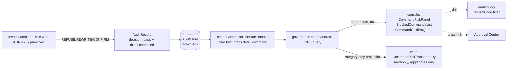

# Command Risk — Design

> Status: Draft (Phase-1 design, pending approval) · Roadmap: WS3 Web Parity · Target apps: console + web

## Problem

Command-risk classification (ADR-123) is live in the kernel layer: `createCommandRiskGuard`
(packages/primitives/src/guards.ts:857) refuses irrecoverable shell commands (`rm -rf /`,
fork bombs, `dd of=/dev/…`, `mkfs`), REWRITEs strippable-flag cases (`rm -rf --force` → `rm -rf`,
taint preserved), and routes recoverable risk (network exfil, credential reads) to
REQUEST_CONFIRMATION. The effects are real and audited — they ride as `validation.command_blocked`
/ `validation.command_flag_stripped` basis codes plus a `business.rule_satisfied`
(`rule: "command_risk_confirm"`) basis on the confirm path.

But there is **no aggregation surface**. An operator can only see command-risk one audit record at a
time via `CommandRiskBadge` (apps/console/src/components/decision/CommandRiskBadge.tsx). There is:

- **no** `packages/admin-sdk/src/schemas/command-risk.ts`,
- **no** `governance.commandRisk` tRPC procedure,
- **no** `createCommandRiskStatsHandler` AuditStore aggregator,
- **no** console dashboard and **no** web-facing transparency view.

This is the readiness **Tier C** gap (no data API; net-new backend). The roadmap requires a
command-risk dashboard at parity with the PII panel: risk distribution by category, a blocked-commands
list, and the queue of commands routed to confirmation (cross-linking the Approval Center). It must
ship the public web a sanitized, aggregates-only transparency view — never raw command text.

Today there is also a latent **data-leak**: the guard threads the **raw command string** into
`DecisionBasis.detail.command` for all three paths (guards.ts:876, :903, :933), and the per-record
badge renders it verbatim (`<code>{detail.command}</code>`, CommandRiskBadge.tsx:48). Any aggregation
or public exposure of this field would leak secrets/credentials embedded in commands. The design must
treat `detail.command` as tainted and never let it reach a count surface, and especially never the web.

## Existing Architecture

**Kernel / primitives (real, frozen by ADR-123):**

- `classifyCommand(command, rules?) → CommandClassification` — pure, no clock/RNG
  (packages/primitives/src/command-classify.ts:71). `CommandClassification = { category:
  "destructive"|"network"|"credential"|"safe"; matchedRuleIds: string[]; disposition:
  "refuse"|"confirm"|"rewrite"|"safe" }`.
- `stripDangerousFlags`, `createCommandRiskGuard`, `DEFAULT_COMMAND_RULES`,
  `DEFAULT_FLAG_STRIP_RULES`, `CommandRiskCategory`, `CommandRule`, `FlagStripRule` — all exported
  from packages/primitives/src/index.ts.
- Basis codes in `@adjudicate/core` (packages/core/src/basis-codes.ts:71-73):
  `validation.COMMAND_FLAG_STRIPPED = "command_flag_stripped"`,
  `validation.COMMAND_SANITIZED = "command_sanitized"`,
  `validation.COMMAND_BLOCKED = "command_blocked"`.
- Recent fix (commit 8e3570b): REFUSE tier broadened to whole-root/whole-home `rm`
  (`CATASTROPHIC_RM_TARGET`, command-classify.ts:44), case-insensitive `isRm`.

**What the guard actually emits (load-bearing for aggregation):**

| Disposition | Decision | Basis emitted | `detail` payload |
|---|---|---|---|
| REFUSE | `decisionRefuse` | `validation.command_blocked` | `{ category, matchedRuleIds, command }` |
| REWRITE (flag strip) | `decisionRewrite` | `validation.command_flag_stripped` | `{ category, matchedRuleIds, command, sanitized, stripped }` |
| REQUEST_CONFIRMATION | `decisionRequestConfirmation` | `business.rule_satisfied` | `{ rule: "command_risk_confirm", category, matchedRuleIds, command }` |

Note: the confirm path is **not** a `validation` code — it is `business.RULE_SATISFIED`. The
aggregator must read both channels. `command_sanitized` is declared but the guard does not currently
emit it; the badge's `COMMAND_CODES` set (CommandRiskBadge.tsx:12) includes it for forward-compat.

**Admin-SDK (consumption layer, no feature-pkg dep):** `adminRouter` from
`@adjudicate/admin-sdk/trpc` (packages/admin-sdk/src/trpc/index.ts). `governanceRouter`
(:312) already has `outcomeDistribution` and `piiClassificationStats` (:331) as the exact pattern to
mirror. `AdminContext.store: AuditStore` (:106) is already wired; `AuditStore.query(AuditQuery)`
returns newest-first records, caps `limit` at 500, inclusive `[since, until]` bounds
(packages/admin-sdk/src/schemas/query.ts:27, store/index.ts:24). The PII handler
(`createPiiClassificationHandler`, handlers/pii-classification.ts) is the precedent: pure fold over
`store.query`, injectable `clock`, bucket map keyed by string, deterministic sort.

**Console (real tRPC, partial surface):** httpBatchLink → `/api/admin/trpc` →
`toNextRouteHandler({ router: adminRouter, … })` (route.ts:337); fail-closed bearer auth
(`requireConsoleAdminAuth`), actor via `extractActor(req)`. `usePiiClassification`
(apps/console/src/hooks/usePiiClassification.ts) + `PiiClassificationPanel`
(components/dashboard/PiiClassificationPanel.tsx) is the dashboard template. Command-risk has **only**
the per-record `CommandRiskBadge` (with test). No hook, no panel.

**Web (apps/web, no governance):** marketing + playground only. `ConsolePreview.tsx` is a 100% static
mock. Has an unused React-Query provider (apps/web/src/app/providers.tsx) but **no** tRPC client, no
auth/tenant model, no charting lib, node-only vitest (no jsdom/RTL).

## Proposed Architecture

Net-new backend aggregation mirroring the PII handler, then two dashboards (console full; web
sanitized). No kernel change — the guard and basis codes are already frozen and sufficient.

- **admin-sdk schemas** (new file `packages/admin-sdk/src/schemas/command-risk.ts`):
  `CommandRiskQuerySchema`, `CommandRiskResultSchema`, `CommandRiskBucketSchema`,
  `CommandRiskCategorySchema`, `CommandRiskDispositionSchema` + inferred types.
- **admin-sdk handler** (new file `packages/admin-sdk/src/handlers/command-risk.ts`):
  `createCommandRiskStatsHandler(deps) → (q) => Promise<CommandRiskResult>` — a pure fold over
  `store.query`, bucketing by `(category × disposition)`. **Reads only enum-bounded fields
  (`category`, `disposition`) from `detail`; never reads or returns `detail.command`.**
- **admin-sdk router**: add `governance.commandRisk` query to `governanceRouter` (trpc/index.ts:312),
  identical shape to `piiClassificationStats` — `store` is already in `AdminContext`, no new context
  wiring, no PRECONDITION_FAILED gate.
- **console**: new `useCommandRisk` hook + `CommandRiskPanel` (distribution table), `BlockedCommandsList`
  (drill into `governance.commandRisk` blocked bucket → `audit.query` filtered to
  `refusalCode: "command_risk_blocked"`), and `CommandConfirmQueue` cross-linking the existing
  `ApprovalsPanel`.
- **web**: a read-only `CommandRiskTransparency` card showing **category distribution only** (no
  disposition split that could imply specific blocked targets, no command text, no drill-down). Sourced
  from a separate **public, redaction-by-construction** read path (see Security).



## API Design

New admin-sdk Zod schemas (consistent with pii-classification.ts naming):

```ts
// packages/admin-sdk/src/schemas/command-risk.ts
export const CommandRiskCategorySchema = z.enum(["destructive", "network", "credential"]);
export const CommandRiskDispositionSchema = z.enum(["blocked", "rewritten", "confirm"]);

export const CommandRiskQuerySchema = z.object({
  since: IsoTimestampSchema,                 // inclusive lower bound (at >= since)
  until: IsoTimestampSchema.optional(),      // handler resolves "now" via injected clock when omitted
  packId: z.string().optional(),             // reserved filter (counts are pack-agnostic, basis-derived)
});

export const CommandRiskBucketSchema = z.object({
  category: CommandRiskCategorySchema,
  disposition: CommandRiskDispositionSchema,
  count: z.number().int().nonnegative(),
});

export const CommandRiskResultSchema = z.object({
  buckets: z.array(CommandRiskBucketSchema),
});
// types: CommandRiskQuery, CommandRiskBucket, CommandRiskResult (z.infer)
```

Handler signature (mirrors `CreatePiiClassificationHandlerDeps`):

```ts
// packages/admin-sdk/src/handlers/command-risk.ts
export interface CreateCommandRiskStatsHandlerDeps {
  readonly store: AuditStore;
  readonly fallbackQueryLimit?: number;   // default 500 (AuditStore cap)
  readonly clock?: () => string;          // injected; default () => new Date().toISOString()
}
export function createCommandRiskStatsHandler(
  deps: CreateCommandRiskStatsHandlerDeps,
): (input: CommandRiskQuery) => Promise<CommandRiskResult>;
```

Fold rules (mapping the two emission channels to the three dispositions):

- `validation.command_blocked` → `disposition: "blocked"`, `category = detail.category`.
- `validation.command_flag_stripped` → `disposition: "rewritten"`, `category = detail.category`.
- `business.rule_satisfied` with `detail.rule === "command_risk_confirm"` → `disposition: "confirm"`,
  `category = detail.category`.
- `detail.category` is validated against `CommandRiskCategorySchema`; unknown values are dropped
  (defensive — closed enum). `detail.command` is **read-skipped** entirely.

tRPC procedure (added to `governanceRouter`, no new context):

```ts
// packages/admin-sdk/src/trpc/index.ts  (inside governanceRouter)
commandRisk: t.procedure
  .input(CommandRiskQuerySchema)
  .output(CommandRiskResultSchema)
  .query(async ({ input, ctx }) => {
    const handler = createCommandRiskStatsHandler({ store: ctx.store });
    return handler(input);
  }),
```

Console hook (mirrors `usePiiClassification`):

```ts
// apps/console/src/hooks/useCommandRisk.ts
export function useCommandRisk(args: { since: string; packId?: string }) {
  return useQuery({
    queryKey: ["governance", "commandRisk", args],
    queryFn: () => trpc.governance.commandRisk.query({ since: args.since,
      ...(args.packId ? { packId: args.packId } : {}) }),
    retry: false,
  });
}
```

Blocked-commands drill reuses the **existing** `audit.query` (no new procedure):
`trpc.audit.query({ since, until, refusalCode: "command_risk_blocked", limit })`. Confirm-queue
cross-link reuses the **existing** `approval.list` surface — no new approval procedure.

**Web public projection:** a separate, narrower read. Two viable shapes (pick at impl, Open
Question): (a) a new admin-sdk procedure `governance.commandRiskPublic` that returns **category counts
only** (no disposition), gated to a public/unauthenticated context; or (b) the web build performs a
server-side projection of `governance.commandRisk` results down to `{ category, count }` behind a
read-only public token. (a) makes the redaction a wire-contract guarantee (preferred) and is the only
option that adds published surface.

## Data Model

**New Zod schemas / closed taxonomies (bounded cardinality):**

- `CommandRiskCategorySchema` — `["destructive","network","credential"]`. Mirrors
  `CommandRiskCategory` minus `"safe"` (safe commands produce no basis, never bucketed). **Closed
  enum**; widening is governed (a new kernel category would be a kernel MAJOR per the Decision/Taint
  freeze posture, so this enum can only grow when ADR-123's category set grows — it will not in the v1
  line). Max cardinality 3.
- `CommandRiskDispositionSchema` — `["blocked","rewritten","confirm"]`. Closed; one-to-one with the
  three guard paths. Max cardinality 3.
- `CommandRiskBucketSchema` — `(category × disposition × count)`. Max 3×3 = **9 buckets**, fully
  bounded, safe to render without pagination.
- `CommandRiskQuerySchema` / `CommandRiskResultSchema` — inclusive `[since, until]` per the
  APIReviewer-003 boundary convention (query.ts:18).

**No new Events / no kernel types.** Command-risk effects already exist as `AuditRecord.decision_basis`
entries (`AuditRecord` is additive-only, frozen). No `GovernanceEvent` taxonomy change. The
`command_sanitized` basis code already exists in core and is not widened.

**Field provenance (what we deliberately do NOT model):** `detail.command`, `detail.sanitized`,
`detail.stripped`, `detail.matchedRuleIds` are present on records but are **never** projected into any
schema in this design. Only `category` (closed enum) and the basis `code`/`rule` discriminator are
consumed.

## Determinism Analysis

The aggregation is a **pure fold** over a finite, already-persisted set of `AuditRecord`s — it has the
identical determinism profile to `createPiiClassificationHandler` and is verified the same way.

- **Inside the determinism boundary:** nothing new. The kernel decision
  (REFUSE/REWRITE/REQUEST_CONFIRMATION) is already pure over `(envelope, policy, state)`;
  `classifyCommand` is pure (no clock/I/O/RNG, command-classify.ts:1-7). On REWRITE the guard
  rebuilds the envelope with `taint: envelope.taint` unchanged (guards.ts:928) and the same `nonce`
  /`createdAt`, so `intentHash` and replay classification are preserved.
- **Outside the determinism boundary:** the stats handler and both dashboards. Counts are telemetry —
  they are **never** an input to any kernel decision. This honors the rule that
  observability/telemetry must never become a kernel input.
- **No wall-clock / RNG in the deterministic path.** The handler's only clock use is resolving an
  omitted `until` window bound via an **injected** `clock` (default `Date.now`), exactly as the PII
  handler does. Tests inject a fixed clock for reproducible windows. The fold itself does not read the
  clock.
- **Ordering / determinism of output:** `AuditStore.query` returns records newest-first; the fold is
  order-insensitive (commutative integer increments into a map). Output buckets are emitted in a
  **deterministic sort** (category rank desc: destructive > credential > network, then disposition
  ascending) so two runs over the same window are byte-identical — required for snapshot/conformance
  tests.
- **Replay safety:** replaying an envelope re-derives the same decision and the same basis codes; the
  stats handler over the replayed audit stream produces identical buckets. No new replay-classify
  surface; `Replay impact: none` for every new symbol.
- **Window-boundary determinism:** the handler re-filters `record.at < since` / `> until` after the
  store query (defensive, like the PII handler at handlers/pii-classification.ts:52-53) so a store that
  over-returns cannot perturb counts.

## Security Analysis

**Threat model.** This surface aggregates the highest-signal-for-attackers data in the system —
exactly which dangerous commands an LLM attempted. Two adversaries: (1) an **untrusted LLM/prompt-injected
plan** trying to launder a dangerous command past the dashboard or into the public view; (2) a
**dashboard viewer** (especially the anonymous public web viewer) trying to read secrets or
reconnaissance from command text.

- **Primary data-leak: `detail.command` contains live secrets.** The guard stores raw command strings
  (guards.ts:876), and credential-category rules fire on exactly the commands most likely to contain
  tokens (`echo $AWS_SECRET_…`, `cat ~/.aws/credentials`, command-classify.ts:59-60). **Mitigation:**
  the stats handler reads **only** `category` + the basis discriminator and returns the 9-bucket count
  result; `detail.command` is never read into any returned object. The schema has no `command` field,
  so even a buggy handler cannot serialize it past the `.output()` Zod gate.
- **Console drill-down leak.** `BlockedCommandsList` shows real records and an operator legitimately
  needs to see the offending command. **Mitigation:** integrate `createDataClassificationGuard`'s
  redaction (the `redactWith` machinery, guards.ts:662) as a **display-time** sanitizer on
  `detail.command` before render — mask `SECRET|TOKEN|PASSWORD|KEY` env expansions and credential file
  paths (reuse `DEFAULT_REDACT_TOKEN`). This is a console-app concern (not a new published symbol) but
  it also fixes the existing `CommandRiskBadge` raw-render leak (CommandRiskBadge.tsx:48) — fold that
  fix into the same PR.
- **Public web view = category distribution ONLY.** The web `CommandRiskTransparency` card shows
  `{ category → count }` and nothing else: no disposition split (which would let an outsider infer
  "credential-blocked spiked → an exfil attempt is in progress"), no counts low enough to fingerprint a
  single incident (apply a small-count floor / "<5" bucketing), no command text, no timestamps finer
  than the marketing window, no drill-down, no tenant scoping that leaks tenant existence. Redaction is
  **by construction**: the public projection's schema literally cannot carry command text.
- **Prompt-injection path.** An injected plan cannot change classification (it is a pure rule table)
  and cannot suppress the basis (it is emitted by the guard, not by model output). It *could* try to
  poison `detail.category` with a bogus value to skew the chart; the handler validates `category`
  against the closed `CommandRiskCategorySchema` and **drops** unknown values, so a poisoned category is
  counted as nothing rather than corrupting a bucket. Counts are never fed back to the kernel, so a
  poisoned dashboard cannot influence future decisions.
- **Taint implications.** `detail.command` is effectively `UNTRUSTED`-origin content (it came from an
  LLM-proposed plan). Treating it as a value to render is a taint violation; this design keeps it out
  of all aggregation and out of the web entirely, and redacts it on the one console surface that must
  show it. The REWRITE path preserves the taint lattice (`taint: envelope.taint`, guards.ts:928), so
  aggregation over rewritten records does not imply any taint downgrade.
- **Abuse / DoS.** `since`/`until` are Zod-validated ISO-8601; `limit` is capped at 500 by the store.
  An attacker cannot request an unbounded scan. The public projection must be cached/rate-limited
  (it is unauthenticated) and must not accept arbitrary `since` (clamp to a fixed public window, e.g.
  last 30 days, to prevent timing-window fingerprinting).
- **AuthZ.** `governance.commandRisk` rides the same fail-closed bearer auth as the rest of the console
  router; the public projection is the only deliberately unauthenticated path and is therefore the
  narrowest possible (category counts, clamped window).

## UI Design

### Console (full operator surface)

**1. `CommandRiskPanel` — risk distribution (mirrors `PiiClassificationPanel`).**
A 3×3 table: rows = category (destructive / credential / network, severity-ordered), columns =
Blocked / Rewritten / Confirm, cells = counts; a totals row. `since` prop drives `useCommandRisk`.
Category cells color-coded matching `CommandRiskBadge` (destructive=red, credential=fuchsia,
network=amber).
- *Loading:* "Loading command-risk stats…" placeholder row (matches PII panel:59).
- *Empty:* "No risky commands in this window." (italic faint) when all 9 buckets are 0.
- *Error:* "Command-risk stats unavailable." (`isError || !data`) — never surfaces raw error text.
- *a11y:* `<table>` with `<th scope="col">`; `data-testid="command-risk-panel"`; counts in
  `tabular-nums`; color is not the only signal (category label text present).
- *Responsive:* table scrolls horizontally inside `overflow-hidden` panel on narrow widths; below
  `sm` collapse Rewritten/Confirm into an expandable detail row.

**2. `BlockedCommandsList` — drill into blocked commands.**
A table of the most recent `command_risk_blocked` audit records via `audit.query`
(`refusalCode: "command_risk_blocked"`). Columns: time, category, **redacted command**, matched rule
ids, link to the full Audit Explorer record. The command column is run through the display-time
redactor before render.
- *Loading:* skeleton rows. *Empty:* "No blocked commands in this window." *Error:* "Could not load
  blocked commands."
- *a11y:* each row links to `/audit/{id}` with an accessible name "View audit record {id}"; redacted
  spans carry `title="redacted"` / `aria-label`.
- *Responsive:* command column truncates with tooltip on narrow widths; stacks to a card list below
  `sm`.

**3. `CommandConfirmQueue` — commands awaiting confirmation (cross-link Approval Center).**
Shows the `confirm`-disposition count from `useCommandRisk` as a headline, then embeds/links the
existing `ApprovalsPanel` filtered to command-risk-origin requests (where the approval engine carries
the `command_risk_confirm` rule). It does **not** add an approval procedure — it reuses
`approval.list`. A "Open in Approval Center" link routes to the existing approvals view.
- *Loading/Empty/Error:* inherit `ApprovalsPanel` states; headline shows "—" while loading, "0
  pending" when empty.
- *a11y:* the headline count has an `aria-live="polite"` region so newly queued confirmations are
  announced. *Responsive:* panel stacks under the distribution table on mobile.

These three mount on the existing console governance dashboard alongside `PiiClassificationPanel`,
sharing the same `since` window control.

### Web (read-only, public, sanitized subset)

**`CommandRiskTransparency` card** — replaces part of the static `ConsolePreview` mock with one live,
public-safe chart: **category distribution only** (a single horizontal bar or donut, 3 categories,
counts or "<5" floored). Copy frames it as "What Adjudicate refuses in the wild." No disposition split,
no command text, no drill-down, no timestamps, no tenant data.
- *Data:* `governance.commandRiskPublic` (clamped 30-day window, cached/rate-limited) — see Rollout.
- *Charting:* web has **no charting lib today**; use a CSS/SVG bar (3 bars) to avoid adding a heavy
  dependency, or adopt a tiny lib if approved (Open Question).
- *Loading:* shimmer bars with neutral height. *Empty:* "No command-risk activity to show." *Error:*
  silently fall back to the existing static `ConsolePreview` mock copy (public site must never show an
  error stack or imply an outage).
- *a11y:* the chart has a visually-hidden data table (`<table>`) as the accessible equivalent; bars
  have `aria-label="{category}: {count}"`; respects `prefers-reduced-motion` (no shimmer animation).
- *Responsive:* bars stack vertically below `sm`; fits the existing `ConsolePreview` two-column grid on
  desktop.

The full Blocked-Commands list, Confirm queue, drill-downs, and any disposition-level detail are
**operator-only** and never exposed on web.

## Observability Design

- **Prometheus metrics** (emitted by the route handler / adapter, outside determinism):
  `adjudicate_command_risk_total{category,disposition}` (counter, mirrors the 9 buckets);
  `adjudicate_command_risk_stats_query_duration_seconds` (histogram, handler latency);
  `adjudicate_command_risk_public_requests_total{result}` (counter, to watch public-endpoint abuse).
- **Logs:** structured handler log at debug `{ since, until, recordCount, bucketCount }` — **never**
  log `detail.command`. A WARN when a record carries an unknown `detail.category` (poisoning signal,
  per Security).
- **Audit records:** unchanged — the source of truth already exists. No new audit field.
- **Event-bus:** none added (counts are derived, not events). The kill-switch / emergency events are
  unaffected.
- **Dashboards / alerts / SLO:** operator alert on
  `increase(adjudicate_command_risk_total{disposition="blocked",category="credential"}[15m]) > N`
  (sustained credential-exfil attempts = likely compromised agent). SLO: stats query p99 < 100ms over
  a 500-record window (it is an in-memory fold). Alert on public-endpoint error/timeout rate to detect
  scraping.

## Testing Strategy

- **Unit (admin-sdk handler):** classification mapping per channel — `command_blocked`→blocked,
  `command_flag_stripped`→rewritten, `business.rule_satisfied`+`rule:"command_risk_confirm"`→confirm;
  unknown `detail.category` dropped; `detail.command` never appears in output; deterministic bucket
  sort; injected-clock window resolution; inclusive `[since,until]` boundary records included/excluded;
  empty window → `{ buckets: [] }`.
- **Integration (tRPC):** `createAdminCaller` → `governance.commandRisk` returns
  `CommandRiskResultSchema`-valid output; respects auth context (unauth rejected); `audit.query` drill
  with `refusalCode:"command_risk_blocked"` returns the seeded blocked records.
- **Conformance:** the 9-bucket enum product is exhaustive and bounded — a conformance vector asserts
  every `(category × disposition)` pair is reachable and no others. Assert the output schema's enums
  match the kernel's `CommandRiskCategory` minus `"safe"`.
- **Replay:** replay a seeded audit stream through the handler twice → byte-identical buckets; replay
  an envelope that triggered a REWRITE → same `intentHash`, same `command_flag_stripped` basis, same
  bucket (proves telemetry tracks replay).
- **Security / adversarial:** a record whose `detail.command` contains
  `echo $AWS_SECRET_ACCESS_KEY` → secret never appears in handler output JSON; poisoned
  `detail.category:"<script>"` → dropped, no bucket corruption; public projection over the same data →
  emits category counts only, no disposition, no command text; small-count floor applied.
- **UI component (RTL, console — jsdom available):** `CommandRiskPanel` loading/empty/error/populated
  states; color-not-sole-signal; `BlockedCommandsList` renders **redacted** command (assert the raw
  secret string is absent from the DOM — pins the leak fix); `CommandConfirmQueue` headline + Approval
  Center link.
- **UI (web):** web has node-only vitest (no jsdom/RTL today). Either (a) add jsdom+RTL to apps/web for
  this card (parity investment, Open Question), or (b) cover the public projection logic with a node
  test asserting the output has no `command`/`disposition` keys and is window-clamped. Recommend (b)
  for the projection + (a) only if web grows more dashboards.
- **E2E (Playwright):** console — open governance dashboard, see distribution, click a blocked command,
  land on the audit record, follow confirm-queue link to Approval Center. Web — load homepage, the
  transparency card renders bars (or falls back to static mock without error) and exposes the
  visually-hidden data table to assistive tech.

## Rollout & Release Impact

**New published surface — `@adjudicate/admin-sdk` MINOR bump** (additive-only; no kernel change, no
major). Joins the existing 15 staged changesets in the single combined post-v1 minor wave; the two new
packs go stable at 0.2.0 in the same wave. Parity-first, ship-together.

- **Changeset** (new, e.g. `.changeset/command-risk-stats.md`), `"@adjudicate/admin-sdk": minor`:
  "feat(admin-sdk): add `governance.commandRisk` — aggregates command-risk dispositions by
  (category × disposition) for the console; new `CommandRiskQuery/Result/Bucket` schemas +
  `createCommandRiskStatsHandler` (ADR-128). Public category-only projection
  (`governance.commandRiskPublic`) for the web transparency view." Pattern matches the
  `pii-data-classification-guard.md` changeset's admin-sdk line.
- **ADR to create:** **ADR-128 — Command-risk aggregation surface** (next free number; 127 is the
  latest under docs/architecture/adr/). Follow-up to ADR-123. Records: read-only telemetry outside the
  determinism boundary; the deliberate `detail.command` redaction-by-construction; the public
  category-only contract; why the confirm path reads `business.rule_satisfied` rather than a
  `validation` code. Per EXTENSION_POLICY §2.2/§2.3 and SEMVER_GOVERNANCE §5/§9, the ADR ships in the
  **same PR** as the symbols.
- **V1_FREEZE_MATRIX.md rows to add** (§8 `@adjudicate/admin-sdk`):
  - Add the new schema names to the re-exported `./schemas/*` row:
    `CommandRiskQuerySchema`, `CommandRiskResultSchema`, `CommandRiskBucketSchema`,
    `CommandRiskCategorySchema`, `CommandRiskDispositionSchema` — Tier F, Replay impact `none`,
    Migration `additive`, Extension `additive`/the two enums `closed`.
  - New handler row: `createCommandRiskStatsHandler` / `CreateCommandRiskStatsHandlerDeps` — F,
    admin-sdk, `none`, `additive`, `additive`, scheduled (mirrors the `createPiiClassificationHandler`
    row).
  - The `trpc` router row already notes "per-procedure surface tracked alongside changesets" —
    `governance.commandRisk` (and `governance.commandRiskPublic`) are covered there; call them out in
    the changeset. The two new closed enums get an `Extension: closed` note so they cannot widen
    without a governed change.
- **App changes (no published surface):** `apps/console` hook + 3 components + the
  `CommandRiskBadge`/drill redaction fix; `apps/web` transparency card (+ possibly jsdom/RTL +
  charting-lib decisions). These are app-only and need no changeset/matrix row.
- **Migration notes:** none — purely additive read surface; existing audit records already carry the
  basis. Adopters get the dashboards by upgrading admin-sdk; no data migration, no envelope/wire
  change.
- **Effort: M.** Backend (schema + pure handler + procedure + tests) is small and well-templated by
  the PII handler. The size lives in the console UI (3 components + redaction integration) and the
  web-side decisions (public projection contract, optional jsdom/RTL + charting). The public,
  unauthenticated projection is the only genuinely new pattern and the main review risk.
