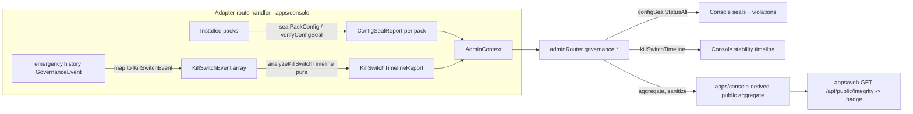

# Configuration Integrity — Design

> Status: Draft (Phase-1 design, pending approval) · Roadmap: WS3 Web Parity · Target apps: console + web

## Problem

Configuration integrity is split across two unrelated console surfaces today and is largely invisible:

- **Seal status** lives in one card — `apps/console/src/components/governance/ConfigSealStatus.tsx` — fed by `governance.configSealStatus` (`@adjudicate/admin-sdk/trpc`). It renders a *single-pack startup snapshot*: `verified`, `digestMatch`, a truncated `computedDigest`, and a flat `errors[]` list. There is no multi-pack view, no structured "violations" list (signature failure vs digest mismatch vs policy-error are all collapsed into opaque `errors[]` strings), and no linkage from a seal failure to the `kill.SEAL_MISMATCH` audit/kill-switch event it triggers.
- **Kill-switch history** lives on a different page — `apps/console/src/app/control/page.tsx` → `KillSwitchPanel` → `EmergencyHistoryList` — showing raw `emergency.history` governance events (`previousStatus → newStatus`, reason, actor). There is no *stability assessment* of that timeline, even though `@adjudicate/audit` already ships a pure analyzer (`analyzeKillSwitchTimeline`) that produces exactly that and is **not exposed over tRPC**.

The roadmap requirement is one coherent **Configuration Integrity** section that answers an operator's three questions in one screen: *(1) which packs are sealed and verifying right now, (2) what integrity violations exist and what they triggered, (3) how stable has the kill switch been*. This doc unifies the two surfaces, surfaces the existing-but-dark `analyzeKillSwitchTimeline` over a new tRPC procedure, and adds a sanitized public transparency badge on `apps/web`.

This is a **readiness tier A→B** feature: seals are fully wired (A); the kill-switch stability assessment needs one small new tRPC procedure + admin-sdk schema (B).

## Existing Architecture

**Seal producer (real, frozen).** `@adjudicate/conformance/src/config-seal.ts` (ADR-121):

- `extractSealableSurface(pack) → SealableSurface` — order-stable surface = `{ id, version, contract, intents[], signals[], basisCodes[], policyStructure (describePolicyBundle), taintMinimums[] }`. Pure.
- `computeConfigDigest(surface) → string` — sha256 over canonical JSON. Pure.
- `sealPackConfig(pack, { privateKeyPem?, algorithm?, keyId?, sealedAt? }) → ConfigSeal` — `{ schemaVersion:1, digest, signature?, packId, sealedAt? }`.
- `verifyConfigSeal(pack, seal, { publicKeyPem?, policy? }) → ConfigSealReport` — `{ verified, digestMatch:'match'|'mismatch', computedDigest, expectedDigest, signatureVerification, errors[] }`. `signatureVerification` is a closed union: `{verified:true}` | `{verified:false, reason}` | `{verified:null, reason:'not_supplied'|'not_required'}`. Pure.

**Seal enforcement (real).** `@adjudicate/adapter-core/src/loop.ts` calls `verifyConfigSeal` **once per agent instance, cached** (`checkConfigSeal`), before the first adjudication. On `!verified` it refuses the turn (`outcome.kind:"refused"`, reason `config_seal_mismatch`, trace phase `config_seal_violation`) and, if `engageKillSwitchOnMismatch`, calls `ctx.killSwitch.set(true, "config_seal_mismatch")`. The kernel basis code is `kill.SEAL_MISMATCH` = `"seal_mismatch"` (`@adjudicate/core/src/basis-codes.ts:84`).

**Seal consumption (real, single-pack).** `governance.configSealStatus` (`packages/admin-sdk/src/trpc/index.ts:360`) → `ConfigSealReportSchema` (`packages/admin-sdk/src/schemas/config-seal.ts`). Throws `PRECONDITION_FAILED` when `ctx.configSealStatus` is absent. The console route handler (`apps/console/src/app/api/admin/trpc/[trpc]/route.ts:234`) seals **one** pack (`deploymentsApprovalPack`) at startup and verifies it against itself, threading a single `ConfigSealReportParsed` into `AdminContext`.

**Kill-switch state (real).** `emergency.state` / `emergency.history` / `emergency.update` (`trpc/index.ts:220`) over `EmergencyStateStore` (`packages/admin-sdk/src/store/emergency-store.ts`; Redis via `createRedisEmergencyStateStore` when `REDIS_URL`+`EMERGENCY_REDIS_KEY`, else in-memory; propagates to the kernel's `DistributedKillSwitch`). `GovernanceEvent` = `{ id, at, kind:"emergency.update", actor, previousStatus, newStatus, reason }`, history newest-first, capped (`DEFAULT_MAX_EMERGENCY_EVENTS = 10_000`). Status vocabulary is the closed `EmergencyStatusSchema` enum `NORMAL | DENY_ALL`.

**Kill-switch analyzer (real, DARK).** `analyzeKillSwitchTimeline(events, options) → KillSwitchTimelineReport` (`packages/audit/src/kill-switch-timeline.ts`). Pure (no clock/RNG/IO; does not sort). Report = `{ schemaVersion:1, totalEvents, trips, clears, transitions, maxTripDensity, bySource, activeDurationMs, stability, headline }`. `stability` is the closed `KillSwitchStabilityClass` = `stable | single_incident | recurring_incidents | storm`. `KillSwitchEvent` = `{ at, kind:'trip'|'clear'|'snapshot', state:'active'|'normal', source?, reason?, actor? }`; `KillSwitchEventSource` closed = `operator|automated|boot|external|unknown`. **Already has a V1_FREEZE_MATRIX row (§29.3, line 581) and is exported from `@adjudicate/audit` — but no tRPC procedure exposes it.**

**Console UI (real, fragmented).** `ConfigSealStatus.tsx` (one card, no violations list beyond `errors[]`) lives under governance; `KillSwitchPanel` + `EmergencyHistoryList` live under `/control`. No page joins them.

**Web (demo only).** `apps/web` has no governance dashboards — only the 100% mock `apps/web/src/sections/ConsolePreview.tsx` card. It has node-only vitest (no jsdom/RTL), an unused React Query provider, no auth/tenant model, no charting lib. Its only live data path is the playground: server route handlers (`apps/web/src/app/api/playground/*`) read an in-memory `kernel-runner` and return plain JSON (e.g. `outcome-distribution/route.ts`). There is **no** tRPC client and **no** admin-sdk usage on web.

## Proposed Architecture

Three changes, one of which is new published surface:

1. **New backend surface (admin-sdk minor):** add `governance.killSwitchTimeline` tRPC procedure backed by a new `KillSwitchTimelineReportSchema` (Zod re-declaration of `@adjudicate/audit`'s `KillSwitchTimelineReport`, mirroring how `ConfigSealReportSchema` re-declares conformance's shape with no package dependency). The console route handler derives `KillSwitchEvent[]` from `emergency.history` (`GovernanceEvent` → trip/clear) plus any `boot` snapshot, runs `analyzeKillSwitchTimeline`, and threads the **report** into `AdminContext` (analyzer runs adopter-side, pure; the procedure stays a read — same pattern as `redTeamReport`, `policyCoherence`, `aiBom`).

2. **Multi-pack seals (admin-sdk minor, additive):** add `governance.configSealStatusAll → z.array(PackConfigSealEntrySchema)` where each entry wraps the existing `ConfigSealReportSchema` with a `packId`/`packVersion` and a derived, structured `violations[]`. The existing single `governance.configSealStatus` is **kept** (no breakage); the adopter populates a new optional `configSealReports?: ReadonlyArray<PackConfigSealEntryParsed>` in context. Violations are derived deterministically from the report fields — no new producer needed.

3. **App-only console aggregation + public web badge.** A new console page `/integrity` (or a unified section on the existing governance route) composes seals + violations + kill-switch timeline. `apps/web` gets a **read-only, sanitized** integrity badge fed by a new public web route `GET /api/public/integrity` that returns only `{ allSealsVerified: boolean, killSwitchStability: KillSwitchStabilityClass, packsSealed: number, asOf: string }` — aggregates only, never raw digests/reasons/actors.



Determinism boundary stays intact: `analyzeKillSwitchTimeline`, `verifyConfigSeal`, and `computeConfigDigest` are all pure producers; they run outside the kernel and are *telemetry/observability*, never kernel inputs.

## API Design

New admin-sdk schemas (`packages/admin-sdk/src/schemas/`):

```ts
// schemas/kill-switch-timeline.ts — re-declares @adjudicate/audit's KillSwitchTimelineReport
export const KillSwitchStabilityClassSchema = z.enum([
  "stable", "single_incident", "recurring_incidents", "storm",
]);
export const KillSwitchEventSourceSchema = z.enum([
  "operator", "automated", "boot", "external", "unknown",
]);
export const KillSwitchTimelineReportSchema = z.object({
  schemaVersion: z.literal(1),
  totalEvents: z.number().int().nonnegative(),
  trips: z.number().int().nonnegative(),
  clears: z.number().int().nonnegative(),
  transitions: z.number().int().nonnegative(),
  maxTripDensity: z.number().int().nonnegative(),
  bySource: z.record(KillSwitchEventSourceSchema, z.number().int().nonnegative()),
  activeDurationMs: z.number().nonnegative(),
  stability: KillSwitchStabilityClassSchema,
  headline: z.string(),
});
export type KillSwitchTimelineReportParsed = z.infer<typeof KillSwitchTimelineReportSchema>;

// schemas/config-seal.ts — ADD (existing ConfigSealReportSchema unchanged)
export const SealViolationKindSchema = z.enum([
  "digest_mismatch", "signature_failed", "signature_missing", "policy_error",
]);
export const SealViolationSchema = z.object({
  kind: SealViolationKindSchema,        // structured, derived from the report
  message: z.string(),                  // == the original errors[] entry
  basisCode: z.literal("seal_mismatch").nullable(), // kill.SEAL_MISMATCH linkage; null when not enforcement-linked
});
export const PackConfigSealEntrySchema = z.object({
  packId: z.string(),
  packVersion: z.string(),
  report: ConfigSealReportSchema,       // reuse existing shape verbatim
  violations: z.array(SealViolationSchema),
});
export type PackConfigSealEntryParsed = z.infer<typeof PackConfigSealEntrySchema>;
```

New tRPC procedures (`governance.*`, mirroring existing PRECONDITION_FAILED + context-threading patterns in `trpc/index.ts`):

```ts
// governance.killSwitchTimeline — read; analyzer ran adopter-side, threaded as a report
killSwitchTimeline: t.procedure
  .output(KillSwitchTimelineReportSchema)
  .query(async ({ ctx }) => {
    if (!ctx.killSwitchTimeline) {
      throw new TRPCError({
        code: "PRECONDITION_FAILED",
        message: "Kill-switch timeline not configured. Map emergency.history to " +
          "KillSwitchEvent[] and run analyzeKillSwitchTimeline at the route handler, " +
          "then wire the report into context.",
      });
    }
    return ctx.killSwitchTimeline;
  }),

// governance.configSealStatusAll — multi-pack; additive sibling of configSealStatus
configSealStatusAll: t.procedure
  .output(z.array(PackConfigSealEntrySchema))
  .query(async ({ ctx }) => {
    if (!ctx.configSealReports) {
      throw new TRPCError({
        code: "PRECONDITION_FAILED",
        message: "Multi-pack config-seal reports not configured. Verify each installed " +
          "pack via verifyConfigSeal and wire the entries into context.",
      });
    }
    return [...ctx.configSealReports];
  }),
```

New `AdminContext` fields (`trpc/index.ts`, both optional → feature-detectable via PRECONDITION_FAILED, consistent with `redTeamReport` / `policyCoherence` / `aiBom`):

```ts
readonly killSwitchTimeline?: KillSwitchTimelineReportParsed;
readonly configSealReports?: ReadonlyArray<PackConfigSealEntryParsed>;
```

The adopter computes `configSealReports` and `killSwitchTimeline` at startup / per-request. A reference `deriveSealViolations(report): SealViolation[]` helper (admin-sdk, app-facing) maps `report.digestMatch === "mismatch"` → `digest_mismatch` (basisCode `seal_mismatch`), `signatureVerification.verified === false` → `signature_failed`, `verified === null && reason === "not_supplied"` under `require_signature` → `signature_missing`, residual `errors[]` → `policy_error`. **No new producer in conformance or audit** — both already exist.

Public web route (app-only, no published surface):

```ts
// apps/web/src/app/api/public/integrity/route.ts — aggregates only
GET /api/public/integrity ->
  { allSealsVerified: boolean, packsSealed: number,
    killSwitchStability: KillSwitchStabilityClass, asOf: string }
```

## Data Model

**Closed taxonomies (all preserved, none widened):**

- `KillSwitchStabilityClass` — `stable | single_incident | recurring_incidents | storm` (4, closed; matches `@adjudicate/audit`).
- `KillSwitchEventSource` — `operator | automated | boot | external | unknown` (5, closed).
- `SealViolationKind` — `digest_mismatch | signature_failed | signature_missing | policy_error` (4, closed; **new**, but derived — a new value would only ever be MINOR-additive).
- `EmergencyStatus` — `NORMAL | DENY_ALL` (unchanged).

**Bounded cardinality:** `KillSwitchTimelineReport` is O(1) in size regardless of event count (it is a roll-up: counts + one stability class + one headline). `configSealStatusAll` is O(#installed packs) — bounded by the deployment's pack registry (single digits in the reference console). `violations[]` is bounded by `report.errors.length`. No unbounded payloads cross the wire.

**Events:** no new event-bus event types and no new `AuditRecord` versions are introduced. Seal enforcement already emits via the existing `kill.SEAL_MISMATCH` basis code path in adapter-core; kill-switch transitions already emit `GovernanceEvent { kind:"emergency.update" }`. This feature is **read-only aggregation** over those existing records — it adds no new write path.

**Schema-version field:** `KillSwitchTimelineReportSchema.schemaVersion` is pinned `z.literal(1)`, matching the producer; a future v2 is an additive widening (`1 | 2`) per the freeze-matrix posture for versioned report shapes.

## Determinism Analysis

- **Outside the determinism boundary, by construction.** Seal verification, digest computation, and timeline analysis are all *observability/telemetry*. None is a kernel input. Per the frozen invariant (telemetry — token usage, drift snapshots, red-team history — lives outside the determinism boundary), the timeline report and seal reports are read-side aggregates that the kernel never consults during `adjudicate()`.
- **Pure producers.** `analyzeKillSwitchTimeline`, `verifyConfigSeal`, `extractSealableSurface`, `computeConfigDigest` have no I/O, no `Date.now()`, no RNG. `analyzeKillSwitchTimeline` deliberately **does not sort** its input — ordering is the caller's responsibility — so the report is deterministic over the same ordered sequence. Same `(events)` ⇒ same `(report)` bytes.
- **Timestamps supplied by the harness/adopter.** `KillSwitchEvent.at` and `ConfigSeal.sealedAt` are caller-supplied ISO strings; the analyzer parses them only for duration accounting and skips `NaN` parses (never throws). The new procedures inject **no** wall-clock: the report is computed adopter-side from supplied timestamps and threaded as static context (the reference console may recompute per-request, but the *function* is clock-free). The public web route's `asOf` is the only wall-clock read, and it lives entirely in app code, never near the kernel.
- **Replay safety.** The seal gate runs in adapter-core *before the first adjudication* and only ever flips the kill switch — it does not feed `(envelope, policy, state)`. The `kill.SEAL_MISMATCH` decision that results is itself pure over its inputs and replays identically. Surfacing the timeline/seal reports for display cannot alter any historical decision; replaying an old `AuditRecord` is unaffected because these reports are never read by the kernel.
- **Taint lattice unaffected.** No rewrite/pause/resume path is touched; the seal gate refuses the whole turn rather than rewriting, so there is no taint to preserve through this feature.

## Security Analysis

- **Public-view data-leak (primary risk).** The web badge must expose **aggregates only**. Forbidden on web: `computedDigest` / `expectedDigest` (config fingerprints — leaking them aids an attacker reconstructing or forging a seal), `report.errors[]` and `violation.message` (may embed pack ids, key ids, signature failure detail), `reason` / `actor` from kill-switch events (operator identity + incident narrative), `headline` (embeds trip counts + engaged-seconds — operationally sensitive incident posture). The `GET /api/public/integrity` route returns a fixed, allow-listed shape (`allSealsVerified`, `packsSealed`, `killSwitchStability`, `asOf`) computed server-side; the raw reports never reach the web client bundle. **A11y of the leak surface:** the badge's `title`/`aria-label` must also be sanitized (no digest in tooltip).
- **Auth posture.** The full console procedures (`configSealStatusAll`, `killSwitchTimeline`) sit behind the existing fail-closed bearer gate (`requireConsoleAdminAuth`, `ADMIN_API_TOKEN`) + `x-adjudicate-actor-*` actor model. Both are **reads** — actor-required is appropriate but they are not mutations, so no confirmation gate is needed. The web public route is intentionally unauthenticated and therefore must serve only the sanitized aggregate; it must `force-dynamic` and **not** proxy the admin tRPC endpoint (no token on web).
- **Threat: forged "verified" badge.** An attacker who can write to the web origin cannot mint a false "sealed" state because the badge is derived server-side from the same adopter-computed reports; there is no client-trusted input. Within the console, a forged `x-adjudicate-actor-*` header without the bearer token is rejected fail-closed (the headers are only trusted *after* the auth gate).
- **Prompt-injection paths.** `KillSwitchEvent.reason` and `GovernanceEvent.reason` are operator/LLM-adjacent free text. They are never executed and never fed back to a planner via this feature (read-only display). On the console they render as text (no `dangerouslySetInnerHTML`); on web they are **not exposed at all**. The seal `errors[]` strings are framework-generated (`config digest mismatch: expected … got …`), not attacker-controlled, but are still treated as untrusted text in the DOM.
- **Abuse cases.** (a) *Seal-mismatch storm as DoS signal* — repeated tampered redeploys flipping the kill switch produce a `storm` stability class; the timeline makes this legible rather than hiding it, which is the intended detection, not a vulnerability. (b) *Truncated-digest collision phishing* — the console shows a 16-char digest prefix; we keep full-digest comparison server-side (`verifyConfigSeal` compares full digests), so the UI prefix is display-only and never a comparison input. (c) *Stale report* — a cached timeline could under-report a live storm; the console surfaces `asOf`/freshness and the report is recomputed per request in the reference handler.
- **Taint implications.** None new. The seal gate refuses (does not rewrite), so no UNTRUSTED→TRUSTED transition is created. The feature reads only post-decision audit/governance records.

## UI Design

### Console (full operator tool)

**New unified `Configuration Integrity` section** (a `/integrity` route, or a panel cluster on the governance route) with three stacked panels. Console keeps the engage/restore controls on the existing `/control` page; this section is read + cross-link.

**Panel A — Active Seals (multi-pack).** A table: columns `Pack` (`packId@packVersion`), `Status` (✓ Sealed / ✗ Drift), `Digest` (16-char prefix, monospace, copy-to-clipboard for full), `Signature` (`verified` / `failed` / `not required` / `not supplied`). Driven by `governance.configSealStatusAll`. The existing single-card `ConfigSealStatus.tsx` is refactored into the per-row presenter so behavior is reused, not duplicated.
- *Loading:* skeleton rows (3) with shimmer; the existing "Loading seal status…" text becomes the table caption.
- *Empty / not-configured:* PRECONDITION_FAILED → the existing "No config seal configured…" guidance, shown once as a full-width row.
- *Error (network/parse):* inline error banner with retry; never silently blank.
- *A11y:* `<table>` with `<caption>`, `scope="col"` headers; status conveyed by text + icon (not color alone); copy button has `aria-label="Copy full digest for {packId}"`; `role="status"` on the loading region.
- *Responsive:* below `md`, collapse to stacked cards (one per pack) reusing the current card layout.

**Panel B — Seal Violations.** A list derived from each entry's `violations[]`, grouped by pack. Each row: violation `kind` chip (`digest_mismatch` / `signature_failed` / `signature_missing` / `policy_error`), the message, and — when `basisCode === "seal_mismatch"` — a "View audit linkage" link to the audit explorer filtered to `kill.SEAL_MISMATCH`. This is the **new** structured replacement for the flat `errors[]` rendering.
- *Loading:* shares Panel A's query state (one fetch).
- *Empty:* "No integrity violations — all installed packs verify." (positive empty state, emerald).
- *Error:* inherits Panel A error.
- *A11y:* violation severity by icon+text; the audit link is a real `<a>`/`<Link>` with descriptive text, not "click here".
- *Responsive:* chips wrap; message truncates with title-attr full text at narrow widths.

**Panel C — Kill-Switch Activation Timeline.** Header shows the `stability` class as a colored badge (`stable` emerald / `single_incident` amber / `recurring_incidents` orange / `storm` red, pulsing) + `headline`. Below it: stat tiles (`trips`, `clears`, `transitions`, `maxTripDensity`, `activeDurationMs` humanized) and a `bySource` mini-breakdown. Beneath, the existing `EmergencyHistoryList` (engage/restore events) is embedded as the raw event log. Driven by the **new** `governance.killSwitchTimeline` + existing `emergency.history`.
- *Loading:* badge placeholder + skeleton stat tiles.
- *Empty:* PRECONDITION_FAILED or `totalEvents === 0` → "Kill switch never engaged — stable." badge.
- *Error:* inline banner; degrade to raw `EmergencyHistoryList` if only the timeline procedure fails (history still renders).
- *A11y:* stability badge has `aria-label` with the class + headline; stat tiles use `<dl>`; `time` elements with `dateTime`.
- *Responsive:* stat tiles wrap 4→2→1 columns; raw log scrolls within a max-height region.

### Web (read-only, sanitized subset)

**Single Integrity Status Badge**, embedded on the marketing/transparency page (and as a richer block replacing part of the mock `ConsolePreview` story). It shows **only**: a seal indicator ("All packs sealed & verified" / "Integrity check pending"), `packsSealed` count, and a kill-switch stability pill (`stable` / `single_incident` / `recurring_incidents` / `storm`) with a neutral, non-incident-detail label, plus `asOf`. **No** engage/restore controls, **no** digests, **no** reasons/actors, **no** headline, **no** per-pack table. Fed by `GET /api/public/integrity` (sanitized aggregate; web has no tRPC client/token).
- *Loading:* compact spinner + "Checking integrity…".
- *Empty / unavailable:* if the public route errors or integrity is unconfigured, show a neutral "Integrity status unavailable" — never a scary false-negative and never raw error text.
- *Error:* same neutral fallback; the public route catches and returns the unavailable shape rather than 5xx leaking a stack.
- *A11y:* badge is a labeled `role="status"`; stability conveyed by text + shape/icon, not color alone; contrast meets WCAG AA on the dark `zinc-950` band.
- *Responsive:* single-line on desktop, stacks to two lines on mobile; no horizontal scroll.

**Explicitly operator-only on web:** the per-pack seal table, violation messages/digests, raw kill-switch event log, and all engage/restore actions are NOT exposed on `apps/web`.

## Observability Design

- **Metrics (Prometheus-compatible), adopter-emitted** (the framework producers are pure; the *route handler* is the natural emission point):
  - `adjudicate_config_seal_verified{pack_id}` gauge (1/0) — per installed pack.
  - `adjudicate_config_seal_violations{pack_id,kind}` gauge — count by `SealViolationKind`.
  - `adjudicate_kill_switch_stability` gauge enum (0..3 mapping the closed class) or `_info` labeled gauge `{stability}`.
  - `adjudicate_kill_switch_trips_total` / `_transitions_total` counters; `adjudicate_kill_switch_active_seconds_total`.
- **Logs:** the existing adapter-core `log.warn` on seal mismatch (`"config seal mismatch — refusing turn"`, with `detail`) stays; add a structured field `basisCode:"seal_mismatch"` for correlation. The public web route logs only an aggregate counter (`public_integrity_requests_total`), never the underlying reports.
- **Audit records:** none added. Seal enforcement already flows through `kill.SEAL_MISMATCH`; the Violations panel's "audit linkage" simply queries the existing audit store for that basis code.
- **Event-bus:** none added (read-only feature).
- **Dashboards / alerts / SLOs:**
  - Alert: `adjudicate_config_seal_verified == 0` for any pack → page (integrity drift is security-critical).
  - Alert: `adjudicate_kill_switch_stability` == `storm` → page; `recurring_incidents` → ticket.
  - SLO: seal-verified ratio across packs ≥ 99.9% of scrapes; kill-switch stability `stable|single_incident` ≥ 99% of the rolling window.
  - Web transparency SLO: `GET /api/public/integrity` p95 < 200 ms, served from cached aggregate.

## Testing Strategy

- **Unit (admin-sdk):** `KillSwitchTimelineReportSchema` round-trips a real `analyzeKillSwitchTimeline` output for each stability class; rejects an unknown `stability` value (closed-enum guard). `PackConfigSealEntrySchema` round-trips. `deriveSealViolations` maps each report shape → correct `SealViolationKind` (digest mismatch, sig fail, sig missing under `require_signature`, residual policy error) with the right `basisCode` linkage.
- **Integration (admin-sdk via `createAdminCaller`):** `governance.killSwitchTimeline` returns the threaded report; throws `PRECONDITION_FAILED` when `ctx.killSwitchTimeline` is absent. `governance.configSealStatusAll` returns per-pack entries; `PRECONDITION_FAILED` when unconfigured. Existing `governance.configSealStatus` still works (no regression).
- **Conformance:** assert `KillSwitchStabilityClassSchema` / `KillSwitchEventSourceSchema` enums are byte-equal to the `@adjudicate/audit` closed types (a drift test that fails if either side widens without the other) — protects the re-declared-schema invariant. Same for `ConfigSealReportSchema` vs conformance's `ConfigSealReport`.
- **Replay:** golden-vector test that `analyzeKillSwitchTimeline(sameOrderedEvents)` is byte-stable across runs and across the unsorted-input guarantee (shuffled input yields a *different* documented result, proving no hidden sort). Confirm seal verification does not perturb a replayed `AuditRecord`.
- **Security / adversarial:** assert the public route response shape contains **none** of `computedDigest`, `expectedDigest`, `errors`, `reason`, `actor`, `headline` (allow-list snapshot test). Assert a forged `x-adjudicate-actor-*` without bearer is rejected on the console procedures. Fuzz `KillSwitchEvent.at` with malformed/`NaN` timestamps → analyzer never throws, `activeDurationMs` stays finite. Inject HTML/script in `reason`/`errors` → console renders inert text; web omits entirely.
- **UI component (RTL, console — has jsdom + @testing-library/react):** Panel A loading/empty/error/multi-pack table; Panel B violation chips + audit link presence only when `basisCode==="seal_mismatch"`; Panel C stability badge per class + degrade-to-history-on-timeline-error. Assert color-independent status (icon/text present).
- **E2E (Playwright):** console — auth, open Integrity section, see seals + violations + timeline; trigger a tampered-pack scenario in a fixture so a `digest_mismatch` violation and `storm`/`recurring` class appear. Web — load transparency page, assert badge renders sanitized aggregate and that no digest/reason text is present in the DOM.
- **Web unit (node vitest):** `GET /api/public/integrity` returns the sanitized shape and the unavailable fallback on upstream error (no 5xx, no leaked detail).

## Rollout & Release Impact

**New published surface — `@adjudicate/admin-sdk` (MINOR).** This joins the existing staged changesets in the single combined post-v1 MINOR wave (parity-first, ship-together). No major; closed enums preserved; additive only.

- **New exports:** `KillSwitchTimelineReportSchema` (+ `KillSwitchStabilityClassSchema`, `KillSwitchEventSourceSchema`, `KillSwitchTimelineReportParsed`); `SealViolationSchema`, `SealViolationKindSchema`, `PackConfigSealEntrySchema`, `PackConfigSealEntryParsed`; new tRPC procedures `governance.killSwitchTimeline` and `governance.configSealStatusAll`; new optional `AdminContext` fields `killSwitchTimeline` / `configSealReports`; reference helper `deriveSealViolations`.
- **No change to `@adjudicate/audit` or `@adjudicate/conformance` exports** — `analyzeKillSwitchTimeline` and `verifyConfigSeal` already exist and already have freeze-matrix rows. `@adjudicate/core` `kill.SEAL_MISMATCH` already exists. This feature is admin-sdk-only published surface plus app code.

- **Changeset:** add a `.changeset/configuration-integrity.md` declaring `@adjudicate/admin-sdk: minor`, summarizing the two procedures + schemas + the multi-pack/timeline parity, referencing ADR-114 (kill switch) and ADR-121 (config seal).

- **ADR to create:** a new ADR (next id: **ADR-128 — Configuration Integrity aggregation surface**) recording: (1) why the kill-switch analyzer is exposed over tRPC now (was dark), (2) the multi-pack seal procedure as additive sibling to the single-pack one, (3) the structured `SealViolationKind` taxonomy and its `kill.SEAL_MISMATCH` linkage, (4) the sanitized public web aggregate boundary. Note the relationship to ADR-114 and ADR-121 explicitly. Per the governance rule, the ADR + changeset + freeze-matrix rows ship in the **same PR** as the symbols.

- **V1_FREEZE_MATRIX.md rows to add (§8 — `@adjudicate/admin-sdk`):** one row for the new Zod schemas (`KillSwitchTimelineReportSchema`, `KillSwitchStabilityClassSchema`, `KillSwitchEventSourceSchema`, `SealViolationSchema`, `SealViolationKindSchema`, `PackConfigSealEntrySchema`) — tier `F`, owner `admin-sdk`, replay `none`, additive, semver `medium`, extension `additive`, tol `scheduled`, rationale "Wire schemas for the integrity-aggregation procedures; re-declare frozen audit/conformance closed vocabularies, additions MINOR." One row noting `governance.killSwitchTimeline` + `governance.configSealStatusAll` under the existing per-procedure tracking line (§8 already tracks the tRPC router's procedure surface alongside changesets). The existing `analyzeKillSwitchTimeline` row (§29.3, line 581) needs **no change** — it remains the producer.

- **Migration notes:** purely additive. Existing `governance.configSealStatus` and the current `ConfigSealStatus.tsx` card keep working; the unified console section is a new route. Adopters opt in by populating the two new optional context fields; absent them, the new procedures return `PRECONDITION_FAILED` (feature-detectable), exactly like every other report-backed procedure. `apps/web` gains a new public route + a new badge component (app-only, no published surface, node-vitest covered).

- **Effort: M.** New schemas + two procedures + context wiring + `deriveSealViolations` (small, deterministic) = S in admin-sdk. The console unification (refactor the existing seal card into a table, add violations + timeline panels, RTL coverage) + the new sanitized web route/badge (web has no tRPC/charting today) push the total to **M**. No kernel changes; no new producers; no major bump.
