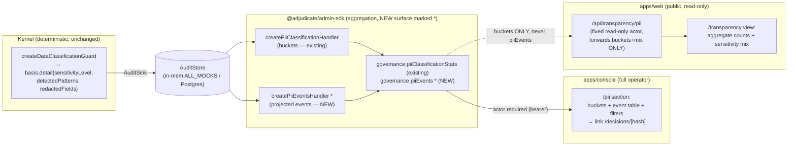

# PII Events — Design

> Status: Draft (Phase-1 design, pending approval) · Roadmap: WS3 Web Parity · Target apps: console + web

## Problem

`createDataClassificationGuard` (ADR-117, `@adjudicate/primitives`) classifies sensitive
data in UNTRUSTED, model-proposed payloads and disposes of it: **REWRITE** masks matched
fields (emitting `validation.pii_redacted`) or **REFUSE** blocks (emitting
`validation.pii_blocked`). The runtime sensitivity tier and which fields fired ride in
`DecisionBasis.detail` — the only structured channel that survives into the durable
`AuditRecord` (`GuardDescription` metadata is never serialized).

That data is already aggregated server-side: `governance.piiClassificationStats`
(`packages/admin-sdk/src/handlers/pii-classification.ts`) reads the `AuditStore` and buckets
by `(sensitivityLevel × disposition)`. But the only UI is a compact dashboard sub-panel
(`apps/console/src/components/dashboard/PiiClassificationPanel.tsx`, used once at
`apps/console/src/app/dashboard/page.tsx:122`). There is:

- **no dedicated PII section** — PII is one small table among many on the firehose dashboard;
- **no event-level drill-down** — an operator can see "3 critical blocks this week" but cannot
  see *which intents*, *which patterns fired*, or jump to their Decision Detail;
- **no filters** beyond the shared `since`;
- **nothing on `apps/web`** — the marketing site has only a static mock `ConsolePreview` card
  and a Decision-Lab PII demo preset; there is no public transparency view of aggregate PII
  posture.

This is **readiness tier A — data ready (UI elevation)**: the aggregate handler exists, so the
console work is mostly UI plus a *thin* event-level read, and the web work is a sanitized,
aggregate-only mirror. The roadmap requirement (WS3 Web Parity) is: promote PII to a
first-class console section with event drill-down + filters, and ship a public read-only
aggregate on `apps/web` that never leaks raw PII.

## Existing Architecture

What is **real** today (not mock):

| Layer | Symbol / file | State |
|---|---|---|
| Guard | `createDataClassificationGuard` — `packages/primitives/src/guards.ts:629` | Real. Pure `Guard<K,P,S>`. Emits `basis("validation", PII_REDACTED \| PII_BLOCKED, { sensitivityLevel, detectedPatterns, redactedFields \| fields })`. |
| Basis codes | `validation.PII_DETECTED / PII_REDACTED / PII_BLOCKED` — `@adjudicate/core` (ADR-117 §3) | Real, closed-but-additive. |
| Schemas | `PiiClassificationQuerySchema`, `PiiClassificationResultSchema`, `PiiClassificationBucketSchema`, `SensitivityLevelSchema`, `PiiDispositionSchema` — `packages/admin-sdk/src/schemas/pii-classification.ts` | Real, published. |
| Handler | `createPiiClassificationHandler({ store, fallbackQueryLimit?, clock? })` — `packages/admin-sdk/src/handlers/pii-classification.ts` | Real. Paginates `store.query` (cap 500), buckets, deterministically sorts by tier desc then disposition. |
| tRPC | `governance.piiClassificationStats` — `packages/admin-sdk/src/trpc/index.ts:331` | Real. Reads `ctx.store`; no extra context wiring. |
| Store | `AuditStore.query(AuditQuery)` / `.getByIntentHash()` — `packages/admin-sdk/src/store/index.ts`; Postgres impl `@adjudicate/audit-postgres` | Real. In-memory `ALL_MOCKS` in dev; Postgres when `DATABASE_URL` set (`apps/console/.../api/admin/trpc/[trpc]/route.ts`). |
| Console hook | `usePiiClassification({ since, packId? })` — `apps/console/src/hooks/usePiiClassification.ts` | Real. TanStack Query → `trpc.governance.piiClassificationStats`. |
| Console UI | `PiiClassificationPanel({ since })` + `.test.tsx` — `apps/console/src/components/dashboard/` | Real but minimal: a 4-row `sensitivity × {redacted, blocked}` table. No filters, no events, no link-out. |
| Decision detail | `/decisions/[intentHash]` + `useDecisionByHash` → `audit.byHash` — `apps/console/src/app/decisions/[intentHash]/page.tsx` | Real. The drill-down target; renders `DecisionTrace` over `decision_basis`. |
| Web | `ConsolePreview` (`apps/web/src/sections/ConsolePreview.tsx`), ADR-117 Decision-Lab preset | **Mock / demo only.** No admin-SDK consumption, no auth, no charting lib, unused React-Query provider (`apps/web/src/app/providers.tsx`). |

**Gaps in the existing aggregate** that block event drill-down: the result is *bucket counts
only* (`{ buckets: { sensitivityLevel, disposition, count }[] }`). There is no per-record
projection — no way to list the audit records that carry a PII basis, no `packId` actually
applied (the input field exists but the handler treats counts as "pack-agnostic" and ignores
it), and no `detectedPatterns` surfaced in aggregate. The console *can* fall back to
`audit.query` + client-side filtering, but `audit.query` has no PII filter (its filters are
`intentKind / decisionKind / refusalCode / taint / intentHash / since / until`), so the client
would over-fetch and re-scan every record's `decision_basis`. That is the thin new surface this
design adds.

## Proposed Architecture

Three changes, all **additive**:

1. **`governance.piiEvents`** — a new tRPC query on the existing `governanceRouter` returning a
   *projected, redaction-safe* page of audit records that carry a PII basis. Backed by a new
   `createPiiEventsHandler` over the same `AuditStore`. This is the only new published surface.
2. **Console "PII Events" section** — a dedicated route `/pii` with: summary buckets (reusing
   `piiClassificationStats`), an event table (new `piiEvents`), filters (sensitivity,
   disposition, time range, packId), and a sensitivity-class breakdown. Each row links to
   `/decisions/[intentHash]`.
3. **Web public transparency view** — a read-only `/transparency` (or section on home) showing
   **aggregate buckets + sensitivity mix only**, fed by a new server-side public route
   `GET /api/transparency/pii` that calls the admin SDK with a *fixed read-only actor* and
   forwards **only** the bucket/mix shape — never `piiEvents`, never raw fields. This mirrors the
   existing `apps/web` playground pattern (`/api/playground/outcome-distribution`).

The console section and web view ship **together** in the same combined post-v1 MINOR wave
(parity-first, per locked sequencing). The kernel and the guard are untouched.



## API Design

All naming follows existing `@adjudicate/admin-sdk` conventions (`governance.*` namespace,
`*QuerySchema` / `*ResultSchema`, inclusive `[since, until]` window, `clock`-injected default
for `until`).

### Existing (reused, unchanged)

```ts
// governance.piiClassificationStats
input:  PiiClassificationQuerySchema   // { since, until?, packId? }
output: PiiClassificationResultSchema  // { buckets: { sensitivityLevel, disposition, count }[] }
```

### New: `governance.piiEvents` (the only new published procedure)

```ts
// packages/admin-sdk/src/schemas/pii-events.ts  (NEW file)
export const PiiEventsQuerySchema = z.object({
  since: IsoTimestampSchema,
  until: IsoTimestampSchema.optional(),
  // Filters — single-value per field, matching AuditQuery's Phase-1.5a convention.
  sensitivityLevel: SensitivityLevelSchema.optional(),  // reuse the existing enum
  disposition: PiiDispositionSchema.optional(),         // reuse the existing enum
  packId: z.string().optional(),
  limit: z.number().int().min(1).max(500).default(100),
  cursor: z.string().optional(),                        // forward-compat, mirrors AuditQuery
});

// One projected, redaction-SAFE event row. NOTE: no payload, no values, no redacted content.
export const PiiEventSchema = z.object({
  intentHash: IntentHashSchema,        // link key → /decisions/[intentHash]
  at: IsoTimestampSchema,
  decisionKind: DecisionKindSchema,    // EXECUTE-side never appears; REWRITE | REFUSE here
  sensitivityLevel: SensitivityLevelSchema,
  disposition: PiiDispositionSchema,
  detectedPatterns: z.array(z.string()).readonly(),     // pattern IDs ("ssn","pan") — NOT values
  redactedFieldCount: z.number().int().nonnegative(),   // COUNT only; field paths are operator-only
  redactedFields: z.array(z.string()).readonly().optional(), // dotted paths — present console-side only
  packId: z.string().optional(),
});

export const PiiEventsResultSchema = z.object({
  events: z.array(PiiEventSchema).readonly(),
  nextCursor: z.string().optional(),
});
```

```ts
// packages/admin-sdk/src/handlers/pii-events.ts  (NEW)
export interface CreatePiiEventsHandlerDeps {
  readonly store: AuditStore;
  readonly fallbackQueryLimit?: number;     // default 500, same cap as buckets handler
  readonly clock?: () => string;
  /** When false, the handler omits `redactedFields` (public/web path). Default true. */
  readonly includeFieldPaths?: boolean;
}
export function createPiiEventsHandler(
  deps: CreatePiiEventsHandlerDeps,
): (input: PiiEventsQuery) => Promise<PiiEventsResult>;

// packages/admin-sdk/src/trpc/index.ts  — added to governanceRouter, actor-gated like audit.query
piiEvents: t.procedure
  .input(PiiEventsQuerySchema)
  .output(PiiEventsResultSchema)
  .query(async ({ input, ctx }) => {
    if (!ctx.actor) {
      throw new TRPCError({ code: "UNAUTHORIZED",
        message: "x-adjudicate-actor-id header required for PII event reads" });
    }
    const handler = createPiiEventsHandler({ store: ctx.store });
    return handler(input);
  }),
```

Handler logic (pure projection, no kernel call): page `store.query({ since, until, limit,
tenantScope: ctx.actor.tenantId })`, then for each record scan `decision_basis` for a
`validation` code in `{pii_redacted, pii_blocked}`, apply optional `sensitivityLevel` /
`disposition` / `packId` filters, and project the **safe subset**. `packId` is matched against
a record-level pack tag if the adopter records one (see Data Model); when absent it is a no-op,
documented identically to the buckets handler's reserved `packId`.

### Console hook + web route

```ts
// apps/console/src/hooks/usePiiEvents.ts  (NEW, app-only)
export function usePiiEvents(args: {
  since: string; until?: string; sensitivityLevel?: SensitivityLevel;
  disposition?: PiiDisposition; packId?: string; limit?: number;
}): UseQueryResult<PiiEventsResult>;  // → trpc.governance.piiEvents.query(...)

// apps/web/src/app/api/transparency/pii/route.ts  (NEW, app-only, public)
// GET → calls createAdminCaller (fixed read-only actor) → governance.piiClassificationStats
//       returns ONLY { buckets, mix } — never calls piiEvents.
export async function GET(req: NextRequest): Promise<NextResponse<{ buckets: PiiBucket[]; mix: SensitivityMix }>>;
```

## Data Model

No new wire-bearing kernel types; no new enums. Closed taxonomies are **reused**, not widened:

- `SensitivityLevelSchema = enum(["low","medium","high","critical"])` — bounded cardinality 4.
- `PiiDispositionSchema = enum(["redacted","blocked"])` — bounded cardinality 2.
- `DecisionKindSchema` — the existing six-outcome closed enum; PII events only ever carry
  `REWRITE` (redacted) or `REFUSE` (blocked), enforced by the handler, not a new enum.

New Zod schemas (admin-sdk only): `PiiEventsQuerySchema`, `PiiEventSchema`,
`PiiEventsResultSchema`. A derived, web-only convenience aggregate computed *client/route-side*
from `buckets` (not a new wire schema): `SensitivityMix = Record<SensitivityLevel, number>`
(per-tier totals across both dispositions) for the web donut/bar.

Source of truth for each field — all read off the existing persisted `DecisionBasis.detail`:

| Event field | Origin | Public-safe? |
|---|---|---|
| `intentHash`, `at`, `decisionKind` | `AuditRecord` top-level | console-only (links to raw record) |
| `sensitivityLevel`, `disposition` | `basis.detail.sensitivityLevel` + basis code | **yes** (already in web buckets) |
| `detectedPatterns` | `basis.detail.detectedPatterns` (pattern *IDs*) | console-only by default; IDs are low-risk but still operator context |
| `redactedFieldCount` | length of `basis.detail.redactedFields \| fields` | console-only |
| `redactedFields` (paths) | `basis.detail.redactedFields \| fields` | **operator-only — NEVER on web** |

**No new Events on the event bus / governance log.** PII detections are already captured as
audit records; introducing a `GovernanceEvent` variant would widen a closed taxonomy and is
explicitly out of scope. The "PII Events" name refers to *audit records carrying a PII basis*,
surfaced as table rows — not a new event type.

**`AuditRecord` unchanged.** Nothing here adds a field to the record or to the canonical-hash
pre-image. `sensitivityLevel`/`redactedFields` already live in `basis.detail`, which is not part
of the hash (ADR-117 "invariants preserved").

## Determinism Analysis

This surface is **entirely outside the determinism boundary** — it is read-side telemetry over
already-persisted records, never a kernel input.

- **The guard stays pure.** Detection is regex over `envelope.payload`; no clock/I/O/RNG; the
  REWRITE path preserves `taint` verbatim and recomputes `intentHash` via `buildEnvelope`
  (ADR-117). This design touches none of that — no change to `packages/primitives` or
  `packages/core`.
- **No wall-clock / RNG in the new handler.** `until` defaults via the injected `clock` exactly
  like `createPiiClassificationHandler` and `createOutcomeDistributionHandler`; tests inject a
  fixed clock. No `Math.random`, no `Date.now()` in any deterministic path (there is none here).
- **Deterministic ordering.** `AuditStore.query` returns records newest-first by `at` (ISO
  string sort = chronological). The events handler preserves that order and pages by the
  existing `limit`/`cursor` convention so two callers with identical inputs get byte-identical
  pages. Pattern IDs and field paths are already emitted in **declared order** by the guard
  (ADR-117 "iterated in declared order"), so `detectedPatterns`/`redactedFields` are stable.
- **Telemetry never re-enters the kernel.** Counts, mixes, and event projections feed dashboards
  only. They are not policy inputs, not state, not replay inputs.
- **Replay safety.** `replay.run` re-adjudicates from the stored `envelope`; because the PII
  basis detail is *output* (not pre-image), replaying a redacted intent reproduces the same
  `intentHash` and the same `pii_redacted`/`pii_blocked` basis. The events view reading those
  records cannot perturb replay. Timestamps are harness/adopter-supplied on the original
  record; the view only reads them.

## Security Analysis

The dominant risk is **the public web view leaking what the guard exists to suppress.** Threat
model and mitigations:

- **Data-leak via the public view (primary).** Raw PII lives only in the original payload, which
  the guard *removes* on REWRITE and *blocks* on REFUSE; it is never in `basis.detail`. The web
  route is hard-restricted to `piiClassificationStats` (counts) and forwards **only**
  `{ buckets, mix }`. It MUST NOT call `governance.piiEvents`. Defense in depth:
  `createPiiEventsHandler({ includeFieldPaths: false })` is the only mode reachable from web *if*
  events are ever exposed there (they are not in v1) — and even then `redactedFields` is dropped
  and only `redactedFieldCount` remains. A conformance test asserts the web route's response type
  has no `events`, no `redactedFields`, no `intentHash`, no `payload`.
- **Field-path inference.** Even dotted field paths (`note`, `items.0.memo`) and pattern IDs
  (`ssn`,`pan`) are mild operator context but can hint at payload schema; they stay **console-only**
  (behind bearer auth). `detectedPatterns` and `redactedFields` are gated by `includeFieldPaths`
  and never serialized to web.
- **Count-channel inference / small-cohort de-anonymization.** Public bucket counts could, in a
  low-volume tenant, approach "1 critical block" granularity. Mitigation: the web aggregate is
  **window-coarse** (fixed wide window, e.g. last 30d) and **tenant-global** (no per-pack, no
  per-actor breakdown on web); optionally a small-count floor ("<5" instead of exact n) is a
  config knob on the route. The console (authenticated) gets exact counts and drill-down.
- **AuthZ / tenant isolation.** `governance.piiEvents` is actor-gated (UNAUTHORIZED without
  `x-adjudicate-actor-*`), identical to `audit.query`/`audit.byHash`. The handler threads
  `tenantScope: ctx.actor.tenantId` into `store.query` so a multi-tenant Postgres store cannot
  return cross-tenant PII rows (AuthReviewer-004). The web route uses a *fixed, least-privilege
  read-only actor* with no tenant scope and only the counts path.
- **Prompt-injection paths.** The model-proposed payload is UNTRUSTED. An attacker could craft a
  payload to (a) embed malicious strings in fields hoping they render unescaped, or (b) name
  fields/patterns to spoof. Mitigations: (1) the events table renders `detectedPatterns` and
  `redactedFields` as **plain text in a `<table>`**, React-escaped, never `dangerouslySetInnerHTML`;
  (2) values themselves are never carried — only IDs and paths the *Pack author* declared in
  `scannedFields`/`patterns`, not attacker-controlled free text; (3) `intentHash` is a sha256 hex
  and is validated by `IntentHashSchema` before becoming an href. There is no injection sink: no
  eval, no HTML interpolation, no SQL built from the projected strings (the store owns
  parameterization).
- **Taint implications.** Read-only; no taint mutation. The view *displays* that REWRITE
  preserved taint (a correctness signal) but cannot alter the lattice. No declassification path
  is introduced.
- **Abuse / DoS.** `limit ≤ 500` (schema-capped) and `cursor` paging bound per-request cost;
  the handler reuses the buckets handler's `fallbackQueryLimit`. The public web route is
  `force-dynamic` GET with no user input beyond a fixed window — trivially cacheable
  (`s-maxage`) and rate-limitable at the edge; it performs at most one bounded `store.query`.

## UI Design

### Console — full operator surface (`/pii`, new route)

A dedicated section (sidebar entry "PII Events", next to Governance). Layout: header with a
`RangePicker` (reuse `apps/console/.../dashboard/RangePicker.tsx`) + filter bar; then three
stacked panels.

1. **Summary buckets panel** — promotes today's `PiiClassificationPanel` to the section top:
   the `sensitivity × {redacted, blocked}` table plus a totals row. Fed by
   `usePiiClassification`.
2. **Sensitivity-class breakdown** — a horizontal stacked bar (critical→low) of the
   `SensitivityMix`, color-keyed by tier (reuse the panel's `TIER_STYLE`: critical=red,
   high=amber, medium=yellow, low=muted). No new charting dep — same hand-rolled bars as
   `GuardFireBars`.
3. **Event table** — fed by `usePiiEvents`. Columns: `at` (relative + ISO title), `decisionKind`
   badge (`DecisionBadge`), `sensitivityLevel` chip, `disposition`, `detectedPatterns`
   (comma-joined IDs), `redactedFieldCount` (with field paths in a hover/expand), and a row link
   → `/decisions/[intentHash]`. Filter bar drives `sensitivityLevel`, `disposition`, `packId`,
   and the shared time range; "Load more" follows `nextCursor`.

Per-screen states (console):

- **Loading:** skeleton rows in the table; "Loading PII events…" / "Loading PII stats…" text
  matching the existing panel idiom.
- **Empty:** "No PII detections in this window." (buckets) and "No PII events match these
  filters." (table) — italic faint, like the current panel.
- **Error:** PRECONDITION_FAILED / store error → friendly inline notice
  ("PII telemetry unavailable."); `audit`-style UNAUTHORIZED never reaches the UI (route handler
  enforces bearer in prod). `retry: false` like the existing hook so we don't hammer a failing
  store.
- **a11y:** real `<table>` with `<th scope="col">`; tier chips have text labels (not color-only);
  the row link is a focusable `<a>` wrapping the hash with `aria-label="Open decision <short
  hash>"`; filter controls are labeled `<select>`s; live region announces result count on filter
  change.
- **Responsive:** ≥ md two-column (buckets + breakdown side by side, table full-width below);
  < md single column, table horizontally scrollable in a `overflow-x-auto` wrapper with the
  decision/sensitivity columns sticky-left.

### Web — public, read-only, sanitized subset (`/transparency`, new view)

A single transparency card (or a section appended to the home page below `ConsolePreview`):
**aggregate posture only.** Renders the same two *aggregate* widgets — a `sensitivity ×
disposition` count grid and the sensitivity-mix bar — fed by `GET /api/transparency/pii`. It
shows totals like "1,204 sensitive fields redacted, 37 blocked (last 30 days)" as a trust
signal.

**Explicitly NOT on web:** the event table, `intentHash` links, `detectedPatterns`,
`redactedFields`/paths, `packId` breakdown, per-actor/per-tenant slices, or any control. This is
read-only marketing/transparency, not an operator tool.

Per-screen states (web):

- **Loading:** lightweight shimmer on the two widgets (the unused React-Query provider in
  `apps/web/src/app/providers.tsx` is finally put to use, or a plain server-fetch with
  Suspense fallback).
- **Empty:** "No data classification activity in this window." — no error styling; absence is a
  valid public state.
- **Error:** the route returns 200 with `{ buckets: [], mix: {} }` on backend unavailability
  (fail-soft, never surface a stack trace publicly); the view shows the empty state. No retry
  storms.
- **a11y:** the count grid is a `<table>` with captions; the mix bar exposes values as text +
  `aria-label` per segment; color is never the only signal; contrast meets AA on the dark band.
- **Responsive:** stacks to single column < md; widgets are fluid-width; numbers use
  `tabular-nums`.

## Observability Design

- **Metrics (Prometheus-compatible, adopter-exported; additive `SEMCONV.*` attributes per
  EXTENSION_POLICY §2.2):**
  - `adjudicate_pii_dispositions_total{sensitivity, disposition, pack}` — counter, the same data
    the buckets handler aggregates (adopter increments at guard-fire time or scrapes the
    aggregate).
  - `adjudicate_pii_events_query_duration_seconds` — histogram on the new handler.
  - `adjudicate_transparency_pii_requests_total{cache}` — counter for the public web route.
- **Logs:** structured log on each `governance.piiEvents` call: `{ actor, tenantScope, filters,
  rowCount, durationMs }` — **never** the projected rows (no PII paths in logs). The web route
  logs `{ window, bucketCount, cacheHit }` only.
- **Audit records:** unchanged — the PII detections *are* the audit records; this surface does
  not emit new ones. (Per Data Model, no new `GovernanceEvent` variant.)
- **Dashboards / alerts / SLOs:**
  - Alert: spike in `critical`+`blocked` rate (possible exfiltration attempt) — threshold over a
    rolling window.
  - Alert: sudden drop to zero across all tiers (guard mis-wired / store outage) vs. genuine
    quiet.
  - SLO: `governance.piiEvents` p95 < 300 ms over the 500-row cap; public route p95 < 150 ms
    (cache-served).

## Testing Strategy

- **Unit (`packages/admin-sdk/tests/pii-events-handler.test.ts`, NEW):** bucketing-parity with
  the existing handler test fixtures; projects only safe fields; `includeFieldPaths:false` drops
  `redactedFields` but keeps `redactedFieldCount`; filters (`sensitivityLevel`, `disposition`,
  `packId`) apply with AND semantics; `until` resolves via injected `clock`; out-of-window
  exclusion; `limit`/`cursor` paging; deterministic newest-first order; ignores non-PII
  `validation` codes (mirror the existing "ignores non-PII validation/other basis codes" case).
- **Integration:** `createAdminCaller` end-to-end — `governance.piiEvents` returns
  UNAUTHORIZED without actor; returns scoped rows with actor; cross-tenant isolation via a
  multi-tenant `getByIntentHash`/`query` stub.
- **Conformance (AC-NNN, NEW):** the web transparency route response type contains **no**
  `events`, `redactedFields`, `intentHash`, or `payload` keys — a structural assertion that the
  public surface cannot regress into leaking. A second check: `piiEvents` output never contains
  raw payload values.
- **Replay:** assert reading PII events does not alter `replay.run` output for the same hash;
  replaying a `pii_redacted` record reproduces the identical basis/`intentHash` (extends the
  ADR-117 replay property).
- **Security / adversarial (`...pii-events.adversarial.test.ts`, NEW):** payload-crafted field
  names / pattern IDs render escaped (no injection sink); malformed `intentHash` rejected by
  schema before href; small-cohort floor honored on the web route; `limit > 500` rejected at the
  wire.
- **UI component (RTL, console):** new `PiiEventsTable.test.tsx` + reuse the existing
  `PiiClassificationPanel.test.tsx` — loading/empty/error/populated; tier chips have text
  labels; row renders a focusable link to `/decisions/<hash>`; filter change refetches.
- **UI component (web):** node-only vitest exists today; the transparency widget needs DOM —
  add a minimal jsdom config to `apps/web` (or test the pure aggregate/`SensitivityMix` reducer
  in node and snapshot the route response). Prefer the latter to avoid bringing RTL to web in v1.
- **E2E (Playwright):** console — navigate `/pii`, apply a `critical`+`blocked` filter, click a
  row, land on Decision Detail. Web — load `/transparency`, assert aggregate widgets render and
  that the DOM contains no `intentHash`/no field paths.

## Rollout & Release Impact

**New published surface:** one package — `@adjudicate/admin-sdk` (**MINOR** bump). New exports:
`governance.piiEvents` procedure + `PiiEventsQuerySchema`, `PiiEventSchema`,
`PiiEventsResultSchema`, `PiiEventsQuery`/`PiiEvent`/`PiiEventsResult` types,
`createPiiEventsHandler` + `CreatePiiEventsHandlerDeps`. Reuses existing `SensitivityLevelSchema`
/ `PiiDispositionSchema` (no new enums; closed enums untouched).

**App-only (no published surface):** console route `/pii`, `usePiiEvents` hook,
`PiiEventsTable` component; web `/transparency` view + `GET /api/transparency/pii` route. These
ship in `apps/console` / `apps/web` and need **no** freeze-matrix rows or ADR.

Per the GOVERNANCE RULE (EXTENSION_POLICY §2.2/§2.3, SEMVER_GOVERNANCE §5/§9) the SDK additions
require, in the **same PR**:

- **Changeset (NEW):** `.changeset/pii-events.md` — `"@adjudicate/admin-sdk": minor`,
  describing `governance.piiEvents` + schemas + handler. Joins the existing 15 staged changesets
  in the single combined post-v1 MINOR wave (no major; the two new packs go stable at 0.2.0).
- **ADR (NEW):** `docs/architecture/adr/ADR-1NN-pii-events.md` — a *thin extension* ADR. Even
  though no closed enum widens and no new package is introduced, this adds a new read seam that
  adopters consume and a new public-facing data path, so an ADR is warranted (§2.3, "new
  closed-enum dimension that adopters consume" does not apply; "new sink/read seam" does). It must
  cover: the projection-safety contract (no raw values, `includeFieldPaths` gate), the
  web-leak boundary, and that it is read-only telemetry outside determinism. Cross-references
  ADR-117.
- **V1_FREEZE_MATRIX rows (NEW), §8 `@adjudicate/admin-sdk`:** add `PiiEventsQuerySchema /
  PiiEventSchema / PiiEventsResultSchema` to the re-exported-Zod-schemas row (tier `F`, replay
  `none`, additive); add `createPiiEventsHandler / CreatePiiEventsHandlerDeps` (tier
  `experimental` for one MINOR cycle per §2.3, then promote on adopter feedback); the
  per-procedure `governance.piiEvents` is tracked under the existing
  `trpc router (@adjudicate/admin-sdk/trpc)` row ("per-procedure surface tracked alongside
  changesets").

**Migration notes:** zero adopter migration — purely additive; existing
`piiClassificationStats` consumers are unaffected. `packId` filtering is honored only by adopters
that record a pack tag on the audit record; otherwise it is a documented no-op (same posture as
the buckets handler today).

**Effort: M.** SDK handler + schemas + tests are small (S) and well-templated by the existing
buckets handler. The bulk is console UI (new route, table, filters, breakdown, drill-down wiring)
and the web transparency view + public route + its leak-prevention conformance test, which
together push it to **M**.
