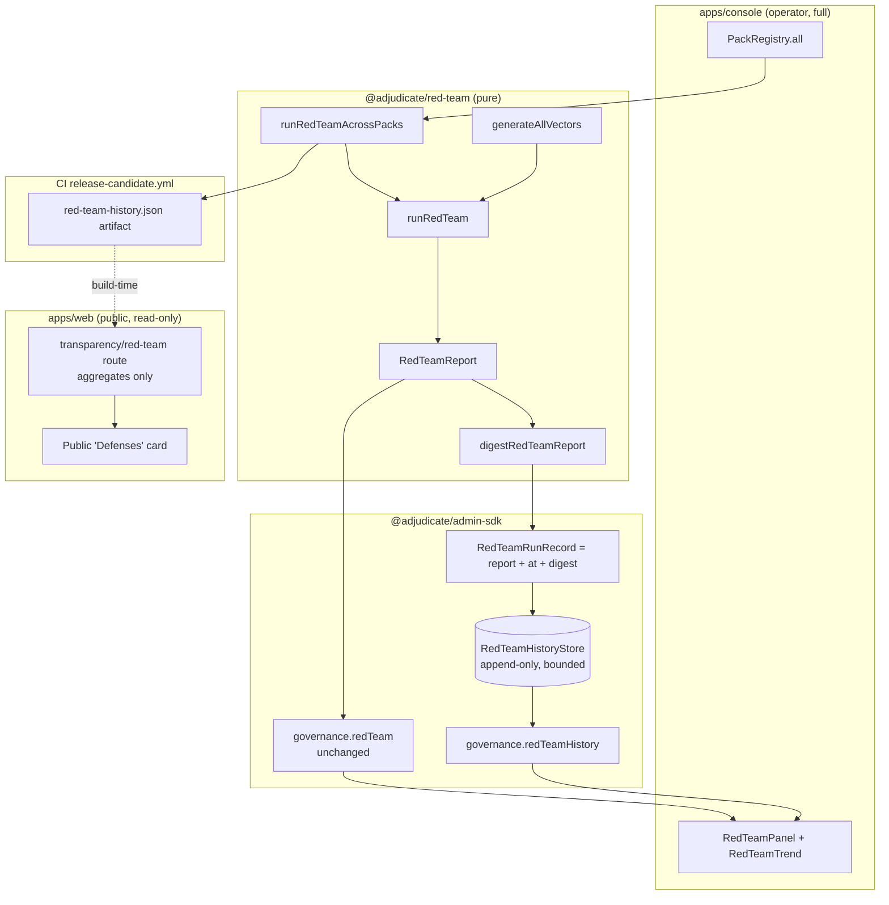

# Red Team Results — Design

> Status: Draft (Phase-1 design, pending approval) · Roadmap: WS3 Web Parity · Target apps: console + web

## Problem

The roadmap asks the operator console to show, per Pack: an **attack-category
breakdown** (by vector), **pass/fail counts** (defended / escaped / error +
`escapesByVector`), and a **trend over runs**. Today only the first two are
possible, and only for a single hard-coded Pack:

- The console computes `runRedTeam(...)` **once at module load** against
  `deploymentsApprovalPack` (apps/console/src/app/api/admin/trpc/[trpc]/route.ts:200-204)
  and threads the single `RedTeamReportParsed` into `AdminContext.redTeamReport`
  (packages/admin-sdk/src/trpc/index.ts:146). `governance.redTeam` returns that
  one snapshot (trpc/index.ts:413-424); `RedTeamPanel.tsx` renders defended /
  escaped / errors + a per-vector escapes table.
- There is **no run history** (the report is recomputed on every cold start and
  never persisted) and **no multi-pack aggregation** (only the first wired Pack
  is exercised; `PackRegistry` holds five — registry.ts `ADAPTERS`). So "trend
  analysis" has **no data source**: there is nothing to plot over time and
  nothing to compare across Packs.

This puts the surface at **readiness tier B — needs run-history persistence**.
This doc specifies a deterministic red-team **run-history store** keyed by a
content digest + a harness-supplied timestamp, multi-pack aggregation across
`PackRegistry`, a new `governance.redTeamHistory` tRPC procedure (new admin-sdk
schema), CI wiring so `release-candidate.yml` feeds history, and a sanitized,
public, read-only "defended" transparency view on apps/web. No kernel changes:
red-team remains a pure consumer of the existing taint/auth/business vocabulary
(ADR-118 "Invariants preserved").

## Existing Architecture

Real today (verified):

| Concern | Where | Status |
|---|---|---|
| Producer | `@adjudicate/red-team` — `runRedTeam`, `generateAllVectors`, `computeRedTeamExitCode`, `taintEscalationCausality`, `renderRedTeamJson/Text` (packages/red-team/src/index.ts) | Real, pure |
| Report shape | `RedTeamReport { pack:{id}, results: RedTeamResult[], summary: RedTeamSummary }` (runner.ts:25-29) | Real |
| Result | `{ name, vector, status:'defended'\|'escaped'\|'error', decision?, basisCodes?, acceptable, error? }` (runner.ts:6-15) | Real |
| Vectors | `'prompt_injection' \| 'taint_escalation' \| 'tool_scope_violation'` (scenario.ts `AttackVector`) | Real, **closed enum** |
| Causality | `taintEscalationCausality` splits defended into `byTaintGate` vs `byOtherGuard` via `TAINT_GATE_BASIS = "taint:level_insufficient"` (runner.ts:117-151; commit 25ea578) | Real |
| Seed/PRNG | `lcg`, `RED_TEAM_DEFAULT_SEED = 0xed7ea`; "no `Math.random()` reachable" (prng.ts) | Real, deterministic |
| Wire schema | `RedTeamReportSchema` / `RedTeamResultSchema` / `RedTeamSummarySchema` / `RedTeamStatusSchema` / `AttackVectorSchema` (admin-sdk/src/schemas/red-team.ts) — structural mirror, **no dep on red-team pkg** | Real, **published** |
| tRPC | `governance.redTeam` → `RedTeamReportSchema`; `PRECONDITION_FAILED` when unwired (trpc/index.ts:413-424) | Real |
| Console wiring | report pre-computed at startup against `deploymentsApprovalPack`; `firstPack` policy descriptor (route.ts:186-204) | Real but **single-pack, single-run** |
| Console UI | `RedTeamPanel.tsx` + `useRedTeam` hook (queryKey `["governance","redTeam"]`, `retry:false`) | Real, has component test |
| CLI | `adjudicate red-team --pack <module>` (exit 2 on escape/error) | Real |
| CI | `release-candidate.yml` runs `pnpm test` (which includes red-team tests) but has **no dedicated red-team gate step** and **persists nothing** | Gap |

apps/web today: **no governance dashboards**. There is a 100%-mock
`ConsolePreview.tsx` card and a playground (DecisionLab etc.) that calls
node-only API routes under `app/api/playground/*`. No charting lib; the React
Query provider (`providers.tsx`) is wired but largely unused. No auth/tenant
model. So the public red-team view is greenfield.

## Proposed Architecture

Four additive pieces, no kernel change:

1. **Run-history store (admin-sdk, new adopter port).** A
   `RedTeamHistoryStore` interface + reference `createInMemoryRedTeamHistoryStore`.
   It persists one immutable `RedTeamRunRecord` per (pack, run), keyed by a
   **content digest of the report** plus a **harness-supplied `at` timestamp**.
   The digest is computed by a new pure helper `digestRedTeamReport(report)` in
   `@adjudicate/red-team` (canonical-JSON → existing canonical hash; no
   wall-clock, no RNG). Idempotent: same digest = same run = no duplicate row.

2. **Multi-pack aggregation.** A new pure helper in `@adjudicate/red-team`,
   `runRedTeamAcrossPacks(packs, opts)`, runs `runRedTeam(generateAllVectors())`
   per Pack and returns `RedTeamReport[]`. The console iterates
   `PackRegistry.all()` instead of `firstPack` only.

3. **New published read surface.** `governance.redTeamHistory` (admin-sdk tRPC)
   + `RedTeamHistoryQuerySchema` / `RedTeamRunRecordSchema` /
   `RedTeamHistoryResultSchema` / `RedTeamTrendPointSchema` Zod schemas. Returns
   per-pack run records (newest-first, bounded) and a pre-bucketed trend series.
   The existing `governance.redTeam` stays unchanged for back-compat.

4. **Public transparency view (apps/web, app-only).** A node-only Next route
   `app/api/transparency/red-team/route.ts` that serves a **sanitized aggregate**
   per *shipped* Pack — `{ packId, total, defended, lastRunStatus, lastRunAt }`
   only. **No** `results[]`, no `basisCodes`, no scenario `name`s, no `error`
   strings, no `acceptable` sets. Backed by a build-time JSON artifact emitted by
   CI (see Rollout), so apps/web needs no admin-sdk auth and no live store.



## API Design

### `@adjudicate/red-team` (additive helpers — pure)

```ts
/** Canonical, deterministic digest of a report's *content* (excludes timing). */
export function digestRedTeamReport(report: RedTeamReport): string; // "0x…" canonical hash

/** Run all vectors against many packs; deterministic, no wall-clock/RNG. */
export function runRedTeamAcrossPacks(
  packs: ReadonlyArray<RedTeamPack>,
  opts?: GenerateOptions,
): ReadonlyArray<RedTeamReport>;
```

`digestRedTeamReport` hashes a canonical projection that **omits** any
timestamp; only `{ pack.id, results (sorted by name), summary }` participate, so
two identical-policy runs collide to one history row regardless of when they ran.

### `@adjudicate/admin-sdk` — tRPC (new, additive)

Mirrors the existing `governance.*` + `PRECONDITION_FAILED`-when-unwired pattern
(trpc/index.ts:396-424). The store is an **optional** `AdminContext` port
(`redTeamHistory`), exactly like `driftDetector` / `tokenBudget`.

```ts
governance.redTeamHistory: query
  .input(RedTeamHistoryQuerySchema)   // { packId?, limit?, vector? }
  .output(RedTeamHistoryResultSchema) // { runs: RedTeamRunRecord[], trend: RedTeamTrendPoint[], packIds: string[] }
```

```ts
// AdminContext additive field (optional, feature-detectable):
readonly redTeamHistory?: {
  query(input: RedTeamHistoryQuery): Promise<RedTeamHistoryResult>;
};
```

Handler (new `handlers/red-team-history.ts`, mirrors
`handlers/outcome-distribution.ts`): pure read over the store — filter by
`packId` / `vector`, truncate to `limit` (schema-capped), and fold the run
records into `trend` points. No auth gate beyond the others (queries do not
require an actor; the console's bearer gate + `requireConsoleAdminAuth` front
the whole router).

### adopter-implemented store contract (admin-sdk, new)

```ts
export interface RedTeamHistoryStore {
  /** Append a run; idempotent on (packId, digest). Returns false if dup. */
  append(record: RedTeamRunRecord): Promise<boolean>;
  query(input: RedTeamHistoryQuery): Promise<RedTeamHistoryResult>;
}
export function createInMemoryRedTeamHistoryStore(
  opts?: { runs?: readonly RedTeamRunRecord[]; maxRunsPerPack?: number },
): RedTeamHistoryStore; // bounded ring, default maxRunsPerPack = 500, newest-first
```

### apps/web (app-only route, no new published surface)

```ts
// GET /api/transparency/red-team  → 200 application/json, immutable cache
// Returns ONLY: { packs: { packId, total, defended, lastRunStatus, lastRunAt }[], generatedAt }
```

## Data Model

```ts
// admin-sdk/src/schemas/red-team-history.ts  (NEW published file)
export const RedTeamRunRecordSchema = z.object({
  packId: z.string(),
  digest: z.string().regex(/^0x[0-9a-f]+$/),        // from digestRedTeamReport
  at: z.string().datetime(),                          // HARNESS-supplied, never wall-clock here
  report: RedTeamReportSchema,                         // reuses the existing frozen schema
});

export const RedTeamHistoryQuerySchema = z.object({
  packId: z.string().optional(),
  vector: AttackVectorSchema.optional(),              // reuse closed enum — never widen
  limit: z.number().int().min(1).max(500).default(100),
});

export const RedTeamTrendPointSchema = z.object({
  at: z.string().datetime(),
  packId: z.string(),
  total: z.number().int().nonnegative(),
  defended: z.number().int().nonnegative(),
  escaped: z.number().int().nonnegative(),
  errors: z.number().int().nonnegative(),
  escapesByVector: RedTeamSummarySchema.shape.escapesByVector, // reuse closed-cardinality map
});

export const RedTeamHistoryResultSchema = z.object({
  runs: z.array(RedTeamRunRecordSchema),
  trend: z.array(RedTeamTrendPointSchema),            // chronological asc, per (pack, run)
  packIds: z.array(z.string()),
});
export type RedTeamRunRecordParsed = z.infer<typeof RedTeamRunRecordSchema>;
export type RedTeamHistoryResultParsed = z.infer<typeof RedTeamHistoryResultSchema>;
```

```ts
// apps/web public DTO (NOT published; app-local) — sanitized subset
interface PublicRedTeamSummary {
  packId: string; total: number; defended: number;
  lastRunStatus: "clean" | "regressed";              // derived: escaped+errors === 0 ? clean : regressed
  lastRunAt: string;                                  // ISO; coarse, no per-scenario timing
}
```

**Closed taxonomies / bounded cardinality.** `AttackVectorSchema` and
`RedTeamStatusSchema` are reused as-is — **not widened**. `escapesByVector` keeps
its fixed 3-key shape. New vectors, per ADR-118 "Lifecycle", land additively
(MINOR) by extending the *producer* enum; this doc adds none. **Events:** none on
the kernel event bus (telemetry, outside the determinism boundary). The only
"event" is the append of a `RedTeamRunRecord`, which is plain governance
telemetry, not a kernel `GovernanceEvent`.

## Determinism Analysis

- **Outside the determinism boundary, full stop.** Run history is telemetry
  (like drift snapshots and token usage). It is **never** a kernel input; the
  kernel's `adjudicateWithTrace(envelope, state, policy)` is unaffected. Storing
  reports cannot change any decision.
- **No wall-clock / RNG in the producer.** `runRedTeam`, `generateAllVectors`,
  `runRedTeamAcrossPacks`, and `digestRedTeamReport` make zero `Date.now()` /
  `Math.random()` calls (prng.ts contract; scenario timestamps come from
  `deterministicTimestamp`/seed). The `at` on a `RedTeamRunRecord` is **supplied
  by the harness/adopter** (CI step, or the console's startup wiring), exactly
  like every other adopter-supplied timestamp in the kernel contract.
- **Digest = content, not timing.** `digestRedTeamReport` deliberately excludes
  `at`. Replaying the *same* policy yields the *same* report → *same* digest →
  the store treats it as the same run (idempotent `append`). This is what makes a
  "trend" meaningful: a new point appears only when the *content* changes
  (a policy regression or fix), not on every cold start.
- **Replay safety.** A reviewer can re-derive any historical row: take the
  stored Pack version + seed, re-run `runRedTeam`, recompute `digestRedTeamReport`,
  and assert it equals the stored `digest`. Same seed → byte-identical report
  (ADR-118 property test). The store is append-only and bounded, so ordering is
  stable (newest-first) and rows are immutable — no in-place mutation to drift.
- **Taint lattice.** Untouched. Red-team only *asserts* the taint gate fires
  (`taintEscalationCausality`); persisting that assertion's result carries no
  taint and cannot perturb the lattice across rewrites/pauses/resumes.

## Security Analysis

**Threat model.** The artifact under protection is the *honesty* of the
red-team signal and the *confidentiality* of attack internals on the public web.

- **Data-leak via the public view (primary risk).** A `RedTeamReport.results[]`
  entry carries `name` (scenario identifier, may telegraph attack construction),
  `basisCodes` (which defense fired — a roadmap for probing the gaps), `decision`,
  `acceptable`, and `error` (may embed stack/internal detail). **None of these
  may reach apps/web.** The public route returns only counts +
  `lastRunStatus`/`lastRunAt` (`PublicRedTeamSummary`). Enforcement is structural:
  the web route reads a CI-emitted artifact that is *already* reduced to the
  sanitized shape — apps/web never imports `RedTeamReportSchema` and has no path
  to `results[]`. A schema test asserts the public DTO has no `results`,
  `basisCodes`, `error`, or `acceptable` keys.
- **Telemetry-as-oracle / abuse.** Even sanitized, a per-pack `escaped > 0`
  number is sensitive (advertises a live hole). Mitigation: the public view shows
  only *shipped* Packs and only the **boolean** `lastRunStatus` (clean /
  regressed) plus `total`/`defended`; it does **not** publish `escapesByVector`
  or raw `escaped` counts. Operators get the full breakdown on the
  bearer-gated console only.
- **Prompt-injection paths.** Red-team's purpose is to *generate* prompt-injection
  scenarios and prove they are defended. Persisting reports does not execute any
  payload — `runRedTeam` runs them through the **pure** kernel, never an LLM, and
  the history store holds only structured outcomes. No scenario text is rendered
  as markup; the console renders `name`/`basisCodes` as text (existing
  `RedTeamPanel` pattern), and the public view never renders them at all.
- **History poisoning / tamper.** The store is append-only and idempotent on
  `(packId, digest)`. A forged "clean" row is detectable: recompute
  `digestRedTeamReport(report)` and compare to the stored `digest` — a mismatch
  means the report was edited after digesting. Console exposes a "verify digest"
  affordance for any row.
- **Auth.** `governance.redTeamHistory` sits behind the same fail-closed
  `requireConsoleAdminAuth` bearer gate as the rest of the admin router
  (route.ts:79-96); in prod with no `ADMIN_API_TOKEN` the whole surface 503s. The
  public web route is intentionally unauthenticated but serves only the sanitized
  aggregate.
- **Unbounded growth.** `maxRunsPerPack` (default 500) bounds the in-memory store
  (mirrors `DEFAULT_MAX_EMERGENCY_EVENTS`); Postgres adopters paginate by `limit`.

## UI Design

### Console (full operator surface)

**Screen A — `RedTeamPanel` (extended), per-Pack breakdown + causality.**
Keep the existing summary line + per-vector escapes table. Add: (1) a **Pack
selector** (defaults to first Pack; lists `PackRegistry.all()` ids); (2) a
**status column** per vector using `RedTeamStatusSchema` colors (escaped/error =
red, defended = emerald, matching current `cn` usage); (3) a **causality strip**
for `taint_escalation` showing `byTaintGate` vs `byOtherGuard` (from
`taintEscalationCausality`) so a green count isn't read as a vacuous pass.

- *Loading:* keep "Loading red-team report…" text (existing).
- *Empty:* if `governance.redTeam` throws `PRECONDITION_FAILED`, keep the
  current "No red-team report configured…" italic guidance.
- *Error:* `retry:false` (existing); show inline non-retryable error text.
- *a11y:* `<table>` with `<th scope="col">`; status conveyed by **text label +
  color**, never color alone; `data-testid="red-team-panel"` retained.
- *Responsive:* table collapses to stacked rows < 480px; Pack selector full-width
  on narrow.

**Screen B — `RedTeamTrend` (new), trend over runs.** Sparkline/line of
`defended` and `escaped` per run from `governance.redTeamHistory`, x-axis = run
`at`, one series group per selected Pack; "All packs" aggregate toggle. A small
table of recent runs (`at`, `digest` short form, defended/escaped/errors,
"verify" button). No new heavy charting dep — render an inline SVG sparkline
(the web app already has zero charting lib; keep console light too).

- *Loading:* skeleton rows (3) for the run table; sparkline shows a muted
  baseline.
- *Empty:* "No runs recorded yet — history populates after the first CI red-team
  run or console cold start." (Distinguish from `PRECONDITION_FAILED` "not
  configured".)
- *Error:* inline message; `retry:false`.
- *a11y:* sparkline has an `<title>`/`aria-label` summarizing latest defended vs
  escaped; the run table is the accessible source of truth (chart is decorative);
  digests are in `<code>` with copy affordance.
- *Responsive:* sparkline scales to container; run table → horizontal scroll
  with a sticky first column < 600px.

### apps/web (public, read-only, sanitized subset)

**Screen C — "Defenses" transparency card** (replaces part of the mock
`ConsolePreview`). One row per *shipped* Pack (from `content/packs.ts`
`status:"shipped"`): Pack display name, `defended / total` ("N of M attack
scenarios defended"), a clean/regressed badge, and "last verified
{lastRunAt}". **No** vectors, **no** scenario names, **no** basis codes, **no**
raw escape counts. Data from `GET /api/transparency/red-team`.

- *Loading:* skeleton rows matching shipped-pack count.
- *Empty:* if the artifact is missing/empty, hide the card (do not render a
  hardcoded mock) and log a build warning — public surfaces must never fabricate
  a "100% defended" claim.
- *Error:* on fetch failure show "Transparency data temporarily unavailable" —
  never fall back to optimistic numbers.
- *a11y:* each row is a labeled group; badge has text ("Clean" / "Regressed") not
  color only; `defended/total` announced as "N of M defended".
- *Responsive:* card grid 1-col mobile, 2-col ≥ md; numbers `tabular-nums`.

The console-internal causality strip, per-vector escapes, scenario names, basis
codes, digests, and the "verify" workflow are **operator-only — not exposed on
web**.

## Observability Design

- **Metrics (Prometheus-compatible, emitted by the adopter, not the kernel):**
  `adjudicate_red_team_scenarios_total{pack,vector,status}`,
  `adjudicate_red_team_escaped_total{pack,vector}` (alert if > 0),
  `adjudicate_red_team_runs_total{pack}`,
  `adjudicate_red_team_history_records{pack}` (gauge; watch vs `maxRunsPerPack`).
- **Logs:** on `append`, structured log `{ packId, digest, defended, escaped,
  errors, at, deduped }`. Never log scenario `name`/`error` at info level
  (avoid leaking attack construction into log sinks); reserve those for
  debug-level, operator-only.
- **Audit records:** none new on the kernel audit stream (telemetry). The console
  may surface a "verify digest" action as an operator activity log entry, but
  it's not a kernel `GovernanceEvent`.
- **Dashboards / SLO suggestions:** "Red-team escapes by pack over time" panel;
  **SLO: `escaped + errors == 0` on every Pack at every RC run** (a hard release
  gate, not a percentage). Alert: page on any `escaped_total > 0`; warn on
  `errors_total > 0` (harness/precondition regression). Trend regression alert:
  fire when a Pack's `defended` drops vs the previous digest.

## Testing Strategy

- **Unit (red-team):** `digestRedTeamReport` is stable across equal reports and
  differs on any content change; excludes `at` (two reports differing only by
  timestamp share a digest). `runRedTeamAcrossPacks` returns one report per Pack
  in input order.
- **Unit (admin-sdk):** `createInMemoryRedTeamHistoryStore` — append idempotent
  on `(packId, digest)`; ring eviction at `maxRunsPerPack`; `query` filters by
  `packId`/`vector`, honors `limit`, returns newest-first runs + chronological
  trend.
- **Integration (tRPC):** `createAdminCaller` with a seeded history store →
  `governance.redTeamHistory` shapes match `RedTeamHistoryResultSchema`;
  `PRECONDITION_FAILED` when `redTeamHistory` is unwired (parity with
  `governance.redTeam`).
- **Conformance:** the lighthouse Pack (PIX) yields **0 escapes** and its digest
  is stable across runs (extends ADR-118's existing 0-escape fixture).
- **Replay:** re-run a stored record's Pack at its seed, recompute the digest,
  assert equality to the persisted `digest` (tamper/replay-safety proof).
- **Security/adversarial:** (1) the leaky-pack fixture (ADR-118) escapes → a
  history row records `escaped > 0` and `lastRunStatus:"regressed"`; (2) **public
  DTO leak test** — the apps/web transparency payload has *no* `results`,
  `basisCodes`, `error`, `acceptable`, or per-vector keys; (3) digest-mismatch
  detection on a hand-edited report.
- **UI component (RTL, console):** `RedTeamPanel` renders defended/escaped/errors
  + per-vector table (existing); new: Pack selector switches data;
  `RedTeamTrend` empty/loading/error states; status conveyed by text+color.
  (apps/web currently has **no jsdom/RTL** — the public card is covered by a
  node-only render/serialization test + Playwright.)
- **E2E (Playwright):** console — operator selects a Pack, sees breakdown +
  trend, clicks "verify digest". web — public visitor loads the home page, the
  Defenses card shows `N of M defended` per shipped Pack and **no** attack
  internals appear in the DOM.

## Rollout & Release Impact

**New published surface (additive MINOR, no major — joins the combined post-v1
minor wave with the existing 15 staged changesets; both new packs go stable at
0.2.0):**

- **`@adjudicate/red-team` → minor:** add `digestRedTeamReport`,
  `runRedTeamAcrossPacks`.
- **`@adjudicate/admin-sdk` → minor:** add `governance.redTeamHistory` procedure;
  `RedTeamHistoryQuerySchema` / `RedTeamRunRecordSchema` /
  `RedTeamHistoryResultSchema` / `RedTeamTrendPointSchema`;
  `RedTeamHistoryStore` + `createInMemoryRedTeamHistoryStore`; optional
  `AdminContext.redTeamHistory` field.
- **Changeset:** extend the existing `.changeset/red-team.md` (or add a sibling)
  declaring both minors. Per **EXTENSION_POLICY §2.2/§2.3** and **SEMVER_GOVERNANCE
  §5/§9**, every NEW public symbol above needs a **V1_FREEZE_MATRIX.md** row **and**
  an ADR **in the same PR**.
- **ADR to create:** **ADR-118 follow-up** ("red-team run-history + multi-pack
  aggregation") — documents the digest recipe (content-only, timing excluded),
  the append-only/idempotent store contract, and the public-view redaction rule.
- **V1_FREEZE_MATRIX rows to add** (under §8 `@adjudicate/admin-sdk`; the current
  red-team schemas aren't yet listed there — add them too): the four new Zod
  schemas, the `RedTeamHistoryStore` interface + reference factory, the
  `governance.redTeamHistory` procedure (note in the existing trpc-router row),
  and the red-team helpers under the red-team package section. Tier `F`
  (frozen-additive), scheduled.
- **CI (`release-candidate.yml`):** add a "Red-team gate" step that runs
  `runRedTeamAcrossPacks` over all shipped Packs (exit 2 on any escape/error,
  `computeRedTeamExitCode`) and an "Emit red-team history" step that writes
  `docs/perf/red-team-history.json` (or an artifact) consumed at apps/web build
  time to populate the transparency route. Mirrors the existing "Upload scale
  baselines" pattern.
- **apps/console / apps/web changes are app-only** (no published surface): console
  wires `createInMemoryRedTeamHistoryStore` (or Postgres adopter) + iterates
  `PackRegistry.all()`; web adds the node-only transparency route + Defenses card.
- **Migration notes:** purely additive; `governance.redTeam` unchanged so existing
  console builds keep working. New `AdminContext.redTeamHistory` is optional
  (feature-detected via `PRECONDITION_FAILED`), so adopters opt in.

**Effort: M.** New SDK schemas + store + handler + two pure red-team helpers +
one new console panel + one app-only web route/card + CI wiring; governance
paperwork (ADR + freeze rows + changeset) is the long pole, but the producer is
already pure and the patterns are all precedented.
