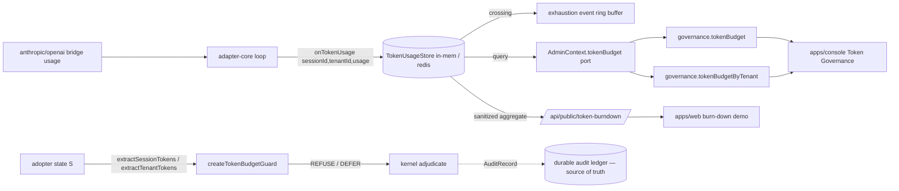

# Token Governance — Design

> Status: Draft (Phase-1 design, pending approval) · Roadmap: WS3 Web Parity · Target apps: console + web

## Problem

Operators need a trustworthy answer to "how much LLM token cost is each session and each tenant burning, and which of them are about to hit (or have hit) their budget?" Today the answer is **session-only, fixed, and faked**:

- `governance.tokenBudget` (tRPC) and the wire schemas (`TokenBudgetQuerySchema` / `TokenBudgetResultSchema` / `TokenBudgetSessionSchema` in `packages/admin-sdk/src/schemas/token-budget.ts`) exist, but `AdminContext` declares only a **port** — `readonly tokenBudget?: { query(input: TokenBudgetQuery): Promise<TokenBudgetResult> }` (`packages/admin-sdk/src/trpc/index.ts:159`) — and the procedure throws `PRECONDITION_FAILED` when unwired (`trpc/index.ts:377-389`). **There is no shipped store.**
- The reference console hand-rolls a `DEMO_TOKEN_SESSIONS` literal — 3 sessions, a single fixed `TOKEN_BUDGET = 50_000` (`apps/console/src/app/api/admin/trpc/[trpc]/route.ts:228-233, 320-335`). `TokenBudgetPanel.tsx` renders only those session rows.
- `TokenBudgetResult` is **session-only**: `{ sessions: { sessionId, consumed, budget?, remaining? }[], totalConsumed }`. **Tenant budgets have no shape at all**, and neither app has a tenant/auth model.
- **Budget exhaustion is not observable as events.** The enforcement primitive `createTokenBudgetGuard` (`@adjudicate/primitives`, ADR-120) REFUSEs/DEFERs when a session/tenant budget is crossed, but the crossing leaves no telemetry timeline an operator can review — only individual audit records buried in the ledger.

The roadmap wants a Token Governance section with **tenant budgets, session budgets, and an exhaustion-event timeline**. The real upstream signal already exists: `adapter-core` fires `onTokenUsage({ sessionId, iteration, usage })` after each `bridge.send` (`packages/adapter-core/src/loop.ts:220-233`), `TokenUsage = { inputTokens?, outputTokens? }` (`types.ts:52-55`), and the Anthropic/OpenAI bridges now map provider usage through (commit `5a7419b`). What is missing is a **store** to fold that hook into per-session AND per-tenant counters + exhaustion events, a **tenant dimension** to scope it, and the **SDK surface** to read it. This is readiness tier C (port-only, no store, no tenant model — the tenant model is the biggest gap).

## Existing Architecture

**Upstream signal — `@adjudicate/adapter-core` (ADR-120).** `RunOptions.onTokenUsage?: (info: { sessionId: string; iteration: number; usage: TokenUsage | undefined }) => void` is fired once per iteration after `bridge.send`, defensively (a throwing observer is logged and ignored — `loop.ts:227-232`). `TokenUsage` is `{ readonly inputTokens?: number; readonly outputTokens?: number }` and is **explicitly not hashed** (`types.ts:47-50`). The package already ships the store pattern this design mirrors: `createInMemoryConfirmationStore` / `createInMemoryMemoryStore` (`persistence.ts:199, 249`) + `createRedisConfirmationStore` / `createRedisMemoryStore` (`persistence-redis.ts:101, 172`), each an interface + in-memory ref impl + Redis impl with TTL sweeps.

**Enforcement primitive — `@adjudicate/primitives` (ADR-120).** `createTokenBudgetGuard<K,P,S>({ extractSessionTokens, extractTenantTokens?, sessionBudget?, tenantBudget?, action?, deferSignal?, deferTimeoutMs?, userFacing? })` (`guards.ts:763`). A **pure** guard: it reads the consumed counter from adopter **state `S`** via `extractSessionTokens`/`extractTenantTokens`, REFUSEs (default) or DEFERs on a crossing, and fails **closed** on a non-finite meter — `+Infinity ≥ budget` crosses (REFUSE); only `NaN` and genuinely sub-budget values pass (`guards.ts:789-806`, hardened per commit `2af02dd`). Basis is `business.RULE_VIOLATED`; metadata is `{ kind: "opaque" }` (no `GuardDescription` widening). **Crucially, its input is `S`, never any store.**

**SDK — `@adjudicate/admin-sdk` (v2.0.0).** `schemas/token-budget.ts` re-declares the wire shapes as Zod with **no dependency** on any feature package:

```ts
TokenBudgetQuerySchema   = z.object({ since: IsoTimestampSchema.optional(), sessionId: z.string().optional() });
TokenBudgetSessionSchema = z.object({ sessionId: z.string(), consumed: int≥0, budget?: int≥0, remaining?: int });
TokenBudgetResultSchema  = z.object({ sessions: TokenBudgetSessionSchema[], totalConsumed: int≥0 });
```

`governance.tokenBudget` is a `.query()` with `.input(TokenBudgetQuerySchema).output(TokenBudgetResultSchema)` that throws `PRECONDITION_FAILED` when `ctx.tokenBudget` is absent (`trpc/index.ts:377-389`). A documented tenant convention already exists elsewhere: `AuditQuerySchema.tenantScope?: string` resolved "from `ctx.actor` (e.g. `actor.tenantId`)" (`schemas/query.ts:39-47`) — but `ActorSchema` (`schemas/emergency.ts:25-28`) is only `{ id, displayName? }` today; there is **no `tenantId` field** and `extractActor` reads only `x-adjudicate-actor-id` / `-name` (`auth/extract-actor.ts`).

**Console adopter.** `route.ts` constructs a `tokenBudget` object whose `query()` filters `DEMO_TOKEN_SESSIONS`, attaches the fixed budget, computes `remaining`, and threads it into `AdminContext`. Hook `apps/console/src/hooks/useTokenBudget.ts` calls `trpc.governance.tokenBudget.query()`; `TokenBudgetPanel.tsx` renders a 4-column session table with over-budget rows in red and an honest "Token-budget telemetry not configured." error state. Has a component test.

**`apps/web`.** No governance dashboards. `src/sections/ConsolePreview.tsx` is a static marketing card. `src/app/providers.tsx` mounts an **unused** React Query `QueryClient`. node-only vitest (1 test), no jsdom/RTL, no charting lib, **no auth/tenant model**, no token.

**Real vs demo today:** the schema, port, procedure, and guard are real and shipped. The **store does not exist** (port only). The **tenant shape does not exist**. The **data** is a 3-row literal at a fixed 50k cap (demo). Exhaustion is **not** captured anywhere as a reviewable event.

## Proposed Architecture

Four changes, parity-first and additive. The **store is telemetry, strictly outside the determinism boundary** — it records usage for the dashboard; it never feeds a kernel decision (the guard's input stays state `S`).

1. **`@adjudicate/adapter-core` (MINOR):** add a `TokenUsageStore` — interface + `createInMemoryTokenUsageStore` + `createRedisTokenUsageStore`, mirroring the existing memory/confirmation stores. It is fed by the `onTokenUsage` hook (one line in the adopter's `onTokenUsage` callback), records **per-session AND per-tenant** cumulative consumption against configured budgets, and appends a bounded **budget-exhaustion event** when a counter crosses its cap. It exposes read methods the admin-sdk port adapts.
2. **`@adjudicate/admin-sdk` (MINOR):** add `TokenBudgetTenantSchema` + a `TokenExhaustionEventSchema` list; extend the result with `tenants[]` and `exhaustionEvents[]`, and add `governance.tokenBudgetByTenant` (a sibling query, keeping `governance.tokenBudget` byte-compatible for existing consumers). New port methods on `AdminContext.tokenBudget`.
3. **Minimal tenant model (cross-cutting, MINOR on admin-sdk):** add an optional `tenantId` to `ActorSchema` and have `extractActor` read `x-adjudicate-actor-tenant`. This is the missing dimension the whole multi-tenant story (audit `tenantScope`, tenant budgets, future per-tenant panels) hangs off. It is **additive and optional** — single-tenant adopters ignore it.
4. **`apps/console` + `apps/web` (app-only):** console gets a full Token Governance section (Tenant budgets / Session budgets / Exhaustion timeline). `apps/web` gets a **read-only, single-tenant, aggregate-only burn-down** demo served from a new public route — never raw session ids, never tenant ids, never token counts that map to a customer.



The store and the guard are **two independent reads of the same upstream usage**: the guard reads it folded into `S` (deterministic, kernel-facing); the store reads it from the `onTokenUsage` hook (telemetry, dashboard-facing). They never cross.

## API Design

### `@adjudicate/adapter-core` (new store, mirrors `MemoryStore`/`ConfirmationStore`)

```ts
/** One provider-reported usage sample, attributed to a session and (optionally) a tenant. */
export interface TokenUsageSample {
  readonly sessionId: string;
  readonly tenantId?: string;             // omitted in single-tenant deployments
  readonly inputTokens: number;           // coerced from TokenUsage; non-finite -> recorded as 0 for sums
  readonly outputTokens: number;
  readonly at: string;                    // ISO-8601, ADOPTER-SUPPLIED (never Date.now() in a hot path the guard shares)
}

/** Configured caps the store compares cumulative consumption against (display + exhaustion detection only). */
export interface TokenBudgetConfig {
  readonly sessionBudget?: number;        // per-session cap
  readonly tenantBudget?: number;         // per-tenant cap
}

export interface TokenUsageStore {
  /** Fold one usage sample into the session + tenant counters; append an exhaustion event on a crossing. */
  record(sample: TokenUsageSample): Promise<void>;
  /** Per-session view (back-compat with the existing TokenBudgetResult shape). */
  sessions(filter: { sessionId?: string; since?: string }): Promise<ReadonlyArray<SessionConsumption>>;
  /** Per-tenant view. */
  tenants(filter: { tenantId?: string; since?: string }): Promise<ReadonlyArray<TenantConsumption>>;
  /** Bounded, newest-first exhaustion-event log. */
  exhaustionEvents(filter: { scope?: "session" | "tenant"; tenantId?: string; limit: number }): Promise<ReadonlyArray<TokenExhaustionEvent>>;
}

export function createInMemoryTokenUsageStore(opts?: {
  readonly budgets?: TokenBudgetConfig;
  readonly perTenantBudgets?: ReadonlyMap<string, TokenBudgetConfig>;  // override the default cap per tenant
  readonly maxSessions?: number;          // LRU bound (default 10_000) — session-id churn defence
  readonly maxEvents?: number;            // exhaustion ring-buffer bound (default 10_000, mirrors DEFAULT_MAX_EMERGENCY_EVENTS)
}): TokenUsageStore;

export function createRedisTokenUsageStore(opts: {
  readonly redis: RedisLike;              // same RedisLike the persistence-redis stores take
  readonly keyPrefix?: string;            // default "adj:tok:"
  readonly budgets?: TokenBudgetConfig;
  readonly perTenantBudgets?: ReadonlyMap<string, TokenBudgetConfig>;
  readonly ttlSeconds?: number;           // counter TTL; events use a capped LIST (LTRIM)
}): TokenUsageStore;
```

`record()` is the single mutation, called from the adopter's `onTokenUsage` callback:

```ts
onTokenUsage: ({ sessionId, usage }) => store.record({
  sessionId,
  tenantId: resolveTenant(sessionId),     // adopter maps session -> tenant
  inputTokens: usage?.inputTokens ?? 0,
  outputTokens: usage?.outputTokens ?? 0,
  at: clock(),                            // adopter/harness clock
});
```

### `@adjudicate/admin-sdk` (new schemas + tenant procedure)

Naming consistent with existing `governance.*` queries (`tokenBudget`, `behavioralDrift`, `redTeam`, `configSealStatus`, `policyCoherence`). `governance.tokenBudget` keeps its current output; a sibling adds the tenant view + events:

```ts
// extend the per-session result additively (existing fields untouched)
TokenBudgetResultSchema = z.object({
  sessions: z.array(TokenBudgetSessionSchema),
  totalConsumed: z.number().int().nonnegative(),
  // NEW optional fields — old consumers ignore them, byte-compatible:
  tenants: z.array(TokenBudgetTenantSchema).optional(),
  exhaustionEvents: z.array(TokenExhaustionEventSchema).optional(),
});

// NEW input for the tenant-scoped sibling
TokenBudgetTenantQuerySchema = z.object({
  tenantId: z.string().optional(),
  since: IsoTimestampSchema.optional(),
  eventLimit: z.number().int().positive().max(500).default(100),
});

// NEW procedures
governance.tokenBudgetByTenant: t.procedure
  .input(TokenBudgetTenantQuerySchema)
  .output(TokenBudgetByTenantResultSchema)
  .query(async ({ input, ctx }) => {
    if (!ctx.tokenBudget?.queryByTenant) throw new TRPCError({ code: "PRECONDITION_FAILED",
      message: "Tenant token-budget store not configured. Wire a TokenUsageStore (fed by onTokenUsage) into the route handler context." });
    return ctx.tokenBudget.queryByTenant(input);
  });
```

`AdminContext.tokenBudget` widens additively (both methods optional so old single-method adopters still typecheck):

```ts
readonly tokenBudget?: {
  query(input: TokenBudgetQuery): Promise<TokenBudgetResult>;                  // existing
  queryByTenant?(input: TokenBudgetTenantQuery): Promise<TokenBudgetByTenantResult>;  // NEW
};
```

### Tenant model (admin-sdk, additive)

```ts
ActorSchema = z.object({
  id: z.string().min(1),
  displayName: z.string().optional(),
  tenantId: z.string().min(1).optional(),   // NEW — the cross-cutting multi-tenant dimension
});
// extractActor also reads x-adjudicate-actor-tenant (optional; null/absent => single-tenant)
```

This finally gives the documented `actor.tenantId` convention (already referenced by `AuditQuerySchema.tenantScope`) a real shape, threaded from the same header contract.

### Public web aggregate (app-only, NOT admin-sdk)

`apps/web` is unauthenticated and must never reach `adminRouter`. A Next route handler `GET /api/public/token-burndown` computes, server-side, a **single-tenant rolled-up burn-down** from the store: `{ consumed: rounded, budget: rounded, remaining: rounded, pctUsed: 0..100, band: "ok"|"warn"|"exhausted", asOf }`. No session ids, no tenant ids, no per-session rows, no raw exhaustion details. Hand-rolled, redaction-reviewed shape — no new admin-sdk surface for the public view.

## Data Model

```ts
// adapter-core (runtime types)
interface SessionConsumption { sessionId: string; consumed: number; budget?: number; remaining?: number; lastAt: string; }
interface TenantConsumption  { tenantId: string; consumed: number; budget?: number; remaining?: number; sessionCount: number; lastAt: string; }
interface TokenExhaustionEvent {
  id: string;                              // crypto.randomUUID()
  at: string;                              // adopter-supplied ISO timestamp
  scope: "session" | "tenant";            // CLOSED — 2 values
  sessionId?: string;                      // present iff scope === "session"
  tenantId?: string;                       // present for tenant scope; session events carry it when known
  consumed: number;
  budget: number;                          // the cap that was crossed
}

// admin-sdk Zod (re-declared; NO dependency on adapter-core)
export const TokenScopeSchema = z.enum(["session", "tenant"]);   // CLOSED — widening is MINOR per lifecycle, MAJOR to narrow

export const TokenBudgetTenantSchema = z.object({
  tenantId: z.string(),
  consumed: z.number().int().nonnegative(),
  budget: z.number().int().nonnegative().optional(),
  remaining: z.number().int().optional(),
  sessionCount: z.number().int().nonnegative(),
});

export const TokenExhaustionEventSchema = z.object({
  id: z.string(),
  at: z.string().datetime(),
  scope: TokenScopeSchema,
  sessionId: z.string().optional(),
  tenantId: z.string().optional(),
  consumed: z.number().int().nonnegative(),
  budget: z.number().int().nonnegative(),
});

export const TokenBudgetByTenantResultSchema = z.object({
  schemaVersion: z.literal(1),             // pinned for dashboards
  tenants: z.array(TokenBudgetTenantSchema),
  exhaustionEvents: z.array(TokenExhaustionEventSchema),   // newest-first, len <= eventLimit
  totalConsumed: z.number().int().nonnegative(),
});
export type TokenBudgetTenant       = z.infer<typeof TokenBudgetTenantSchema>;
export type TokenExhaustionEvent    = z.infer<typeof TokenExhaustionEventSchema>;
export type TokenBudgetTenantQuery  = z.infer<typeof TokenBudgetTenantQuerySchema>;
export type TokenBudgetByTenantResult = z.infer<typeof TokenBudgetByTenantResultSchema>;
```

**Closed taxonomies / bounded cardinality:**
- `TokenScopeSchema` is a closed 2-value enum (`session` | `tenant`). It is **not** a kernel enum (Decision-6 / Taint / IntentActor / BasisCategory are untouched).
- Exhaustion events live in a **fixed-capacity ring buffer** (`maxEvents`, default 10_000, mirroring `DEFAULT_MAX_EMERGENCY_EVENTS`), newest-first, oldest evicted — bounded memory.
- Session counters are LRU-bounded (`maxSessions`, default 10_000) so unbounded session-id churn cannot grow the store without bound (this also doubles as the abuse defence below). Tenant counters are bounded by the (small) tenant cardinality.

**Events vs the audit ledger:** `TokenExhaustionEvent` is a **telemetry** record, *not* a `GovernanceEvent` (that enum stays `emergency.update` only) and *not* an `AuditRecord` field. The actual REFUSE/DEFER produced by `createTokenBudgetGuard` is already a normal, audited, replayable kernel Decision in the ledger; the exhaustion event is a denormalized read-model for the timeline, never the system of record.

## Determinism Analysis

- **The store is outside the determinism boundary, by construction.** The kernel never imports the store; the guard's only inputs are `(envelope, state S)`. `createTokenBudgetGuard` reads the counter from `S` via `extractSessionTokens`/`extractTenantTokens` (`guards.ts:746-748, 787-806`) — *not* from `TokenUsageStore`. The store is fed by `onTokenUsage`, which the loop documents as "side-effect-only and defensive… must not break the loop" (`loop.ts:216-233`). Telemetry token usage is explicitly listed in the constraints as living **outside** the determinism boundary and must never become a kernel input — this design honors that: two parallel reads of the same upstream usage, one for the guard (in `S`), one for the dashboard (in the store), with **no edge between them**.
- **`intentHash` untouched.** `TokenUsage` is "NOT part of any hash" (`types.ts:49`); the store never touches the envelope, the canonical-hash recipe, or `S`.
- **No wall-clock / RNG on any decision path.** `record()` takes an adopter-supplied `at` (it does not call `Date.now()` for the recorded timestamp — the only `Date.now()` is the in-memory TTL/LRU sweep, which lives in adapter-core outside the boundary, exactly as the existing `createInMemoryMemoryStore` sweep does, `persistence.ts:254-261`). Event ids use `crypto.randomUUID()` — telemetry only, never in a hash or a decision. The guard itself is RNG/clock-free.
- **Replay safety preserved.** Replaying an envelope through the kernel re-derives the same Decision from the same `(envelope, policy, S)`; the store is not consulted, so it cannot perturb replay. ADR-120's existing fast-check property (deep-frozen `S` adjudicated twice → identical decisions) is unaffected — this design adds no new guard input. The durable audit ledger remains the replay source of truth.
- **Taint lattice.** The store records `sessionId`/`tenantId`/counts only; it never reads, mutates, or relabels taint, and never participates in rewrite/pause/resume. It cannot perturb the lattice. The guard's REFUSE/DEFER preserves taint through the normal kernel path (unchanged by this design).
- **Ordering.** Counters are commutative sums, so the cumulative session/tenant totals are order-insensitive (best-effort bus loss only undercounts telemetry — it never changes a Decision). Exhaustion events are ordered by adopter-supplied `at`, with a monotonic insertion seq as the stable tiebreaker; across replicas the Redis impl uses an append-capped LIST so per-replica order is preserved.

## Security Analysis

- **Purpose: budgets are a cost/DoS control, not an access control.** The guard is the enforcement primitive (fail-closed); the store is the *visibility* layer. A compromised or lossy store degrades observability only — it cannot let an over-budget request through, because enforcement reads `S`, not the store.
- **Abuse: budget evasion via session-id churn.** An adversary that mints a fresh `sessionId` per request resets the **session** counter and slips under any per-session cap. Mitigation (design intent): the **tenant cap** is the backstop — `extractTenantTokens` aggregates across all of a tenant's sessions, so churn within a tenant still trips `tenantBudget`. The store mirrors this: per-tenant `consumed` aggregates regardless of session churn, and the LRU `maxSessions` bound means a flood of throwaway session ids evicts old session rows rather than exploding memory (a churn flood is itself visible as an anomalous `sessionCount` on the tenant row). This is why threading the **tenant dimension** is the load-bearing part of the design, not a nicety.
- **Prompt-injection paths.** (a) A crafted payload cannot fake a low counter to evade the guard — the guard reads `S` (adopter-controlled), never payload, and non-finite/`+Infinity` meters fail **closed** (`guards.ts:789-806`). (b) A crafted `sessionId`/`tenantId` flowing into `onTokenUsage` cannot exceed the bounded store (LRU + ring buffer) and cannot reach the kernel. (c) Injected content cannot create spurious exhaustion events that mislead the operator beyond noise — events are emitted only on a real cap crossing computed from summed provider usage, and the timeline is capped.
- **Data-leak / redaction — public web view.** Token counts, session ids, and tenant ids are **business-sensitive** (they leak customer scale, usage, and identity). The **console** (authenticated operator, fail-closed bearer `ADMIN_API_TOKEN` + `x-adjudicate-actor-*`) may see full per-session and per-tenant rows and raw event details. The **public web** view must NOT: it ships a single rolled-up, rounded, banded burn-down (`pctUsed`, `band`) for one demo tenant only — no session ids, no tenant ids, no per-session rows, no raw `consumed`/`budget` that maps to a real customer, no exhaustion event details (only an "exhausted" band). A field-level allowlist (see Observability) enforces this; a snapshot test fails if any disallowed field ever appears in `/api/public/token-burndown`.
- **Abuse: inference from the public view.** Even a banded burn-down leaks "usage is high right now." Mitigation: the public number is **demo/synthetic or coarsely rounded + cached** (e.g. 5-min revalidate), carries no real tenant identity, and exposes a band not a precise count — an attacker cannot confirm "my injected loop drove cost up" from it.
- **Auth/replay.** Both `governance.tokenBudget` and `governance.tokenBudgetByTenant` sit behind the same fail-closed auth + actor extraction as every `governance.*` procedure; both are `.query` (read-only, no mutation, no privileged action). The new `tenantId` on the actor is **read from a header the adopter's auth middleware populates** — `extractActor` "does NOT authenticate" (`auth/extract-actor.ts:3-12`); the runbook must warn that a publicly-mounted route lets a caller forge `x-adjudicate-actor-tenant` and read another tenant's budgets. Tenant isolation is enforced by the adopter's middleware + the store's tenant filter, exactly as the existing `tenantScope` contract requires (`schemas/query.ts:39-47`).

## UI Design

### Console (full operator surface) — **Token Governance** section

One section, three sub-views, clear "Tenant" vs "Session" labelling.

**Sub-view A — Tenant budgets** (NEW, from `governance.tokenBudgetByTenant`)
- Table: Tenant · Consumed · Budget · Remaining · Sessions · Burn bar (consumed/budget). Over-budget rows highlighted; near-budget (≥80%) amber. Sort by % used; filter by tenant; `since` range.
- Loading: 3 skeleton rows + "Loading tenant budgets…". Empty: "No tenant usage recorded." Error / `PRECONDITION_FAILED`: keep the honest copy — "Tenant token-budget store not configured. Wire a TokenUsageStore (fed by onTokenUsage) into the route handler context."

**Sub-view B — Session budgets** (existing `TokenBudgetPanel`, kept)
- Today's 4-column table (Session · Consumed · Budget · Remaining), over-budget in red. Add a per-row tenant chip when `tenantId` is known, and a "filter to this tenant" affordance linking from sub-view A.
- Loading/empty/error: unchanged honest states already shipped (`TokenBudgetPanel.tsx:23-30`).

**Sub-view C — Exhaustion timeline** (NEW, from `exhaustionEvents`)
- Newest-first event list: time · scope badge (session/tenant) · tenant/session id · consumed/budget. A coarse inline SVG sparkline of exhaustion-event counts over the window (no new charting dep — reuse the `Sparkline` approach already in `DriftPanel.tsx`). Filter by scope; `eventLimit` "load more".
- Loading: shimmer rows. Empty: "No budget exhaustions recorded — usage is within configured caps." (healthy state, neutral styling — not an error). Error: "Failed to load exhaustion events."

**a11y (all sub-views):** real `<th scope>`; over/near-budget conveyed by **text + icon**, never colour alone (the current panel uses `text-red-300` only — fix in this section); burn bars get `role="img"` + `aria-label` ("tenant acme: 47,900 of 50,000 tokens, 96%, near budget") with a visually-hidden numeric fallback; sparkline `role="img"` + text summary; filters are labelled `<select>`/`<button>`; keyboard-navigable.

**Responsive:** desktop = three sub-views side-by-side or tabbed; < md = stacked; tables collapse to 2-line card rows (label over value); burn bar stays full-width; timeline collapses to latest-N with a "view full timeline" disclosure.

### Web (apps/web) — READ-ONLY sanitized **token burn-down** demo

Replaces/augments the static `ConsolePreview` numbers with a public transparency band. Aggregates only.

- Content: one burn-down card for a single demo tenant — a horizontal burn bar (% used), a band label (ok / warn / exhausted), and "tokens used this period" as a **rounded** figure (e.g. "≈ 1.2M / 2M"). No session ids, no tenant id, no per-session rows, no event details.
- Data source: `GET /api/public/token-burndown` (server-side, field-allowlisted). NO tRPC/adminRouter, NO token, NO raw per-session/per-tenant data.
- Loading: static skeleton bar (no spinner flash). Empty: "Usage monitoring active." Error: render the neutral "monitoring active" copy (fail-safe — a public site must never surface stack traces or "store not configured").
- a11y: bar is `role="img"` + `aria-label` "Token budget: 60% used, within budget"; respects `prefers-reduced-motion` (no animated fill). Text band + icon, not colour alone.
- Responsive: full-width card on mobile, inline chip on desktop. Reuse the existing (currently unused) React Query provider for client refresh, or static server-render with `revalidate` — no new dep.

## Observability Design

- **Metrics (Prometheus-compatible, emitted by the adopter, not the package):**
  - `adjudicate_token_consumed_total{scope,tenant}` (counter) — cumulative tokens by scope/tenant (tenant label cardinality is bounded by real tenant count; **do not** label by `session_id` — unbounded).
  - `adjudicate_token_budget_remaining{scope,tenant}` (gauge) — remaining headroom.
  - `adjudicate_token_exhaustion_total{scope}` (counter) — budget crossings (this is the alertable signal).
  - `adjudicate_token_store_sessions` (gauge) + `adjudicate_token_store_events_dropped_total` (counter) — store saturation / ring eviction (churn-flood indicator).
- **Logs:** structured log on each exhaustion **crossing** (transition), not on steady over-budget state, to avoid spam: `{ msg, scope, tenantId, consumed, budget }`. Never log raw prompt/payload; tenant id is fine at info level for operators, but redact it in any log shipped to a shared/public sink.
- **Audit records / event-bus:** the **enforcement** REFUSE/DEFER is already a normal audited Decision (`business.RULE_VIOLATED`) in the ledger — no change. The store adds **no** new audit-ledger writes and **no** new `GovernanceEvent` taxonomy entry; `TokenExhaustionEvent` is a read-model only.
- **Dashboard / alerts / SLO:** suggested alert = "`adjudicate_token_exhaustion_total{scope="tenant"}` increases" (a tenant hitting its cap is operator-actionable) and "session-churn anomaly: `store_sessions` spikes while `consumed_total` per tenant is flat" (evasion signal). SLO framing: budgets are a cost guardrail, not an availability SLO; pair with a "usage pipeline healthy" check (`consumed_total` increasing while an adapter loop is live).
- **Public redaction gate:** a field allowlist for `/api/public/token-burndown` reviewed in the same PR; the snapshot test below is the enforcement.

## Testing Strategy

- **Unit (`@adjudicate/adapter-core` store):** `record()` folds session + tenant counters correctly; non-finite/absent `usage` coerces to 0 for sums; exhaustion event appended exactly once on the crossing (not on every subsequent over-budget sample); ring-buffer eviction at `maxEvents` + LRU eviction at `maxSessions`; `at` is used verbatim (no `Date.now()` for recorded timestamps); Redis impl: `LTRIM`-capped event list, counter TTL, key-prefix isolation.
- **Unit (admin-sdk):** `TokenBudgetTenantSchema` / `TokenExhaustionEventSchema` / `TokenBudgetByTenantResultSchema` parse valid + reject invalid (negative consumed, bad `scope`, `schemaVersion !== 1`, `eventLimit > 500`); extended `TokenBudgetResultSchema` is **back-compatible** (old payloads without `tenants`/`exhaustionEvents` still parse); `governance.tokenBudgetByTenant` throws `PRECONDITION_FAILED` when `ctx.tokenBudget.queryByTenant` absent (via `createAdminCaller`); `ActorSchema` accepts `tenantId` optional and `extractActor` reads `x-adjudicate-actor-tenant`.
- **Integration:** `onTokenUsage` → `store.record()` → `governance.tokenBudget` / `tokenBudgetByTenant` end-to-end; assert tenant aggregate equals the sum across its sessions; assert a crossing emits exactly one timeline event; assert the existing session-only `governance.tokenBudget` output is byte-identical to today for old callers.
- **Conformance:** `TokenScopeSchema` stays the closed 2-value set; kernel enums (Decision-6 / Taint / IntentActor / BasisCategory) unchanged; canonical-hash recipe unchanged (the store touches no hash input).
- **Replay:** dependency-direction test — core/kernel must not import the store; extend ADR-120's fast-check property to assert the store is never read by the guard (deep-frozen `S` adjudicated twice with a *populated* store present → identical decisions, proving the store is not a kernel input).
- **Security/adversarial:** **session-id churn** — mint N throwaway sessions under one tenant, assert per-session caps are evaded but the **tenant** cap still trips and `sessionCount` reflects the churn; flood distinct session ids → assert LRU bound holds; **public redaction** — snapshot of `/api/public/token-burndown` that **fails** if any session id, tenant id, raw per-row count, or event detail appears.
- **UI component (RTL, console):** Token Governance section — Tenant/Session/Timeline loading/empty/error/`PRECONDITION_FAILED`; over/near-budget rendered as text+icon (not colour-only); burn-bar `aria-label`; timeline empty (healthy) state. (apps/console already has jsdom + RTL.)
- **UI component (web):** apps/web is node-only vitest today — prefer snapshot-testing the `/api/public/token-burndown` handler's redaction (server-side) over expanding the web toolchain with jsdom/RTL; note as a sequencing decision (same call as the drift design).
- **E2E (Playwright):** console — operator opens Token Governance, sees a tenant over budget, drills into its sessions, reviews the exhaustion timeline. web — public visitor sees the burn-down band and the page issues **no** `/api/admin/trpc` request and carries no token.

## Rollout & Release Impact

**New published surface — called out per governance rule (EXTENSION_POLICY §2.2/§2.3; SEMVER_GOVERNANCE §5/§9):**

| Package | Bump | New symbols |
|---|---|---|
| `@adjudicate/adapter-core` | **minor** | `TokenUsageStore`, `TokenUsageSample`, `TokenBudgetConfig`, `SessionConsumption`, `TenantConsumption`, `TokenExhaustionEvent` (runtime), `createInMemoryTokenUsageStore`, `createRedisTokenUsageStore` |
| `@adjudicate/admin-sdk` | **minor** | `TokenBudgetTenantSchema`, `TokenExhaustionEventSchema`, `TokenScopeSchema`, `TokenBudgetTenantQuerySchema`, `TokenBudgetByTenantResultSchema` (+ inferred types), extended `TokenBudgetResultSchema` (additive optional fields), `governance.tokenBudgetByTenant`, `AdminContext.tokenBudget.queryByTenant`, `ActorSchema.tenantId` |

- **Changeset:** one combined changeset (`adapter-core: minor`, `admin-sdk: minor`) joining the existing **15** staged changesets in the single post-v1 **MINOR** release wave (parity-first, ship-together). **No major.** Closed kernel enums unchanged; the only new enum (`TokenScopeSchema`) is admin-sdk-local and closed; wire format is append-only (`TokenBudgetResult` gains *optional* fields, `governance.tokenBudget` stays byte-compatible, `ActorSchema.tenantId` is optional). The two new packs going stable at 0.2.0 are unrelated to this surface (this surface bumps existing packages only).
- **ADR:** create **ADR-120-follow-up** ("token-usage telemetry store + tenant budgets + minimal tenant model") in the SAME PR. It must record: (1) the store is telemetry **outside** the determinism boundary and is **never** a guard/kernel input (guard reads `S`); (2) the bounded cardinality of events (ring buffer) and sessions (LRU); (3) the session-churn → tenant-cap abuse mitigation; (4) the public-view redaction allowlist; (5) that `ActorSchema.tenantId` is additive/optional and realizes the pre-existing `tenantScope` convention; (6) confirmation that kernel enums and the canonical-hash recipe do not change.
- **V1_FREEZE_MATRIX rows to add:**
  - §8 `@adjudicate/admin-sdk`: add the new schemas to the re-exported-Zod row, add a row for `governance.tokenBudgetByTenant` + the tenant/event schemas (mirroring the existing token-budget schema entry), and note the additive widening of `TokenBudgetResultSchema` and `ActorSchema`. Tier `E`/`experimental` while ADR-120's `@experimental` lifecycle holds (matching the guard), owner `admin-sdk`, replay impact `none`, extension `additive`, tol `scheduled`.
  - `@adjudicate/adapter-core` section: add rows for `TokenUsageStore` + `createInMemoryTokenUsageStore` / `createRedisTokenUsageStore` alongside the existing `MemoryStore`/`ConfirmationStore` store rows — tier `E`, replay impact `none`, extension `additive`, tol `scheduled`, rationale "telemetry store fed by `onTokenUsage`; never a kernel input."
- **App-only changes (no published surface):** the console Token Governance section and the `apps/web` `/api/public/token-burndown` route + burn-down card are application code — no changeset/ADR/matrix rows, but the web redaction allowlist must be reviewed in the same PR. The console's `DEMO_TOKEN_SESSIONS` literal is replaced by a wired `createInMemoryTokenUsageStore` seeded with the same demo numbers (so the panel still renders in dev without an adapter loop).
- **Migration notes:** purely additive. Existing `governance.tokenBudget` consumers and `TokenBudgetPanel` are untouched (the result only **gains** optional fields). Single-tenant adopters ignore `tenantId` / `tokenBudgetByTenant` entirely. The biggest net-new concept is the tenant dimension — flagged as cross-cutting because audit `tenantScope`, future per-tenant panels, and these budgets all share it.

**Effort: M.** The store (mirroring existing memory/confirmation stores) and the admin-sdk additions are small and well-patterned; the bulk is the console Token Governance section (three sub-views, burn bars, timeline without a new dep, a11y fixes) and the tenant-model threading + web public-aggregate route with its redaction review.
