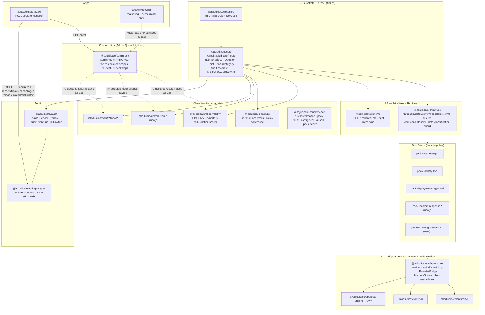

# Discovery Report — Phase-0 Architectural Survey

> **Status.** Normative for the enhancement-roadmap program. This is the
> program's mandatory Phase-0 architectural survey: a faithful, repo-grounded
> map of what exists today, what the roadmap landed, and what the two
> remaining workstreams (WS3 web parity, WS4 combined release) may touch.
> Design/analysis only — no code lands from this document.
>
> Companion to the per-feature design docs under
> [`docs/roadmap/design/`](./design/) and to the freeze discipline in
> [`docs/release/V1_FREEZE_MATRIX.md`](../release/V1_FREEZE_MATRIX.md),
> [`EXTENSION_POLICY.md`](../release/EXTENSION_POLICY.md),
> [`SEMVER_GOVERNANCE.md`](../release/SEMVER_GOVERNANCE.md), and
> [`ADR-116`](../architecture/adr/ADR-116-post-v1-extension-discipline.md).
>
> Every claim below was confirmed against the working tree at the head of
> `feat/enhancement-roadmap`. Where a number appears (test counts, package
> counts, changeset counts) it was counted, not estimated.

---

## 0. Executive summary

`adjudicate` is a zero-trust governance kernel for LLM intent execution. The
substrate is a pure, deterministic decision kernel wrapped by a disciplined
freeze regime: the v1 line is **frozen** (additive-only, no major bumps, closed
enums stay closed, wire format append-only).

The enhancement roadmap is **already implemented at the substrate level.** All
14 roadmap features have shipped code, an ADR, and a changeset; the 15 staged
changesets are queued for one combined post-v1 **MINOR** release wave. The
recent commits on this branch are *remediation and honest-wiring* work
(red-team causality assertions, honest reference-data wiring in the console,
PII redaction in the access-governance pack, a groundedness scorer, and a first
web playground test harness) — not new feature substrate.

What remains is **not** kernel work. It is two product-surface workstreams:

- **WS3 — Web parity.** `apps/web` has zero governance dashboards today (only a
  100%-mock `ConsolePreview` card). WS3 brings a **read-only, public-facing,
  sanitized subset** of the governance surfaces to the marketing site. A small
  set of WS3 features need **new published `@adjudicate/admin-sdk` surface**
  (new Zod schema + new procedure) — each carries the full freeze-matrix + ADR
  + changeset obligation.
- **WS4 — Combined release.** The new WS3 backend surfaces are built now and
  their changesets/ADRs/freeze-matrix rows **join the existing 15 staged
  changesets in ONE combined post-v1 MINOR release** (no major). The two new
  experimental packs go stable at `0.2.0`. Sequencing is locked: **parity
  first, ship together.**

The single largest finding is a **data-readiness gradient** across the 8
governance surfaces (§8). Three surfaces are data-ready, two are snapshot-only
(need time-series before a useful dashboard), and three have hard data
blockers — most acutely **Command Risk, which has no data API at all** (it
rides entirely on `DecisionBasis.detail` in the audit record).

---

## 1. Repository Analysis

### 1.1 Workspace shape

pnpm monorepo (`pnpm@10.32.1`, Node `>=20`). `pnpm-workspace.yaml` globs
`packages/*`, `examples/*`, `apps/*`, and `bench`. Root `package.json` is
`adjudicate@0.1.0`, public, MIT.

- **26 packages** under `packages/`.
- **2 apps** under `apps/` (`console`, `web`).

### 1.2 Package inventory (26)

| Package | Version | Layer | Direct `@adjudicate/*` deps |
|---|---|---|---|
| `@adjudicate/canonical` | 1.1.0 | L1 (substrate) | — (`@noble/hashes`) |
| `@adjudicate/core` | 1.2.0 | L1 kernel | `canonical` |
| `@adjudicate/primitives` | 0.2.0 | L2 primitives | `core` |
| `@adjudicate/runtime` | 0.2.0 | L2 runtime (DEFER park/resume) | `core` |
| `@adjudicate/pack-payments-pix` | 0.2.0 | L3 pack (lighthouse) | `core`, `primitives` |
| `@adjudicate/pack-identity-kyc` | 0.2.0 | L3 pack | `core`, `primitives` |
| `@adjudicate/pack-deployments-approval` | 0.2.0 | L3 pack | `core`, `primitives` |
| `@adjudicate/pack-incident-response` | **0.1.0-experimental** | L3 pack (new) | `core`, `primitives` |
| `@adjudicate/pack-access-governance` | **0.1.0-experimental** | L3 pack (new) | `core`, `primitives` |
| `@adjudicate/adapter-core` | 0.2.0 | L4 adapter-core | `audit`, `conformance`, `core`, `runtime` |
| `@adjudicate/anthropic` | 0.2.0 | L4 adapter | `adapter-core`, `audit`, `core`, `runtime` |
| `@adjudicate/openai` | 0.2.0 | L4 adapter | `adapter-core`, `audit`, `core`, `runtime` |
| `@adjudicate/approval-engine` | **0.1.0** | L4 (orchestration) | `adapter-core`, `core` |
| `@adjudicate/observability` | 1.0.0 | observability | — (`@opentelemetry/api`) |
| `@adjudicate/conformance` | 1.0.0 | conformance | — (zero deps) |
| `@adjudicate/analyze` | 0.2.0 | analyze (static + Tier-3) | `core`, `ts-morph` |
| `@adjudicate/red-team` | **0.1.0** | analyze-adjacent (new) | `core` |
| `@adjudicate/drift` | **0.1.0** | observability-adjacent (new) | `core` |
| `@adjudicate/audit` | 2.0.0 | audit | `core` |
| `@adjudicate/audit-postgres` | 2.0.0 | audit (durable) | `audit`, `core` |
| `@adjudicate/admin-sdk` | 2.0.0 | **consumption / AQI** | — (`@trpc/server`, `zod`) |
| `@adjudicate/cli` | 0.2.0 | tooling | `analyze`, `conformance`, `core`, `red-team` |
| `@adjudicate/migrate` | 0.2.0 | tooling | — (`ts-morph`) |
| `@adjudicate/locales-pt-br` | 0.2.0 | i18n | `core` |
| `@adjudicate/eslint-config` | 0.0.1 | tooling | — |
| `@adjudicate/bench` | (workspace `bench/`) | perf harness | — |

Plus the two apps: `@adjudicate/console@0.1.1` (private) and
`@adjudicate/web@0.1.1` (private).

> **New-this-roadmap packages** (carry the highest freeze obligation):
> `red-team`, `drift`, `approval-engine` (all `0.1.0`), and the two
> `0.1.0-experimental` packs. Under the locked sequencing, the **two packs go
> stable at `0.2.0`** in the combined wave.

### 1.3 Layered architecture

### 1.4 Dependency / trust direction

The defining invariant is the **inverted trust gradient at the consumption
layer**: the kernel sits at the bottom of the dependency graph with the
narrowest allowlist, and `@adjudicate/admin-sdk` — which sits at the *top* of
the read path — depends on **no feature packages** at all.

- **Kernel dependency allowlist.** `@adjudicate/core` depends only on
  `@adjudicate/canonical`, `@noble/hashes`, and `zod`. Confirmed in
  `packages/core/package.json`. Nothing else may enter the deterministic core.
- **`admin-sdk` carries no feature-package dependency.** Its only runtime deps
  are `@trpc/server` and `zod` (confirmed in `packages/admin-sdk/package.json`).
  It re-declares feature result shapes as Zod schemas under
  `packages/admin-sdk/src/schemas/*` (e.g. `RedTeamReportSchema`,
  `BehavioralDriftResultSchema`, `ConfigSealReportSchema`, `AiBomSchema`,
  `TokenBudgetResultSchema`, `PolicyCoherenceReportSchema`,
  `PiiClassificationResultSchema`, `ApprovalRequestSchema`,
  `MemorySnapshotSchema`). The **adopter** computes the real reports from the
  feature packages and threads them into `AdminContext` (see §6.3).

This means the read/UI plane can never become a kernel input, and the SDK's
wire contract is decoupled from feature-package internal types.

---

## 2. Roadmap feature inventory (14 features)

All 14 features are **implemented**: each has shipped code, a numbered ADR, and
a staged changeset. The roadmap landed at the substrate level; the open work is
product-surface (WS3/WS4). Recent commits on this branch are remediation /
honest-wiring (see §0).

| # | Feature | ADR | Landing package(s) | admin-sdk surface (if any) |
|---|---|---|---|---|
| 1 | Data-classification / PII guard | ADR-117 | `primitives` (`createDataClassificationGuard`), `core` basis codes, `analyze` | `governance.piiClassificationStats` (`pii-classification` schema) |
| 2 | Red-team | ADR-118 | **`red-team`** (new), `cli` | `governance.redTeam` (`red-team` schema) |
| 3 | Behavioral drift | ADR-119 | **`drift`** (new) over `AuditEventBus` | `governance.behavioralDrift` (`behavioral-drift` schema) |
| 4 | Token-budget guard | ADR-120 | `primitives` (`createTokenBudgetGuard`), `adapter-core` (`onTokenUsage`), `anthropic`/`openai` | `governance.tokenBudget` (`token-budget` schema) |
| 5 | Config-integrity seal | ADR-121 | `conformance` (`sealPackConfig`/`verifyConfigSeal`), `core`, `adapter-core` | `governance.configSealStatus` (`config-seal` schema) |
| 6 | Approval engine | ADR-122 | **`approval-engine`** (new) | `approval.list` / `approval.resolve` (`approval` schema) |
| 7 | Command-risk guard | ADR-123 | `primitives` (`classifyCommand`/`stripDangerousFlags`/`createCommandRiskGuard`), `core` basis codes | **none** — rides on `DecisionBasis.detail` in the audit record |
| 8 | Hallucination scoring | ADR-124 | `observability` (groundedness scorer), `core` (**AuditRecord v5** optional `metadata`, excluded from `auditHash`) | rides on `AuditRecord.metadata` (no dedicated procedure) |
| 9 | Policy-coherence analyzer | ADR-125 | `analyze` (Tier-3 `AJD-301`) | `governance.policyCoherence` (`policy-coherence` schema) |
| 10 | Agent memory store | ADR-126 | `adapter-core` (`MemoryStore` in-memory + redis, `enrichContext`) | `memory.bySession` (`memory` schema) |
| 11 | AI-BOM | ADR-127 | `conformance` (`generateAiBom`), `cli` (`pack-bom`) | `pack.aiBom` (`ai-bom` schema) |
| 12 | Incident-response pack | (pack changeset `incident-and-access-packs`) | **`pack-incident-response`** (new, `0.1.0-experimental`) | reuses audit/governance surfaces |
| 13 | Access-governance pack | (pack changeset `incident-and-access-packs`) | **`pack-access-governance`** (new, `0.1.0-experimental`) | reuses audit/governance surfaces |
| 14 | Release-gating | (changeset `release-gating`) | `pack-deployments-approval` (regression-score ESCALATE, carbon-budget REWRITE, model/prompt-change CONFIRM) | reuses `governance.*` (DeploymentGatePanel) |

**Notes confirmed in-repo.**
- ADR-124 raised the audit record to **v5** (`AUDIT_RECORD_VERSION = 5`,
  `AuditRecordVersion = 1 | 2 | 3 | 4 | 5` in `packages/core/src/audit.ts`); the
  new optional `metadata` is **excluded** from the canonical `auditHash` —
  telemetry stays outside the determinism boundary (§7.1).
- Command-risk (ADR-123) added `validation.COMMAND_BLOCKED /
  COMMAND_FLAG_STRIPPED / COMMAND_SANITIZED` basis codes; the console's
  `CommandRiskBadge` reads them from `record.decision_basis[].detail` — there is
  **no admin-sdk schema or procedure** for command-risk (verified: no
  `command-*` schema file, no `command` reference in the router).

### 2.1 ADR coverage map

ADR-101..115 cover the pre-roadmap substrate (kernel audit emission, fail-closed
default, runtime context, envelope v2 nonce, guard metadata/exception isolation,
refusal externalization, primitives expansion, analyze Tier-1, conformance,
audit-record v4, observability/migrate, adapter-core extraction, kill-switch v2,
pack trust primitives). **ADR-116** is the post-v1 extension discipline (§7.5).
**ADR-117..127** are the roadmap's 11 numbered feature ADRs (table above). The
incident/access packs and release-gating ship under changesets rather than new
numbered ADRs (they compose existing primitives; no new architectural seam).

---

## 3. Existing primitives, packs, analyzers, adapters

### 3.1 Primitives (L2)

`@adjudicate/primitives` exposes the guard factories that Packs compose:
`createThresholdGuard`, `createStateDeferGuard`, `createSystemTaintPolicy`
(frozen), and `createConfirmGuard` / `createEscalateGuard` /
`createIdempotencyGuard` / `createRewriteGuard` (still `@experimental` per
freeze-matrix §4, awaiting Pack #4–#6 evidence). The roadmap added
`command-classify` (`classifyCommand`, `stripDangerousFlags`,
`CommandRiskCategory = destructive | network | credential | safe`,
`DEFAULT_COMMAND_RULES`) and the data-classification guard. `@adjudicate/runtime`
holds the DEFER park/resume handshake with taint preservation across pause.

### 3.2 Packs (L3)

Five domain Packs. Three are mature (`pix`, `kyc`, `deployments-approval`, all
`0.2.0`); two are new and experimental (`incident-response`,
`access-governance`, `0.1.0-experimental`). Both new packs exercise all six
`Decision` outcomes via L2 primitives and are registered in the console pack
registry (`apps/console/src/lib/packs/registry.ts`). The access-governance pack
redacts PII from access-request justifications (Item 1 remediation commit).

### 3.3 Analyzers

`@adjudicate/analyze` ships Tier-1 (`AJD-1NN`, AST-free), Tier-2 (`AJD-2NN`,
ts-morph AST), and the roadmap's **Tier-3 policy-coherence analyzer**
(`AJD-301`, ADR-125) — phantom/unreachable intent, system-taint contradiction,
threshold-conflict, planner-probe error, via pure pack inspection plus planner
probing (new `plannerProbes` / `tier3Analyzers` options). `@adjudicate/red-team`
generates deterministic adversarial vectors (prompt-injection, taint-escalation,
tool-scope-violation) and asserts kernel-level defenses hold.

### 3.4 Adapter architecture (L4)

`@adjudicate/adapter-core` is the **provider-neutral** agent loop:
`createAdjudicatedAgent`, the three-method `ProviderBridge<H>` (history `H` is
opaque to the loop — load-bearing for vendor neutrality, freeze-matrix §22), the
decision→loop-action translator, confirmation/defer stores. The roadmap added
`MemoryStore` (in-memory + redis, ADR-126) feeding planner/renderer context
**upstream** of the envelope, and the `onTokenUsage` hook (ADR-120).
`@adjudicate/anthropic` and `@adjudicate/openai` are thin per-provider shims;
neither may import its vendor SDK into the loop (tested via `why`).
`@adjudicate/approval-engine` (new) orchestrates human approval for
`REQUEST_CONFIRMATION` flows with pluggable channels and a replay-safe resume
via `adapter-core.confirm()`.

### 3.5 Event architecture — `AuditEventBus`

`@adjudicate/audit` exposes `createInMemoryAuditEventBus` /
`createRedisAuditEventBus` / `bridgeAuditSinkToBus` plus the `AuditEventBus` and
`AuditEventHandler` types (freeze-matrix §6, tier `evidence-gated`: surface
frozen, default channel `audit.event.v1` and reconnect-backoff gated on adopter
evidence). The new `@adjudicate/drift` detector consumes this bus to compute
decision-distribution shift (total-variation distance, new-category,
proportion-spike) over deterministic count-based windows.

### 3.6 Audit architecture

`AuditRecord` is now **v5** (additive across versions; readers loop on
`record.version`). `buildAuditRecord` / `verifyAuditRecord`
(`packages/core/src/audit.ts`) are the canonical builder + tamper-detection
verifier: the `auditHash` is taken over `canonical(record \ { auditHash,
signature })` and — post-ADR-124 — also excludes the new optional `metadata`.
`@adjudicate/audit` adds sink composition, ledgers (memory + redis), replay
(`replay` / `classify` / `replayWithIntegrity`), kill-switch v1/v2, and the
post-v1 operational-intelligence helpers (`classifyReplayDrift`,
`buildSupersessionChains`, `analyzeKillSwitchTimeline`).
`@adjudicate/audit-postgres` provides the durable store plus the concrete
`AuditStore` / `EmergencyStateStore` / governance-log / guard-stats / outcomes
implementations the admin-sdk consumes.

### 3.7 Conformance architecture

`@adjudicate/conformance` (zero runtime deps) is the adopter-callable invariant
harness (`runConformance`, per-AC checks), the pack-manifest validator, the pack
trust primitives (ADR-115: `computePackFingerprint` / `verifyPackTrust`,
algorithm enum closed at `ed25519 | rsa-pss-sha256`), and the roadmap's
config-seal (`sealPackConfig` / `verifyConfigSeal`, ADR-121), AI-BOM
(`generateAiBom`, ADR-127), and pack-health (`scorePackHealth`) surfaces.

### 3.8 The two web apps

| | `apps/console` (:5180) | `apps/web` (:5181) |
|---|---|---|
| Role | **FULL reference operator console** | Marketing site + interactive demo playground |
| Framework | Next.js 15 App Router, React 19 | Next.js 15 App Router, React 19 |
| Data path | tRPC v11 client → `adminRouter` over `httpBatchLink` at `/api/admin/trpc`; `toNextRouteHandler` mounts it; `createAdminCaller` for tests/SSR | **No governance data path.** React Query provider wired but unused; no tRPC client; no admin queries |
| Governance surfaces | All 8 present in **PARTIAL** form (52 components incl. `governance/`, `dashboard/`, `decision/`, `approvals/`, `control/`, `replay/`) | **None.** Only a 100%-mock `ConsolePreview` card (stylised, links to `localhost:5180`) |
| Auth / tenant | Fail-closed bearer auth (`ADMIN_API_TOKEN`) required in prod — `toNextRouteHandler` **throws** without `requireAuth`; actor via `x-adjudicate-actor-*` headers | **None.** No auth, no tenant model |
| Testing | jsdom + `@testing-library/react`; **16 test files** | node-only vitest (no jsdom/RTL); **1 test** (`kernel-runner.test.ts`) |
| Charting | `@tanstack/react-table`, `xstate`/`@xstate/react` (replay machine); bespoke SVG bars | **No charting lib** |
| Feature deps | depends on all five packs + `red-team` + `drift` + `approval-engine` + `audit-postgres` + `conformance` (it is the **adopter** that computes reports) | depends only on `core`, `audit`, `primitives`, three mature packs, and `admin-sdk` (for types) |

**Dual-app decision (locked).** The **console is the full operator tool**;
**`apps/web` is read-only, public-facing, sanitized demo dashboards** —
aggregates only, never raw PII, raw commands, prompt contents, tokens, or
privileged actions. Public-safe transparency views. Every WS3 feature's UI
design must cover both the full console surface and the sanitized web subset (or
explicitly mark the feature operator-only and not exposed on web).

---

## 4. Architectural constraints

These are the load-bearing invariants every WS3/WS4 change must respect. They
are non-negotiable within the v1 line.

### 4.1 Determinism

`adjudicate()` is pure over `(envelope, policy, state)`. No clock, no I/O, no
RNG inside the deterministic path (freeze-matrix §23). Timestamps are supplied
by the harness/adopter, never read inside the kernel. The fail-closed default is
`REFUSE`; a throwing guard becomes a SECURITY `REFUSE` with `kernel.GUARD_PANIC`
(ADR-106).

### 4.2 Replay safety

`replay` / `classify` / `replayWithIntegrity` are the judges of `IDENTICAL |
BASIS_ONLY | DECISION_CHANGED` and the tamper axes. Replay is load-bearing for
semver enforcement. Any new field that could change a replay outcome is a
**decision-impact** change and therefore frozen-tier; telemetry must not.

### 4.3 Taint lattice

`Taint` is the closed lattice `SYSTEM > TRUSTED > UNTRUSTED`. It must be
**preserved across rewrites, pauses, and resumes** — the DEFER park/resume
handshake (`@adjudicate/runtime`) and every REWRITE primitive
(command-flag-strip, PII-mask, carbon-region clamp) preserve taint by contract.

### 4.4 Trust direction / package layering

The kernel allowlist (`canonical`, `@noble/hashes`, `zod`) is closed.
`admin-sdk` depends on no feature packages. Layering flows L1 → L2 → L3 → L4;
observability/analyze/conformance/red-team/drift hang off L1; audit feeds the
consumption layer; the consumption layer (admin-sdk) re-declares result shapes
rather than importing them. WS3 must **not** invert this: web reads through
admin-sdk, never directly from feature packages or the kernel.

### 4.5 Telemetry is outside the determinism boundary

Token usage, drift snapshots, red-team history, hallucination scores — all live
**outside** the kernel decision. AuditRecord v5 `metadata` is excluded from the
`auditHash` precisely so observability can ride the record without becoming a
kernel input. WS3 dashboards consume telemetry; they never feed it back into a
decision.

### 4.6 ADR-116 post-v1 extension discipline

Additive-only within the v1 line; no major bumps. Closed vocabularies stay
closed (`Decision.kind` 6, `Taint` 3, `RefusalKind` 6, `BasisCategory` 11,
`IntentActor.principal` 3, `ReplayMismatchKind` 3, `IntegrityFailure.kind` 3).
Wire formats append-only. Permanent guardrails forbid (among others) a hosted
control plane adopters depend on, a Pack marketplace, a Pack DSL, runtime
mutation surfaces, and `Decision.metadata` / `Decision.confidence`. **Evidence
before code.**

### 4.7 V1 freeze-matrix discipline

`docs/release/V1_FREEZE_MATRIX.md` is the single source of truth for every
public symbol's tier (`frozen | experimental | unstable | internal-only |
deprecation-target | evidence-gated | removed`), replay impact, migration
impact, and extension policy. **Governance rule:** every NEW public symbol needs
a freeze-matrix row + an ADR **in the same PR** (EXTENSION_POLICY §2.2/§2.3,
SEMVER_GOVERNANCE §5/§9) **and a changeset**. This binds every new admin-sdk
schema/procedure WS3 introduces (§5, §6).

### 4.8 Closed-enum doctrine

Decision-6, Taint-3, BasisCategory-11, RefusalKind-6, IntentActor-3 must **not
widen**. New basis *codes within an existing category* are MINOR; new
*categories* are MAJOR. Closed-but-additive enums (`KillSwitchEventSource`,
`ReplayFailureClass`, `AdapterErrorCode`, `OperationalIncidentClass`,
`HallucinationBucket`, `CommandRiskCategory`) may gain values in a MINOR. WS3
dashboards must render unknown enum values defensively (the policy-descriptor
schema already widens `GuardDescription` to a passthrough for exactly this
reason).

---

## 5. Integration map

### 5.1 WS3 — Web parity (read-only, sanitized, public-facing)

**Goal.** Bring a sanitized, aggregates-only subset of the governance surfaces
to `apps/web` for public transparency, without exposing any operator-only data
or actions.

| Concern | Detail |
|---|---|
| **Target package** | `apps/web` (UI) + `@adjudicate/admin-sdk` (for any new public data surface) |
| **Impacted packages** | `@adjudicate/admin-sdk` (new schemas/procedures), `@adjudicate/audit-postgres` (if a new aggregate store query is needed), `apps/web` (new tRPC client, charting lib, dashboard sections) |
| **Required new APIs** | Per-feature: a **new Zod schema + new procedure** in admin-sdk wherever web needs aggregate data the console does not already expose in a public-safe shape. Each is a NEW PUBLISHED SURFACE → freeze-matrix row + ADR + changeset, same PR. The likely shape is a `public.*` (or `transparency.*`) namespace returning **pre-aggregated, PII-free** rollups distinct from the operator `governance.*`/`audit.*` procedures. |
| **Backward-compat** | Strictly additive. New namespace/procedures land alongside existing ones; existing console wiring is untouched. No enum widening, no wire-format change. |
| **UI implications** | `apps/web` must gain: a tRPC client (it has none today), a charting approach (it has no charting lib), and read-only dashboard sections. The mock `ConsolePreview` is replaced/augmented by real read-only views. **No auth, no tenant model** is acceptable *only* because web sees aggregates-only public data; any surface that would require per-tenant scoping is operator-only and must stay in the console. |
| **Sanitization contract** | Web shows aggregates: counts, distributions, trends, pass/fail rollups, BOM summaries. Web must **never** show raw PII, raw commands, prompt contents, token values tied to a session, or any mutating/privileged action. |
| **Testing implications** | `apps/web` currently has **no jsdom/RTL** and **1 test**. WS3 dashboards need component-level tests → web must adopt jsdom + `@testing-library/react` (mirroring the console's harness) before it can test rendered dashboards. New admin-sdk procedures need handler tests in the SDK package. |

### 5.2 WS4 — Combined release (one post-v1 MINOR wave)

| Concern | Detail |
|---|---|
| **Target** | Single combined release of the **15 staged changesets + the new WS3 backend changesets**, as one post-v1 **MINOR** wave. No major bump. |
| **Impacted packages** | All packages touched by the 15 staged changesets (core, primitives, conformance, analyze, observability, drift, red-team, approval-engine, adapter-core, anthropic, openai, audit-postgres, admin-sdk, the five packs) plus any WS3 admin-sdk bump. |
| **Pack stabilization** | `pack-incident-response` and `pack-access-governance` promote `0.1.0-experimental → 0.2.0` (stable) in this wave. |
| **Required new APIs** | Only WS3's new admin-sdk surface (§5.1). Everything else is already staged. |
| **Backward-compat** | Every changeset is `minor`/`patch` (verified: no `major` headers among the 15). The combined wave preserves the freeze: additive-only, closed enums unchanged, wire-format append-only. |
| **Governance bundle** | Each new public symbol the wave introduces must arrive with: (1) freeze-matrix row, (2) ADR (numbered, or a documented changeset for pure-composition additions), (3) changeset — all in the same PR. The combined-release PR must reconcile all freeze-matrix rows in one pass (SEMVER_GOVERNANCE §9 freeze-boundary review). |
| **Sequencing (locked)** | **Parity first, ship together.** WS3 backend surfaces are built now; their artifacts join the 15 staged changesets; the whole set ships as one MINOR wave. |
| **Testing implications** | RC checks (`pnpm rc:check`), version check (`scripts/check-versions.ts`), and freeze-matrix check (`scripts/check-freeze-matrix.ts`) must pass for the combined set. WS3 adds web component tests + SDK handler tests to the gate. |

---

## 6. The data layer in detail (admin-sdk)

### 6.1 Router shape

`adminRouter` (from `@adjudicate/admin-sdk/trpc`) is a tRPC v11 router with
namespaces (confirmed in `packages/admin-sdk/src/trpc/index.ts`):

- `audit.*` — `query`, `byHash` (actor-required reads)
- `emergency.*` — `state`, `history`, `update` (kill switch)
- `replay.*` — `run` (re-adjudicate a historical record)
- `governance.*` — `outcomeDistribution`, `piiClassificationStats`,
  `policyCoherence`, `configSealStatus`, `tokenBudget`, `behavioralDrift`,
  `redTeam`, `guardFireStats`, `describePolicy`, `recordOutcome`,
  `decisionAccuracy`
- `approval.*` — `list`, `resolve`
- `pack.*` — `aiBom`
- `memory.*` — `bySession`

`createAdminCaller` is the same-process caller factory (tests/SSR).

### 6.2 Feature-detection pattern

Most feature procedures throw `PRECONDITION_FAILED` when their slot in
`AdminContext` is absent — the procedure shape is static, runtime
feature-detection is via the error code. Reads that expose tenant-scoped data
throw `UNAUTHORIZED` without an actor. This is the pattern any new WS3 procedure
must follow.

### 6.3 The adopter-computes-reports contract

`AdminContext` carries optional, pre-computed report slots (`redTeamReport`,
`driftDetector`, `tokenBudget`, `configSealStatus`, `policyCoherence`,
`approvalPort`, `aiBom`, `memoryLookup`, …). The **console route handler**
(`apps/console/src/app/api/admin/trpc/[trpc]/route.ts`) is the reference adopter:
it imports the real feature packages (`red-team`, `drift`, `conformance`,
`approval-engine`, `adapter-core`, `analyze`), computes the reports at startup,
and threads them into the context. The SDK never imports those packages. **Any
new WS3 data => new Zod schema + new procedure in admin-sdk + a new context
slot** — a new published surface with the full freeze obligation.

---

## 7. Data-readiness tiers for the 8 governance surfaces

The 8 surfaces are not equally ready for a *useful* dashboard. This gradient is
the central planning input for WS3 (and explains why "all 8 exist in console"
does not mean "all 8 are web-ready").

### Tier A — data ready (wire it through)

| Surface | Why ready | admin-sdk surface |
|---|---|---|
| **PII / Data-classification** | Dispositions ride in `DecisionBasis.detail` (sensitivity tier + redacted fields), aggregated by the handler over the existing AuditStore — no extra wiring. Console panel is real. | `governance.piiClassificationStats` |
| **AI-BOM** | `generateAiBom` is a pure roll-up; `bomDigest` excludes `generatedAt`+signature for reproducibility. Naturally aggregate, naturally public-safe (summary, not raw). | `pack.aiBom` |
| **Config-Integrity** (mostly) | `verifyConfigSeal` yields a pass/fail report computable at startup; pass/fail + digest is a clean public rollup. "Mostly" because the *sealed surface* detail is operator-only — web shows the verdict, not the surface. | `governance.configSealStatus` |

### Tier B — snapshot-only, needs time-series before a useful dashboard

| Surface | Gap | Implication for WS3 |
|---|---|---|
| **Behavioral Drift (timeline)** | `governance.behavioralDrift` returns a **single snapshot** (`driftDetector.snapshot()`). A drift *timeline* needs persisted historical samples over time, not one point. | WS3 needs a stored time-series (new aggregate store query + new procedure) before a drift trend chart is honest. |
| **Red-Team (trend)** | `governance.redTeam` returns the **latest** pre-computed report. A pass-rate *trend* needs run history persisted across runs. | WS3 needs a red-team-history store + new procedure for a trend; a single latest-report card is web-shippable now. |

### Tier C — hard data blockers

| Surface | Blocker | Detail (verified) |
|---|---|---|
| **Command Risk** | **No data API at all** — the *only* feature with no admin-sdk surface. | No `command-*` schema, no `command` procedure in the router. The console `CommandRiskBadge` reads `record.decision_basis[].detail` directly off the audit record. WS3 has nothing to call; a public command-risk view would require a brand-new aggregate procedure **and** raw commands must never reach web (sanitize to category counts only). |
| **Token Governance** | **No store + no tenant model.** | The console route's `tokenBudget.query` is fed from an in-file `DEMO_TOKEN_SESSIONS` constant — there is no durable token store, and the `onTokenUsage` hook is not wired to persistence. There is no tenant model in admin-sdk (`tenantScope` is an optional, host-enforced injection field, not a model). Token values are session-tied and **not** public-safe. |
| **Approval Center** | **Display-only resolve.** | `approval.resolve` flips the in-memory registry projection's status; the route handler comment confirms the demo registry's `resolve()` only updates the projection (the real single-use confirm path is `createApprovalEngine.resolve() → agent.confirm(token)`). Approvals are a privileged, mutating, operator-only action — **not exposed on web at all**. |

### 7.1 Web exposure summary (per the dual-app decision)

| Surface | Console (full) | Web (read-only, sanitized) |
|---|---|---|
| PII / Data-classification | full panel | aggregate disposition counts (no raw fields) |
| AI-BOM | full BOM | summary / digest (public-safe) |
| Config-Integrity | full seal + surface | verdict + digest only |
| Behavioral Drift | snapshot panel | trend **only after** time-series store (Tier B) |
| Red-Team | latest report | latest pass-rate card now; trend after history store (Tier B) |
| Command Risk | badge off audit record | category-count rollup **only** via a new procedure; raw commands never |
| Token Governance | demo panel today | **operator-only** until a real store + tenant model exist; token values not public-safe |
| Approval Center | list + resolve | **operator-only, not exposed on web** (mutating/privileged) |

---

## 8. Open questions

1. **WS3 namespace shape.** Does web read a dedicated public namespace
   (`public.*` / `transparency.*`) returning pre-aggregated PII-free rollups, or
   reuse `governance.*` with a sanitizing projection? The former keeps the
   public contract explicitly minimal and auditable; it adds surface. (Decision
   gates several freeze-matrix rows.)
2. **Tier B time-series ownership.** Where do drift-history and red-team-history
   live — a new `audit-postgres` aggregate table, or an adopter-supplied store
   threaded through `AdminContext`? This determines whether WS4 adds an
   `audit-postgres` surface or stays admin-sdk-only.
3. **Web charting choice.** `apps/web` has no charting lib. Adopt the console's
   bespoke-SVG approach (zero new dep, public-bundle-friendly) or a charting
   library (faster, heavier)?
4. **Command-risk public view.** Is a sanitized category-count rollup worth a
   net-new admin-sdk procedure for the *one* feature with no data API, or does
   command-risk stay operator-only in WS3?
5. **Token-governance scope in WS3.** Confirmed operator-only for web (no
   store, no tenant model, session-tied values). Is building the durable token
   store in scope for this wave, or deferred behind ADR-116 "evidence before
   code"?
6. **Pack changeset → ADR.** The incident/access packs ship under a changeset,
   not a numbered ADR. The two packs stabilizing to `0.2.0` introduce no new
   architectural seam, but WS4's freeze-boundary review should confirm whether a
   retroactive ADR is warranted for the stabilization itself.
